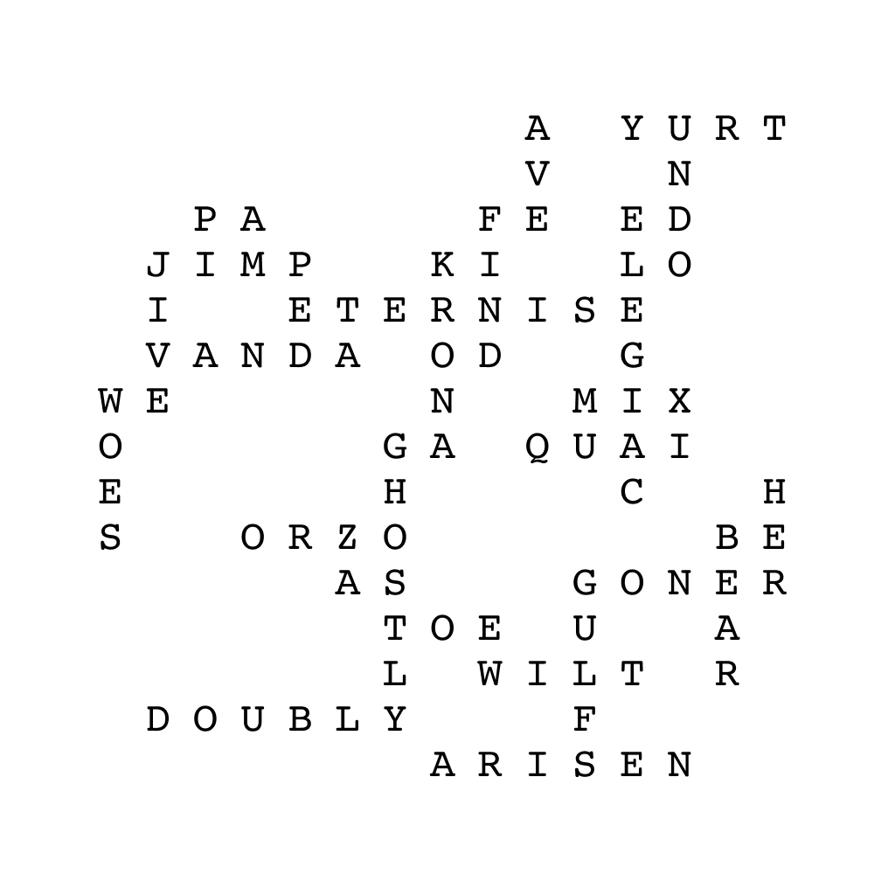

# BYUCTF 2023 - Q10

## 题目简述

题图把字母按 Scrabble 棋盘布局排列，标题 `Q10` 对应字母 Q 在英文 Scrabble 中价值 10 分。目标不是直接读取棋盘文字，而是找出未使用的字母砖并求最高分落子。



## 解题过程

标准英文 Scrabble 一共有 100 块字母砖，包括两块空白万能牌。统计图中 93 块并与标准分布相减，缺少：

```text
C, E, I, T, T, blank, blank
```

七块正好是一手牌。结合棋盘上已有字母寻找合法最高分落子，两个空白牌分别代替 `P` 和 `X`，可以组成：

```text
CIPHERTEXT
```

该落子得分 181，明显高于其他候选。题目说明大小写不敏感，因此答案为：

```text
byuctf{CIPHERTEXT}
```

## 方法总结

本题的关键约束来自桌游规则：字母总分布、七块手牌、棋盘连接和计分格。仅对缺失字母做变位词会卡住，因为最终单词还利用了棋盘已有字母。
