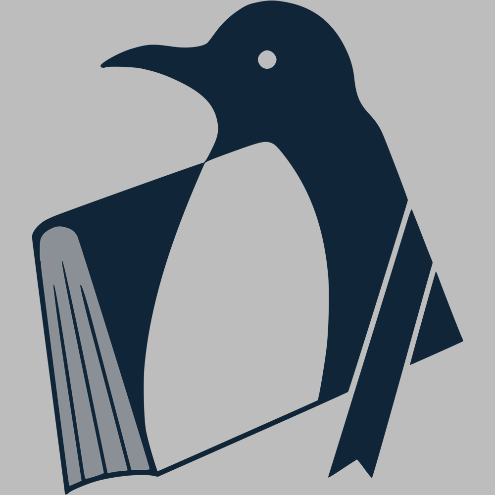

# 灯，等灯等灯

## 题目简述

题目是 $12\times12$ 的 256 级 Lights Out。点击一个格子会按固定 $5\times5$ 核改变附近灯的亮度，所有运算模 256：

```text
0 0 1 0 0
0 0 2 0 0
1 2 3 2 1
0 0 2 0 0
0 0 1 0 0
```

三级任务分别要求：精确还原目标；部分按钮禁用时尽量逼近目标；在同类限制下得到更低误差。核心是模环线性代数、离散优化和格上的最近向量问题，而不是 Web 交互本身。



## 解题过程

### Level 0：模 256 线性方程

把二维格按行编号为 0 到 143。对每个可点击位置模拟一次核影响，所得 144 维列向量组成矩阵 $A$；目标亮度展平为 $b$，点击次数为 $x$：

$$
Ax=b\pmod{256}
$$

SageMath 可以直接在环 $\mathbb Z/256\mathbb Z$ 上求解：

```python
N = 12
R = Zmod(256)
kernel = Matrix(R, [
    [0, 0, 1, 0, 0],
    [0, 0, 2, 0, 0],
    [1, 2, 3, 2, 1],
    [0, 0, 2, 0, 0],
    [0, 0, 1, 0, 0],
])

A = Matrix(R, N * N, N * N)
for row in range(N):
    for col in range(N):
        click = row * N + col
        for dr in range(-2, 3):
            for dc in range(-2, 3):
                rr, cc = row + dr, col + dc
                if 0 <= rr < N and 0 <= cc < N:
                    A[rr * N + cc, click] = kernel[dr + 2, dc + 2]

x = A.solve_right(vector(R, target))
```

`target` 是网页 12×12 方块的灰度值；每个方块像素值恰好等于亮度，可从页面状态或截图逐格读取。提交 $x_i\in[0,255]$ 即可精确通过。

### Level 1：禁用按钮下的近似优化

删除禁用位置对应的列后通常无法精确命中。定义环形亮度差：

$$
d(a,b)=\min(|a-b|,256-|a-b|)
$$

总分可取 $\sum_i d((Ax)_i,b_i)$。模拟退火每次随机改变一个可用点击次数，若分数下降则接受；分数上升时以 $e^{-\Delta/T}$ 的概率接受，并逐渐降低温度。多进程独立重启可以避免局部最优，官方脚本通常能把分数降到约 300。

### Level 2：格基归约与 CVP

设 $A'$ 只保留可点击列。所有可达亮度在整数空间中形成：

$$
\mathcal L=\{A'c+256z\mid c\in\mathbb Z^k,
z\in\mathbb Z^{144}\}
$$

寻找最接近目标 $b$ 的可达向量就是 CVP。构造带有系数辅助维度的格基，用 LLL 归约后通过 Babai nearest-plane 算法求近似最近向量，再从辅助维度取回点击次数。官方构造额外加入了一百多个维度，反而使第三关解法产生的误差足够低，也覆盖了第二关阈值。

最终候选仍要在本地计算 `(A' @ clicks) % 256`，用题目同一距离函数复核分数后再提交。

## 方法总结

- 核心技巧：把局部点击核展开为模 256 线性映射；精确题解线性方程，受限近似题用退火或 LLL+Babai 求最近可达状态。
- 识别信号：固定邻域影响、状态按模数累加、禁用部分控制变量且目标改为最小误差。
- 复用要点：$\mathbb Z/256\mathbb Z$ 不是域，不能假设任意非零元素可逆；距离也应按环形差定义。提交前必须用原评分函数验证。
