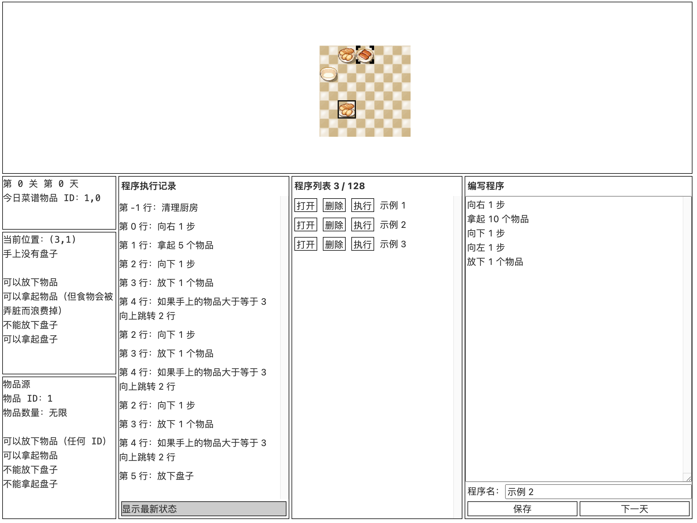

# 赛博厨房

## 题目简述

题目提供一个网格厨房和自定义机器人指令集：移动、取放物品、取放盘子，以及按手中物品数量条件跳转。每次运行程序前会清除有限物品并让机器人回到原点，但放在地上的盘子不会被清除。四关从基础控制流逐步过渡到利用程序哈希操纵伪随机菜谱，以及用持久盘子在多次程序执行之间编码信息。



## 解题过程

### Level 0：枚举四份菜谱

只有物品 0、1，菜谱长度为 2，所以仅有四种组合。分别保存做 `[0,0]`、`[0,1]`、`[1,0]`、`[1,1]` 的程序，进入当天后按菜谱选择执行。取一种物品并投入锅的基本片段为：

```text
向右 1 步
拿起 1 个物品
向下 1 步
向左 1000 步
放下 1 个物品
```

向左走 1000 步利用边界夹紧，无论当前横坐标多少都会回到锅所在列。

### Level 1：循环压缩 73 次操作

菜谱只有一种物品但长度为 73。单条“放下 n 个物品”只推进菜谱一个位置，必须用条件跳转形成循环：

```text
向右 1 步
拿起 114514 个物品
向左 1 步
向下 1 步
放下 1 个物品
如果手上的物品大于等于 1919 向上跳转 1 行
```

阈值只需让循环执行足够多次；超出的物品不会改变已经完成的菜谱判定。

### Level 2：枚举程序哈希对应的菜谱

32 种物品、长度 6 共有 $32^6$ 个菜谱，但最多保存 128 个程序。前端源码显示菜谱不是独立随机：它先对每个程序内容做 SHA-256，再把这些哈希拼接后二次 SHA-256，所得 seed 初始化 ARC4 风格 PRNG。

先固定 127 个程序，分别制作：

```text
[0, 0, 0, 0, i, j]，其中 0 <= i < 4，0 <= j < 32
```

它们覆盖 128 种菜谱中的 127 种。第 128 个程序只放随机注释 `# nonce = ...`，不断改变它并离线计算当天菜谱，直到菜谱前四项为 0 且第五项小于 4。期望尝试次数约为：

$$
\frac{32^6}{128}=8\,388\,608
$$

核心枚举逻辑为：

```python
import hashlib
import random
from Crypto.Cipher import ARC4

sha256 = lambda text: hashlib.sha256(text.encode()).hexdigest()

def recipe_for(programs):
    program_hashes = "\n".join(sha256(p.strip()) for p in programs)
    seed = sha256(program_hashes)
    rng = ARC4.new(seed.encode(), drop=256)
    return [
        int.from_bytes(rng.encrypt(b"\0" * 4), "big") % 32
        for _ in range(6)
    ]

while True:
    nonce = f"# nonce = {random.randrange(10**11)}"
    recipe = recipe_for(fixed_127 + [nonce])
    if recipe[:4] == [0, 0, 0, 0] and recipe[4] < 4:
        break
```

程序编号由 `recipe[4] * 32 + recipe[5]` 确定，保存找到的 nonce、进入下一天并执行对应程序即可。

### Level 3：用盘子保存 49 位菜谱

128 种物品需要 7 bit，8 项菜谱共 56 bit，地图也恰好提供 56 个可放盘子的空格。盘子的“有/无”能跨程序执行保留，因此它们就是持久位存储。

为了给 runner 留工作区，先用 Level 2 的 nonce 枚举让最后一个菜谱项固定为 0，只需保存前 7 项，共 $7\times7=49$ bit；剩余 7 个格子作为临时寄存器。

每个 `setbit(i)` 程序走到第 $i$ 个格子并放下清理阶段发给机器人的盘子。看到当天菜谱后，按其 49 个二进制位依次执行相应 setbit 程序。runner 读取一组 7 个格子时，向盘子中分别尝试放入 $1,2,4,8,16,32,64$ 个物品，再把它们取回；没有盘子的格子会让物品消失，有盘子的格子会保留并返还，因此手中数量正好还原 0 到 127 的物品 ID。

随后利用“每走一步放掉一个物品”的循环按该 ID 移动到对应物品源，取一件并投入锅中。重复七组，再投入固定的第八项 0，即完成任意已编码菜谱。

## 方法总结

- 核心技巧：先把机器人指令当小型汇编写循环，再利用程序内容决定 PRNG seed；最终用不会被清理的盘子实现跨执行持久位存储。
- 识别信号：地图状态在“清理”后仍有对象残留，随机状态由可控程序哈希派生，且空间数量与菜谱信息量恰好匹配。
- 复用要点：分别计算状态的信息量和存储容量；Level 2 枚举应完全离线，Level 3 要明确盘子不存在时物品消失、存在时可取回这一读位语义。
