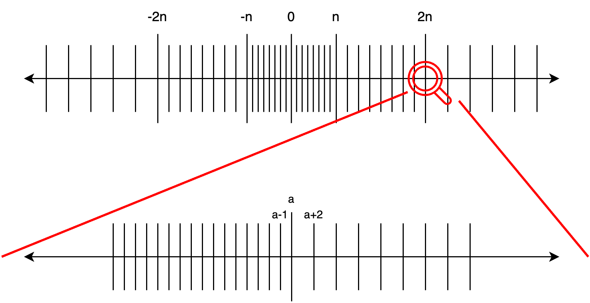

# 图灵完备的浮点数减法

## 题目简述

服务实现了一个无循环的直线程序解释器。初始内存是 32 个随机输入字节转成的 Python `float`；提交的每行要么追加一个浮点常量，要么给出两个已有下标并追加二者之差。程序最多 $10^6$ 行，最后 32 个值必须是 $0\ldots255$ 的精确整数，并在 10 组随机输入上等于 SHA-256 摘要。

SHA-256 只是要求实现的目标函数。真正的突破口是利用 IEEE-754 binary64 在 $2^{52}$、$2^{53}$ 附近的舍入行为，把减法组合成功能完备的布尔电路。解释器源码和语义均已直接给出，不需要恢复未知程序行为；正式目录中又没有对应的数学/编程方向，因此归入 `_unclassified`，而不是因载体是解释器就归为 `reverse`。

## 解题过程

### 用减法得到加法和取反

先固定布尔编码 False 为 `0.0`、True 为 `1.0`。只有减法时仍可构造

$$
x+y=x-(0-y),
\qquad
\neg x=1-x.
$$

难点是构造非线性逻辑门。binary64 有 53 位有效精度；到 $2^{53}$ 附近，相邻可表示数的间距发生变化，运算的舍入不再保持小整数差异。



令 $M=2^{53}$。对布尔值 $x,y$，按固定求值顺序计算

$$
x\land y=((x+y-1)-M)+M.
$$

$x+y-1$ 只可能为 $-1,0,1$；在与巨大负数相加时，$-1$ 和 0 的差异被舍入吞掉，而 1 对应的情形保留下来，最终得到 AND 真值表。实现中必须保留逐节点顺序：

```python
MAGIC1 = float(2**53)

def NOT(x):
    return 1.0 - x

def AND(x, y):
    return x + y - 1.0 - MAGIC1 + MAGIC1

def OR(x, y):
    return x + y - 1.0 + MAGIC1 - (MAGIC1 - 1.0)

def XOR(x, y):
    return OR(AND(x, NOT(y)), AND(NOT(x), y))
```

这里的 `+` 最终仍由 `a - (0 - b)` 展开。得到 NOT 与 AND 后，任意组合逻辑都能生成。

### 把输入字节拆成比特

还需把 $0\ldots255$ 的浮点整数拆成 8 位。第一种原语是按 $2^i$ 截断，通过把数平移到 ULP 为 $2^i$ 的量级再移回：

```python
MAGIC0 = float(2**52)

def trunc_pow2(x, i):
    # x // 2**i * 2**i，适用于这里的非负小整数
    k = (MAGIC0 + 2.0) * 2**i
    return x - float(2**(i - 1) - 0.5) + k - k
```

第二种原语把只可能为 0 或 $2^i$ 的值缩小一半：

```python
def div2_pow(x, i):
    k = MAGIC1 * 2**(i - 1)
    return x - float(2**(i - 1)) - k + k
```

从最高位到最低位，先 `trunc_pow2(x, i)` 取出高位部分，从余数中减掉它，再反复 `div2_pow` 归一化到 0/1，即可得到 8 个 bit。输出时反向执行 `byte = byte + byte + bit`，把 8 位重新组成整数。

### 生成 SHA-256 组合电路

把每个值表示成 DAG 节点：常量节点、输入节点和减法节点。节点构造时缓存 `(left_id, right_id)`，相同子表达式只生成一次。然后实现：

- 32 位逐位全加器，结果自然模 $2^{32}$；
- AND、OR、XOR、NOT；
- 左右移和循环右移；
- SHA-256 的 `Ch`、`Maj`、$\Sigma_0$、$\Sigma_1$、$\sigma_0$、$\sigma_1$；
- 32 字节消息的固定 padding：`0x80 || 29*0x00 || 0x0100`；
- 64 轮消息扩展和压缩函数。

最后把 8 个 32 位状态加回初始向量，按大端字节顺序重组为 32 个输出节点。对每个输出节点递归拓扑展开；常量输出单个浮点数，减法输出两个已经存在的内存下标。为了确保“最后 32 个值”正好是摘要，再各追加一次 `output_index - zero_index`。

提交前可在本地把生成文本重新喂给题目 `run_program`，至少验证空消息构造之外的多组随机 32 字节输入：

```python
for _ in range(100):
    data = os.urandom(32)
    assert run_program(program, data, 32) == hashlib.sha256(data).digest()
assert len(program) <= 1_000_000
```

官方生成器完整展开 64 轮并通过服务端 10 组随机测试。本次整理静态核对了门、字节拆装、SHA-256 轮函数和输出拓扑，没有重新发送超大程序到已结束的远程服务。

## 方法总结

- 核心技巧：利用 IEEE-754 在幂次边界的舍入不连续性，从纯减法构造 AND/OR，再编译出任意组合逻辑电路。
- 识别信号：解释器只允许线性算术，但数据类型是有限精度浮点数且允许巨大常量时，真实语义并非实数域线性运算，应检查 ULP、舍入、溢出和有符号零。
- 复用要点：浮点表达式不可随意代数化简或重排；先解决输入/输出 bit 编码，再搭建字级运算；DAG 公共子表达式消除和最终节点顺序是满足程序长度、输出位置限制的关键。
