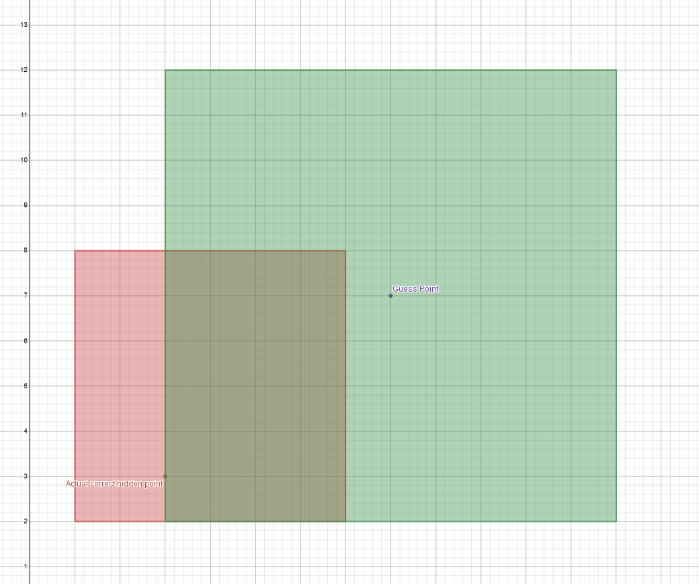
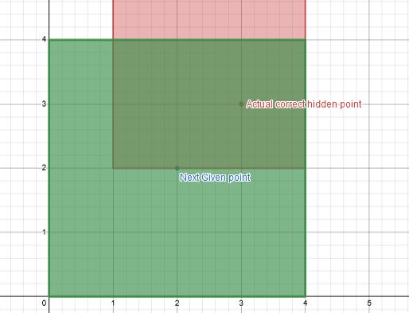
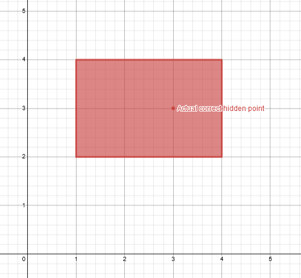

# L3akCTF 2024 Square Game Writeup

## 题目简述

每局在 $10^6\times10^6$ 网格中随机隐藏一点 $(x_h,y_h)$。服务端连续给出 100 个随机中心 $(x_i,y_i)$，选手为每个中心提交整数半径 $r_i$，并得到一点是否位于轴对齐正方形内的回答：

$$
|x_h-x_i|\le r_i
\quad\text{且}\quad
|y_h-y_i|\le r_i.
$$

100 轮后要猜隐藏坐标，两轴误差均不超过 $10^4$ 即获胜；连续完成 10 局才得到 flag。它不是独立对 $x,y$ 做二分，因为一次 `outside` 只表示两个条件至少一个不成立。官方方法维护一个矩形可行域，并精心选择查询半径，使每次否定回答后剩余区域仍是矩形。

## 解题过程

### 1. 建立第一个边界框

隐藏点实际只会生成在 $[200000,800000]^2$ 内。官方脚本先对随机中心反复提交：

```text
r = 370000
```

直到第一次得到 `inside`。此时查询正方形一定包含隐藏点，可把它与已知全局范围的交集作为初始边界框：

$$
B=[x_{\min},x_{\max}]\times[y_{\min},y_{\max}].
$$

### 2. 用“三边覆盖规则”选半径

对新中心 $(x,y)$，计算到当前矩形四条支撑线的距离：

```python
distances = sorted([
    abs(x - xmin),
    abs(xmax - x),
    abs(y - ymin),
    abs(ymax - y),
])

r = max((distances[2] + distances[3]) // 2, distances[2] + 1)
```

半径至少越过第三远的边、但通常不越过最远的边。因此查询正方形会覆盖当前矩形的至少三条边，却不把四条边全部覆盖。若四边全覆盖，答案必然是 `inside`，不能获得新信息；若只覆盖两边，`outside` 后的补集可能变成 L 形，单个矩形无法准确表示。



### 3. 根据回答更新可行域

若回答为 `inside`，隐藏点同时属于旧矩形 $B$ 和查询正方形 $S$，所以直接取交集：

```python
xmin = max(xmin, x - r)
xmax = min(xmax, x + r)
ymin = max(ymin, y - r)
ymax = min(ymax, y + r)
```

下图先展示查询正方形与当前边界框的重叠区域，再展示取交后的新边界：





若回答为 `outside`，隐藏点属于 $B\setminus S$。由于选半径时满足三边覆盖规则，该差集只会是靠近未覆盖边的一条矩形带，因此只需移动对应的一条边。例如查询覆盖旧矩形左、上、下三侧而右侧未被覆盖时：

```python
xmin = x + r
```

另外三个方向对称处理。持续更新后，以矩形中心作为最终答案：

```python
guess_x = (xmin + xmax) // 2
guess_y = (ymin + ymax) // 2
```

只要矩形两条边长都不超过 $20000$，其中点对任意可行隐藏点的两轴误差就不超过 $10000$。官方演示通常在十几轮内进入容差范围，100 轮足够留出余量。连续通过 10 局后得到：

```text
L3AK{5qu4r35_574y_5h4rp}
```

## 方法总结

- 二维包含 oracle 的否定结果通常会产生非凸或非矩形区域；选查询形状时必须同时考虑“如何提问”和“答案后能否继续用简单状态表示”。
- 三边覆盖规则让 `inside` 对应矩形交集、`outside` 对应单侧矩形带，两种分支都能继续用四个边界值维护。
- 官方规则 PDF 与 Walkthrough PDF 已逐页核对；正文保留了决定算法的几何示意图，终端输出和源码截图则已转写为可复制文本。
