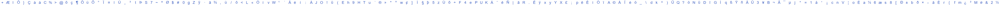
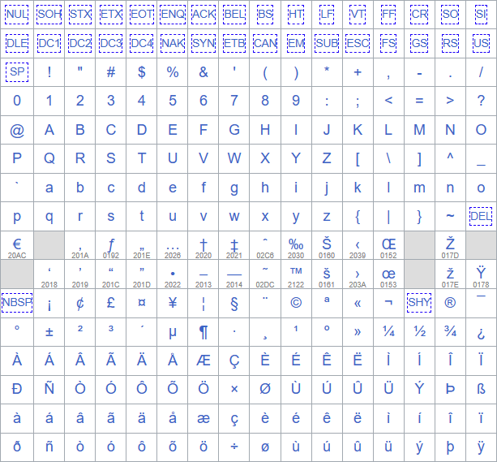

# L3akCTF 2024 Windows 1252 Writeup

## 题目简述

服务端连续生成 100 张 CAPTCHA，每张由 5 个 $25\times25$ 字形横向拼接而成，总限时为：

$$
0.2\times5\times100=100\text{ 秒}.
$$

每个字形对应一个允许的 Windows-1252 字节，答案不是可见字符本身，而是 5 个字节的十六进制串。例如图中出现 `L3AK` 时，应回答 `4c33414b`。

题目提供一条打乱顺序的完整样本图，可切成 188 个参考字形：



仓库还保留了生成参考字形时使用的 Windows-1252 码表：



官方给出模板匹配与 CNN 两条路线。由于噪声颜色和字形模板都是固定的，纯图像匹配更短、更快，也更能说明题目的决定性弱点。

## 解题过程

### 1. 建立字形模板

允许集合排除了控制字符、`0x7f` 至 `0xa0` 和 `0xad`，共 188 个字节。把样本条每隔 25 像素切开，再依据可见字符与码表为每块标注对应的两位十六进制值：

```python
def split_symbols(image):
    return [
        image[:, x:x + 25]
        for x in range(0, image.shape[1], 25)
    ]
```

仓库中的参考文件直接以 `21.png`、`22.png` 等字节十六进制命名，加载后得到 `label -> image` 字典。

### 2. 利用蓝色噪声的生成规则

服务端从 32 个固定点阵中随机选择一个，只在原字形的白色像素上覆盖纯蓝色。OpenCV 使用 BGR 顺序，因此源码中的噪声值是：

```python
color_blue = [0xff, 0x00, 0x00]
```

这类噪声没有真正抹去未知像素：

- CAPTCHA 像素为蓝色时，原模板该位置必须为白色；
- CAPTCHA 像素不是蓝色时，它必须与模板像素完全相等。

据此逐像素过滤 188 个候选即可：

```python
def matches(noisy, template, blue=(255, 0, 0)):
    for y in range(25):
        for x in range(25):
            pixel = tuple(noisy[y, x])
            original = tuple(template[y, x])

            if pixel == blue:
                if original != (255, 255, 255):
                    return False
            elif pixel != original:
                return False

    return True
```

把每张 CAPTCHA 切成 5 块，分别找到唯一匹配模板，再直接连接模板文件名：

```python
def solve_captcha(captcha, templates):
    answer = []
    for block in split_symbols(captcha):
        label = next(
            label
            for label, template in templates.items()
            if matches(block, template)
        )
        answer.append(label)
    return "".join(answer)
```

远程交互只需逐行提取 Base64 PNG、解码、识别并回复。100 轮通过后得到：

```text
L3AK{0pT!cal_chaR4Ct3R_R3cOgN!tIon_i5_fUN}
```

### 3. CNN 替代路线

官方 14 页 CNN Walkthrough 也已逐页核对。该路线用干净模板合成约 188 万张带随机噪声和轻微平移的训练图，训练 188 分类网络：

```text
Conv2D(32) -> BatchNorm -> MaxPool
Conv2D(64) -> BatchNorm -> MaxPool
Flatten -> Dense(128) -> Dropout(0.5) -> Dense(188, softmax)
```

训练采用 Adam、学习率 $0.001$、分类交叉熵和 5 个 epoch；文档记录的验证准确率约为 $99.95\%$，远程完成 100 轮约用 10.2 秒。这条路线可行，但固定颜色噪声已经留下无损的确定性匹配条件，无需承担训练成本。

## 方法总结

- 先审计 CAPTCHA 的生成器，再决定是否需要 OCR 或机器学习。只在白色像素上覆盖一种独占颜色，相当于把“原像素是白色”直接标记出来。
- 标签是 Windows-1252 字节值，而非任意 Unicode 码点；输出阶段应以模板的字节标签为准。
- 样本条与码表包含关键视觉对应关系，因此以语义化名称保留；PDF 中的代码、模型结构和终端输出已转写为文本，没有保留低价值截图。
