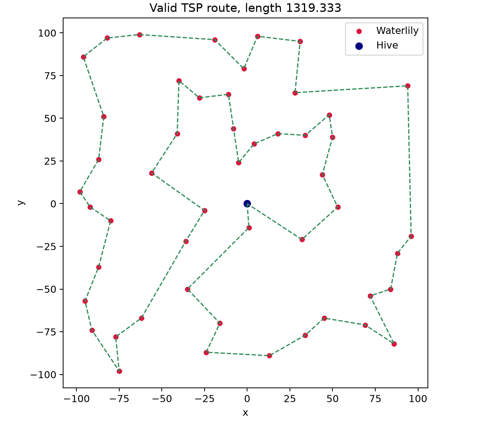

# G-Bee-S

## 题目简述

附件给出 50 朵睡莲的二维坐标，蜂巢位于 $(0,0)$。提交路径必须从编号 0 的蜂巢出发、每朵花恰好访问一次并回到 0，总欧氏距离不超过 1400。服务只要求足够好的路线，不要求全局最优解。

## 解题过程

这就是一个 51 个节点的旅行商问题。枚举所有排列需要 $O(n!)$ 时间，没有必要；阈值 1400 留有余量，先用最近邻构造初始环路，再用 2-opt 消除交叉和明显绕路即可稳定通过。

2-opt 每次选择两条边 $(a,b)$、$(c,d)$，若：

$$
\operatorname{dist}(a,c)+\operatorname{dist}(b,d)
<
\operatorname{dist}(a,b)+\operatorname{dist}(c,d)
$$

就反转 $b$ 到 $c$ 之间的路径。反复扫描直到没有改进，得到一个局部最优环路：

```python
from math import hypot

points = [(0, 0)]
with open("flowers.txt", "r", encoding="utf-8") as source:
    points.extend(
        tuple(map(int, line.split()))
        for line in source
    )


def distance(left, right):
    x1, y1 = points[left]
    x2, y2 = points[right]
    return hypot(x1 - x2, y1 - y2)


def route_length(route):
    return sum(
        distance(left, right)
        for left, right in zip(route, route[1:])
    )


# 最近邻初始解。
remaining = set(range(1, len(points)))
route = [0]
while remaining:
    current = route[-1]
    nearest = min(
        remaining,
        key=lambda node: distance(current, node),
    )
    route.append(nearest)
    remaining.remove(nearest)
route.append(0)

# 2-opt 局部搜索。
improved = True
while improved:
    improved = False
    for i in range(1, len(route) - 2):
        for j in range(i + 1, len(route) - 1):
            old = (
                distance(route[i - 1], route[i])
                + distance(route[j], route[j + 1])
            )
            new = (
                distance(route[i - 1], route[j])
                + distance(route[i], route[j + 1])
            )
            if new + 1e-9 < old:
                route[i:j + 1] = reversed(route[i:j + 1])
                improved = True

print(route_length(route))
print(" ".join(map(str, route)))
```

在仓库提供的坐标上，脚本得到长度 `1319.3326592400624` 的路线：

```text
0 45 16 47 50 33 40 7 28 37 43 36 44 6 9 24 35 20 13 48 22 46 23 30 25 27 42 31 21 12 4 19 41 1 39 18 5 49 17 8 11 2 15 34 29 14 10 32 3 26 38 0
```



提交该序列后获得：

```text
N0PS{w4t3rl1ll13s_f0r_v4l3nt1n3}
```

## 方法总结

这是一道纯组合优化题，核心是构造低于阈值的 TSP 路线。最近邻负责快速生成可用初解，2-opt 通过替换两条边持续降低距离；由于服务不要求最优，简单局部搜索已经足够。题目不涉及安全机制、模型行为或训练过程，无法合理映射到现有正式安全方向，因此按规范暂存于 `_unclassified`，而不是误归为 `ai-ml` 或 `crypto`。
