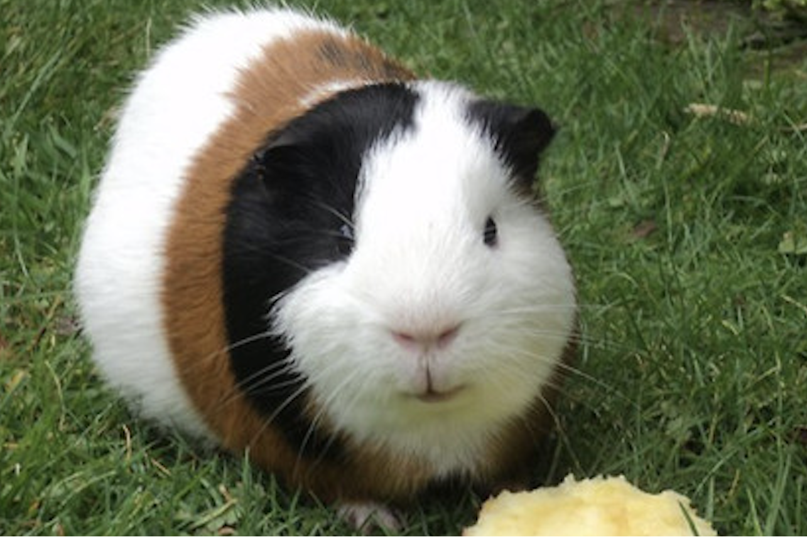
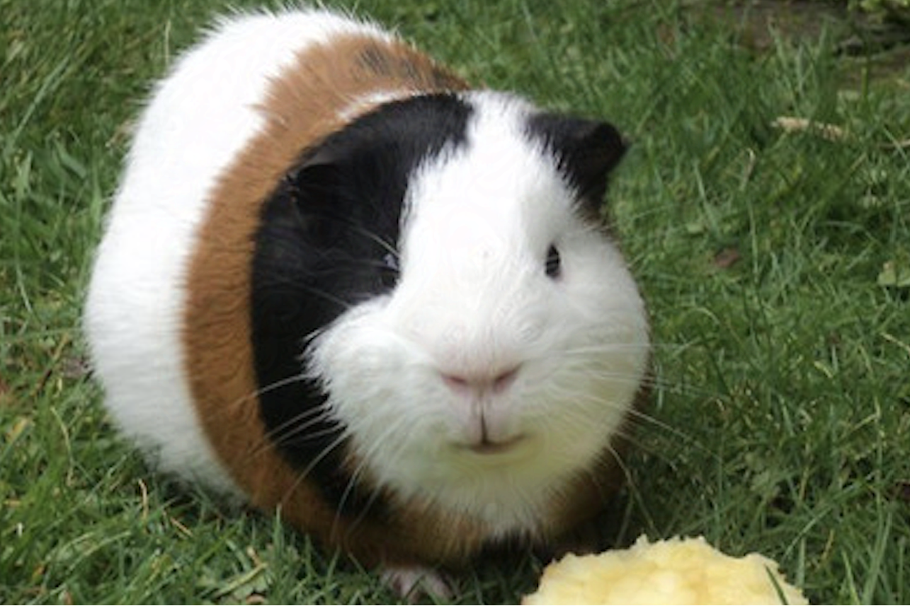

# yolov?-cls

## 题目简述

题目给出一张豚鼠图片，要求提交一张人眼几乎无法区分的对抗样本。服务端把 Base64 解码后的图片转为 RGB，并与原图逐像素比较：

$$
\operatorname{mean}(|I-I'|)\le 1,\qquad
\max(|I-I'|)\le 2.
$$

通过像素检查后，同一张图还必须同时满足：

- YOLO11x-cls 的 Top-1 类别为 341（`hog`），置信度至少 0.99；
- YOLOv8x-cls 的 Top-1 类别为 719（`piggy_bank`），置信度至少 0.99。

原图和最终对抗样本如下。两者视觉上几乎相同，但模型输出被定向到两个不同类别。





## 解题过程

### 1. 复现模型真实预处理

直接对原始尺寸张量求梯度往往不能稳定通过远端，因为分类模型实际看到的是预处理后的 $224\times224$ 输入。官方解法复现的关键链为：

```python
resize = T.Resize(
    size=224,
    interpolation=T.InterpolationMode.BILINEAR,
    antialias=True,
)
crop = T.CenterCrop((224, 224))

def preprocess(x):
    return crop(resize(x)).unsqueeze(0)
```

Resize 和 CenterCrop 都放在可微前向过程中，梯度才能从两个模型的 logits 正确传回原尺寸图片。还要使用与服务端一致的 YOLO11x-cls、YOLOv8x-cls 权重和 Ultralytics 版本；否则即使本地类别正确，远端置信度也可能偏移。

### 2. 同时优化两个定向分类目标

加载模型后取出底层分类网络，目标类别分别设为 341 和 719：

```python
model11 = YOLO("models/yolo11x-cls.pt").to(device)
model8 = YOLO("models/yolov8x-cls.pt").to(device)
model11.eval()
model8.eval()

classifier11 = model11.model
classifier8 = model8.model

target11 = torch.tensor([341], device=device)
target8 = torch.tensor([719], device=device)
```

令 $x_0$ 为原图张量，优化变量 $x$ 从 $x_0$ 开始。对两个模型的交叉熵损失交替反向传播，并在每次更新后投影回 $L_\infty$ 邻域：

```python
x = x0.clone().detach().requires_grad_(True)
optimizer = torch.optim.Adam([x], lr=0.01)
loss_fn = torch.nn.CrossEntropyLoss()
eps = 0.006

def logits11(x):
    return classifier11(preprocess(x))[1]

def logits8(x):
    return classifier8(preprocess(x))[1]

for _ in range(1000):
    optimizer.zero_grad()
    loss_fn(logits11(x), target11).backward()
    optimizer.step()
    x.data.clamp_(x0 - eps, x0 + eps).clamp_(0, 1)

    optimizer.zero_grad()
    loss_fn(logits8(x), target8).backward()
    optimizer.step()
    x.data.clamp_(x0 - eps, x0 + eps).clamp_(0, 1)
```

这里的 $\varepsilon=0.006$ 对应约 $1.53/255$ 的连续像素扰动，量化到 8 位图片后可满足服务端 `max_diff <= 2`。交替优化比只对两个 loss 求一次和更容易复现原解，但两种方式都必须同时监控两个目标置信度。

### 3. 按服务端口径验证并提交

保存图片前后都要按服务端的 8 位 RGB 计算差异，避免浮点张量合格但 PNG 量化后越界：

```python
adv = tensor_to_img(x)
orig_np = np.array(original, dtype=np.int32)
adv_np = np.array(adv, dtype=np.int32)
diff = np.abs(orig_np - adv_np)

assert diff.mean() <= 1
assert diff.max() <= 2
```

再用完整的 Ultralytics `YOLO(...)` 接口对保存后的 PNG 重新推理，确认两个 Top-1 类别及置信度均满足远端条件。最后把 PNG 字节 Base64 编码后发送，并以服务约定的 `OWARI^_^` 单独一行结束输入。

## 方法总结

- 核心技巧：在严格 $L_\infty$ 像素约束下，对同一输入同时执行两个定向白盒对抗攻击。
- 识别信号：本地梯度攻击有效但远端分类不一致时，应首先核对 Resize、CenterCrop、插值、量化、模型版本和保存后重载流程。
- 复用要点：优化变量始终投影到原图邻域；最终验证必须使用落盘后的 8 位图片和服务端同款完整推理接口，而不是只看训练张量上的 logits。
