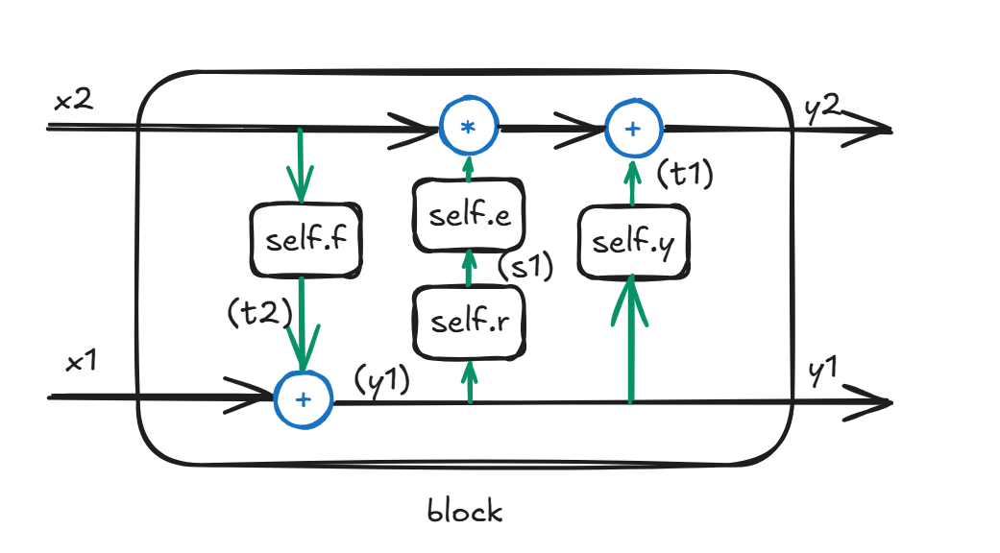
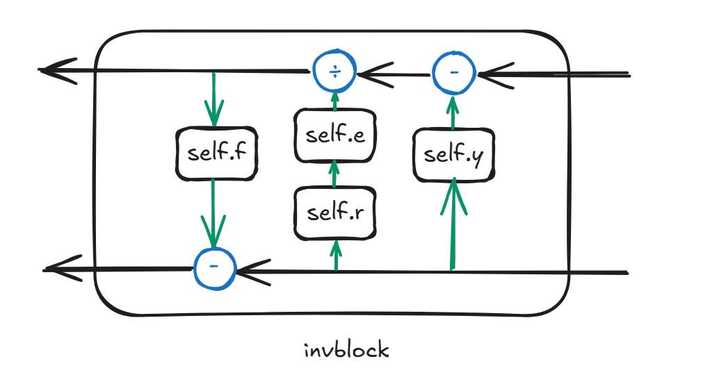

# d3image

## 题目简述

题目是轻量 AI / 图像隐写方向：给出一个把信息隐藏进图像的神经网络模型，要求从 stego 图像中恢复消息。关键不在重新训练模型，而在识别网络结构中哪些运算可逆，重建反向网络并加载题目权重。参考资料 HiNet 和 SteganoGAN 的重要信息是：前者使用可逆网络做图像隐藏，强调正向 / 反向两个方向共享结构；后者是高容量图像隐写模型，说明深度模型可以学习把消息嵌入图像。对本题而言，真正需要的是 HiNet 风格的“可逆结构”思想，而不是重新训练 GAN。

## 解题过程

### 预期解

此题的预期解是选手能够意识对网络模型进行逆向建模，只需要正确写出反向的网络与运算规则，把题目给出的模型加载进新的框架即可得到flag。在这样的情况下，选手端需要的资源并不多，仅需满足以下环境：

- Python 解释器版本需与题目要求的 PyTorch 版本匹配

- 其余缺失库选择pip 默认安装版本即可

- cuda 并非必须的，你可以把所有的张量都移动到cpu 上运算。

在收到的 wp 中，很高兴大部分选手都使用了正确的思路，下面详细的解释一下这个思路的实现与可行性。首先，分析网络框架：

原始可逆块的正向计算核心如下，输入按通道拆成 `x1` 和 `x2`，再通过 `self.f`、`self.r`、`self.y`、`self.e` 组合出 `y1` 和 `y2`：

```python
def forward(self, x):
    x1, x2 = (x.narrow(1, 0, self.channels * 4),
              x.narrow(1, self.channels * 4, self.channels * 4))

    t2 = self.f(x2)
    y1 = x1 + t2
    s1, t1 = self.r(y1), self.y(y1)
    y2 = self.e(s1) * x2 + t1
```



每个block 大致如上图，标注的文字信息与代码截图对应。

- 蓝色部分：基础张量运算（均存在数学逆运算）；

- 绿色箭头：输入输出变换（方向固定，不可逆）；

- 黑色箭头：可逆运算路径。



根据如上思路，我们只需要在 model.py，d3net.py 和 block.py 中作如下修改即可：

```python
# model.py
class Model(nn.Module):
    def forward(self, x, rev=False):
        if not rev:
            out = self.model(x)
        else:
            out = self.model(x, rev=True)
        return out
```

```python
# d3net.py
class D3net(nn.Module):
    def forward(self, x, rev=False):
        if not rev:
            out = self.inv1(x)
            out = self.inv2(out)
            out = self.inv3(out)
            out = self.inv4(out)
            out = self.inv5(out)
            out = self.inv6(out)
            out = self.inv7(out)
            out = self.inv8(out)
        else:
            out = self.inv8(x, rev=True)
            out = self.inv7(out, rev=True)
            out = self.inv6(out, rev=True)
            out = self.inv5(out, rev=True)
            out = self.inv4(out, rev=True)
            out = self.inv3(out, rev=True)
            out = self.inv2(out, rev=True)
            out = self.inv1(out, rev=True)
        return out
```

```python
# block.py
class INV_block(nn.Module):
    def forward(self, x, rev=False):
        x1, x2 = (x.narrow(1, 0, self.channels * 4),
                  x.narrow(1, self.channels * 4, self.channels * 4))

        if not rev:
            t2 = self.f(x2)
            y1 = x1 + t2
            s1, t1 = self.r(y1), self.y(y1)
            y2 = self.e(s1) * x2 + t1
        else:
            s1, t1 = self.r(x1), self.y(x1)
            y2 = (x2 - t1) / self.e(s1)
            t2 = self.f(y2)
            y1 = x1 - t2

        return torch.cat((y1, y2), 1)
```

其次，DWT（离散小波变换）和 IWT（逆小波变换）在图像处理中本身就互为一对逆运算。最后，逆向网络还需要 $y_2$，题目附件中提供了一个名为 `auxiliary_variable` 的函数来辅助完成。经实验与数学验证，$y_2$ 可为任意与 $y_1$ 同形状的张量，不影响最终结果。修改后的 `decode` 如下：

```python
def decode(steg):
    output_steg = transform2tensor(steg)
    output_steg = dwt(output_steg)
    backward_z = gauss_noise(output_steg.shape)
    output_rev = torch.cat((output_steg, backward_z), 1)
    bacward_img = d3net(output_rev, rev=True)
    secret_rev = bacward_img.narrow(1, 4 * 3, bacward_img.shape[1] - 4 * 3)
    secret_rev = iwt(secret_rev)
    image = secret_rev.view(-1) > 0
    candidates = Counter()
    bits = image.data.int().cpu().numpy().tolist()
    for candidate in bits_to_bytearray(bits).split(b'\x00\x00\x00\x00'):
        candidate = bytearray_to_text(bytearray(candidate))
        if candidate:
            candidates[candidate] += 1
    if len(candidates) == 0:
        raise ValueError('Failed to find message.')
    candidate, count = candidates.most_common(1)[0]
    print(candidate)
```

### 其他

由于这道题的定位是趣味，所以在这种需要看出可逆向结构的方法之外，亦可训练一个解密网络（力大砖飞需更高算力，但测试中笔记本电脑仍可胜任）：

具体做法是，选手自行选一个图像数据集，通过题目模型加密生成“密文-明文”配对数据；然后以加密数据为输入，原始数据为标签，训练一个自定义解密模型。

这个方法的可行性在于，由于题目最终输出为二进制形式，解密问题被简化为二分类任务，再加上校验码的存在可以降低对解密精确度的要求，所以对解密网络的训练难度与网络深度要求大大降低。

如果题目是把图片隐写到图片里，那么训练一个解密网络的难度将会大大增加。因为本意只是想在一天内给选手们一个有趣的简单轻量AI 题，专注在网络本身，而不是演变为算力比拼或者过于脑电波，所以在任务上没有继续加深难度，也给出了大部分的代码。

非常遗憾也因为题目代码量较小，选手可以使用 AI 来理解工程代码，并快速的得到解答。但还是希望选手能够从中感受到题目本身“不需要训练 AI 的 AI 题”的趣味性。

### 参考

HiNet：《基于可逆网络的深度图像隐藏》。关键点是使用可逆神经网络将载体图像和秘密图像编码到隐写图像及辅助变量中，解码时沿网络反向传播即可恢复秘密内容。本题的 DWT/IWT 和 `rev=True` 反向网络正对应这一思路。

SteganoGAN：《基于 GAN 的高容量图像隐写》。关键点是用生成式模型提升图像隐写容量，并通过编码器 / 解码器结构恢复消息。本题没有要求训练 GAN，但它说明“训练解密网络”作为非预期解为什么可行。

## 方法总结

- 核心技巧：识别网络中的可逆块，按正向计算的相反方向重写 `model.py`、`d3net.py` 和 `block.py`，再用 DWT/IWT 互逆关系恢复隐藏比特。
- 识别信号：AI 隐写题如果给出完整模型和权重，且结构中存在 DWT/IWT、split/concat、`rev=True` 等信号，应优先考虑反向建模而不是重新训练。
- 复用要点：辅助变量 $y_2$ 只需形状匹配，不影响最终恢复；输出是二进制消息时可以用重复候选和校验码提高容错。
