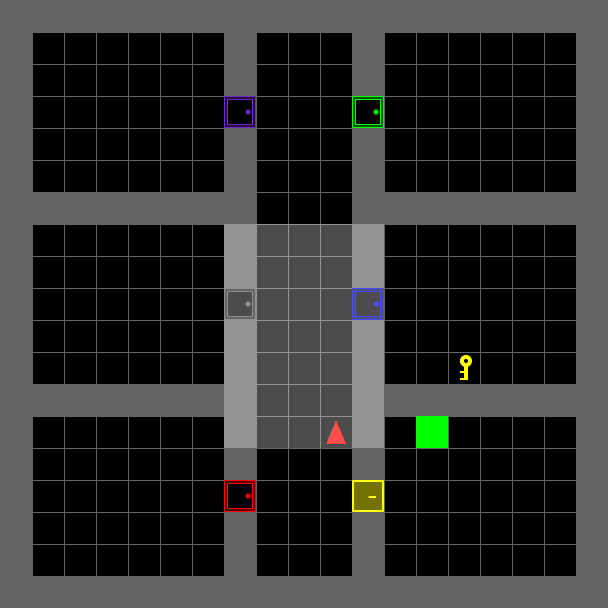
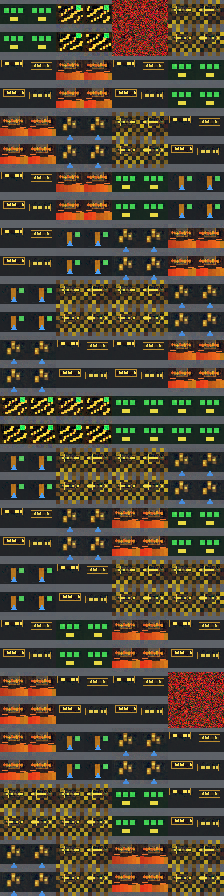
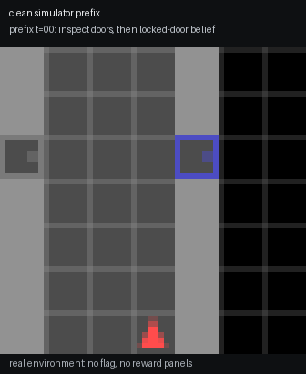
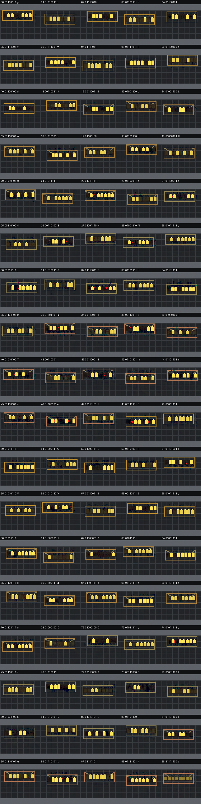

# If Models Could Dream

## 题目简述

题目提供的是在 `MiniGrid-LockedRoom-v0` 的 $56\times56\times3$ 局部 RGB 观察上训练的离线 world model，而非一个直接吐 flag 的环境。真实 MiniGrid 地图没有 flag。附件中的 encoder、RSSM、decoder、reward/continue/value heads 可在不再观察真实环境的情况下继续生成 imagined frames；`verify.py` 只保存候选 flag 的 SHA-256。



关键点是 RSSM belief state 依赖完整真实历史。只有先经历特定的钥匙、门和失败交互历史，再从该 belief 进行随机的 open-loop rollout，才有概率进入稳定的走廊。最高预测奖励和最大单步图像误差都是故意设置的诱饵；正确分支是中等奖励、高 continuation、低时间抖动且带规律墙板的 imagined future。墙板每帧有八盏灯，亮/灭编码一个 ASCII 字节。模型行为和随机潜在分支决定了解法，故归入 `ai-ml`。

## 解题过程

### 区分真实环境与 open-loop 想象

先阅读 `dream_rollout.py`：`observe_prefix()` 会在真实环境中执行动作并把历史归纳成 belief；随后 `rollout_steps()` 仅使用该 belief、RSSM 和采样模式推进潜变量并由 decoder 输出帧。也就是说，下面两段流程的语义不同：

```python
belief, _, _, _ = observe_prefix(seed, prefix)  # 真实 MiniGrid 历史
steps = rollout_steps(model, belief, suffix, sample_index=i,
                      deterministic=False)      # 模型自己的未来
```

不要用最终一张图重新初始化模型，也不要在每一步用真实观察 teacher-force 校正；这两种做法都会破坏题目依赖的历史状态。`correct_history` 的公开判定要求：检查普通门、在未持钥匙时至少两次对锁门作无效尝试、随后拿到钥匙、在锁门附近使用 `toggle`，且全程没有 `drop`。官方的 `find_reward_desire_prefix(2026)` 以可复现方式构造这段前缀，停在真正完成任务之前。

### 选择 coherent future 而非极端分数

从正确 belief 出发，对同一诊断性后缀采样多个未来。后缀使用重复的 `toggle`、`forward`：

```python
suffix = [5, 2] * 48     # 5 = toggle，2 = forward
for sample in range(256):
    steps = rollout_steps(model, belief, suffix,
                          sample_index=sample, deterministic=False)
```

随机采样很重要：`mode_for_sample()` 对正确历史才把 `MODE_SIGNAL` 放入可能模式；deterministic mean rollout 不会清晰显示目标分支。筛选时排除单纯总 reward 极大的 treasure/lava/collapse 模式，优先查看以下信号的组合：

- continuation 在多步内维持高值；
- 帧间形状稳定、不是随机噪声或快速坍塌；
- 起初与真实观测接近，随后在开放循环中持续偏离；
- 画面反复出现同一位置的八灯面板。



官方求解器并不假设某个固定 sample 编号；它逐个采样，直到解码字符串的 SHA-256 与 `verify.py` 的公开摘要匹配。因此摘要在这里是独立验证器，而不是用来反推明文的捷径。

### 从灯板读取 ASCII 并验证

每个候选帧在红色通道上搜索一排八个 $4\times5$ 灯位，中心间距为五像素。候选区域须有足够明暗对比；八个小块均值高于该行的中点即为 `1`，否则为 `0`。按从左到右的位序组装：

```python
def byte_from_bits(bits):
    value = 0
    for bit in bits:
        value = (value << 1) | int(bit)
    return value

candidate = ''.join(chr(byte_from_bits(bits)) for bits in panel_bits)
```

初始帧给出第一个字节，之后每个 `forward` 产生下一个面板；中间 `toggle` 帧只是稳定/重复当前面板，故解码器保留第一帧后每隔一帧读取一次。收集可打印 ASCII 后执行：





```bash
python dist/verify.py 'grey{d3LulU_c4N_Som3T1me5_GiV3_A_gooD_s0LUlu}'
```

输出 `correct`，得到 flag `grey{d3LulU_c4N_Som3T1me5_GiV3_A_gooD_s0LUlu}`。灯板截图已人工核对，但其信息已完整转写为灯位、阈值、位序和帧选择规则，故不保留冗余图片副本。

## 方法总结

- 核心技巧：把世界模型的 hallucinated rollout 当成待分析对象；从正确的 recurrent belief state 做随机开放循环采样，再从稳定视觉结构提取信息。
- 识别信号：离线的 encoder/RSSM/decoder 与 `reward`、`continue` head 同时出现、真实环境没有目标、而附件允许继续 rollout 时，应考虑模型的 imagined future，而不是只搜真实地图或权重字符串。
- 复用要点：高 reward、高单步误差和 deterministic mean 可能都是诱饵。对 history-conditioned 模型，应保留产生 belief 的真实前缀，并用 continuation、时序稳定性、重复结构和独立 hash 校验共同筛选候选分支。
