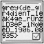

# N00bcak's Last Gradient

## 题目简述

题目泄露了一个卷积神经网络的结构、训练后的参数，以及对单张训练图片执行一次交叉熵反向传播得到的全部参数梯度。输入是一张 $1\times1\times64\times64$ 的灰度图，模型输出 10 个类别。目标是从这一次梯度更新中恢复原始训练图片，并读取图片上的 flag。

单样本梯度包含的约束远多于普通的损失值或分类结果。已知模型参数后，可以构造一张可优化的候选图片，使它产生的参数梯度逐步逼近泄露梯度，这就是本题的梯度反演主线。

## 解题过程

先加载公开的 `model.py`、`model_weights.pt` 和 `gradients.pt`。模型由三层卷积/池化特征提取和一层全连接分类头组成，泄露文件依次保存了每个权重与偏置张量的梯度。

交叉熵对最后一层偏置的梯度为：

$$
\nabla_b L=\operatorname{softmax}(z)-\operatorname{onehot}(y)
$$

除真实类别外的分量均为正，真实类别对应分量则会减去 1。因此，最后一层偏置梯度中最小分量的下标就是标签。该样本恢复出的类别为 `7`：

```python
final_bias_grad = target_grads[-1]
label = int(torch.argmin(final_bias_grad).item())
```

接着随机初始化一个与输入同形状的 `image_logits`，实际送入模型的是 `sigmoid(image_logits)`，从而把像素限制在 $[0,1]$。冻结模型参数，仅优化图片。每一步都重新计算候选图片产生的参数梯度，并最小化它与泄露梯度之间的均方误差：

$$
L_{\mathrm{match}}=\sum_i\left\lVert
\nabla_{\theta_i}\operatorname{CE}(f_\theta(x'),y)-g_i
\right\rVert_2^2
$$

这里必须给 `torch.autograd.grad` 传入 `create_graph=True`，因为还需要对“梯度之间的误差”继续求导，才能更新候选图片：

```python
candidate = torch.sigmoid(image_logits)
loss = F.cross_entropy(model(candidate), y)
dummy_grads = torch.autograd.grad(loss, tuple(model.parameters()), create_graph=True)
match_loss = sum(
    F.mse_loss(dummy, target, reduction="sum")
    for dummy, target in zip(dummy_grads, target_grads)
)
```

为减少孤立噪点，再加入较小的总变分正则项：

$$
L=L_{\mathrm{match}}+3\times10^{-5}L_{\mathrm{TV}}
$$

用 Adam 以学习率 `0.03` 优化约 6000 步，并在中后段两次减半学习率。最终图片中的文字已经能够直接辨认。下图是官方仓库保存的原始训练样本，用于赛后与反演结果做视觉核验；它不是解题脚本的输入。



将各行拼接得到：

```text
grey{de_gr4dienT_1eaK4ge_rUnz_D3eP_iNdeeD_1906.08935}
```

## 方法总结

单样本梯度会同时泄露标签和输入。最后一层偏置梯度提供了几乎直接的标签 oracle；已知标签后，再通过二阶自动微分匹配全部参数梯度即可反演像素。`sigmoid` 约束与总变分正则不是攻击成立的根本原因，但能显著提高图像稳定性和可读性。真实系统若必须共享梯度，应考虑大批次聚合、裁剪、噪声注入和差分隐私，而不能把梯度视为无敏感信息的中间量。
