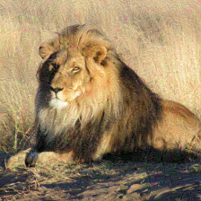

# Foul the model

## 题目简述

服务接收一张图片，并用相同的 ImageNet 预处理分别送入 ResNet-50 与 SqueezeNet 1.1。只有同时满足以下两个 top-1 条件才返回 flag：ResNet-50 将图片识别为 lion（WordNet `n02129165`），而 SqueezeNet 将同一图片识别为五类家猫之一。核心是构造具有模型迁移差异的定向对抗样本，因此原仓库的 `misc` 分类应调整为 AI/ML。

## 解题过程

### 精确复现服务判定

服务端预处理链为：缩放短边到 256、中心裁剪 $224\times224$、转张量，再按 ImageNet 均值和标准差归一化。猫目标集合为 tabby、tiger cat、Persian cat、Siamese cat 和 Egyptian cat。

必须匹配服务端的严格条件：

```python
resnet_idx = resnet(image).argmax(dim=1).item()
squeezenet_idx = squeezenet(image).argmax(dim=1).item()

challenge_solved = (
    resnet_idx == lion_idx
    and squeezenet_idx in cat_indices
)
```

先选择一张原始状态下能被 ResNet-50 top-1 识别为 lion 的图片。以某个目标猫类别 $y_{cat}$ 为目标，对 SqueezeNet 的交叉熵做迭代定向梯度下降，并把扰动投影回原图的 $L_\infty$ 邻域：

$$
x_{t+1}=\Pi_{[0,1]\cap[x_0-\epsilon,x_0+\epsilon]}
\left(x_t-\alpha\,\operatorname{sign}
\left(\nabla_x\operatorname{CE}(f_{sq}(x_t),y_{cat})\right)\right).
$$

官方脚本默认使用约 $\epsilon=24/255$、$\alpha=2/255$ 和 300 次迭代。关键更新如下：

```python
perturbed = original.clone().detach().requires_grad_(True)

for _ in range(iterations):
    if perturbed.grad is not None:
        perturbed.grad.zero_()

    logits = squeezenet(normalize(perturbed).unsqueeze(0))
    loss = torch.nn.functional.cross_entropy(logits, target_cat)
    loss.backward()

    with torch.no_grad():
        perturbed -= alpha * perturbed.grad.sign()
        delta = (perturbed - original).clamp(-epsilon, epsilon)
        perturbed.copy_((original + delta).clamp(0, 1))
```

每隔若干轮同时检查两个模型：只保存仍被 ResNet-50 top-1 判为 lion 的候选，并优先保留 SqueezeNet 目标猫概率更高的版本。最终还必须用与服务完全相同的落盘图片和预处理重新推理，确认 SqueezeNet 的 **top-1** 已进入猫类别集合。

仓库提供的对抗样本在肉眼上仍是一只狮子，但像素扰动使两个模型产生不同预测：



将满足判定的 PNG 上传后，服务返回：

```text
shellmates{W3ak_m0D3L$_AR3_3a2Y_t0_f0O0o0O0oL}
```

官方 `solve.py` 有一个需要纠正的细节：它部分进度与最终提示只检查“猫是否进入 SqueezeNet top-5”，而服务端实际要求猫是 top-1。编写或复用 solver 时必须以服务端条件为准，不能把脚本的宽松提示当作验收通过。

## 方法总结

- 核心技巧：对弱模型做 $L_\infty$ 约束的定向迭代攻击，同时筛选仍被强模型识别为原类别的样本。
- 识别信号：同一输入由两个模型分别判定、服务要求预测分歧，并公开精确预处理时，应构造模型特异的对抗样本，而不是攻击上传接口。
- 复用要点：优化、保存、重新加载和服务推理必须使用一致的 resize、crop、归一化及 top-1 条件；PNG/JPEG 量化或预处理差异都可能让对抗效果失效。
