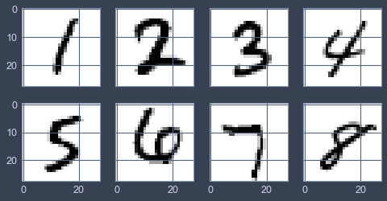
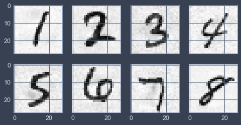

# MiniLCTF2022 NEXT Writeup

## 题目简述

题目给出一个带 Dropout 的全连接 MNIST 分类器和 8 个原始标签为 1 至 8 的样本，要求为每个样本生成定向对抗扰动，使模型依次预测为下一个数字，即 $1\to2,2\to3,\ldots,8\to9$。提交同时限制扰动的 $L_2$ 与 $L_\infty$ 范数，因此不能用肉眼明显的大面积覆盖。



## 解题过程

模型源码只使用 NumPy，需要先复原前向传播和反向传播。对目标类别 $t$，攻击目标可写成 Carlini-Wagner 定向损失的核心形式：

$$
f_6(x')=\left(\max_{i\ne t}Z(x')_i-Z(x')_t\right)^+,
$$

其中 $Z$ 是 logits，$u^+=\max(u,0)$。实际实现可保留目标类别与当前最大非目标类别对应的梯度，将其余 logits 梯度置零，从而一边压低当前赢家，一边提高目标类别。

每轮对 $x'=x+\delta$ 前向传播，若目标置信度未达阈值，则反向求 $\nabla_{x'}L$ 并更新扰动。为限制 $L_2$，当 $\lVert\delta\rVert_2$ 超过动态约束时，沿扰动径向加入惩罚；梯度过大或过小时做归一化。若连续多轮损失几乎不变，再加入小的随机单位向量跳出停滞区域：

```python
grad, pred = get_input_gradient(x + pert, target)

if np.linalg.norm(pert):
    penalty = max((np.linalg.norm(pert) - constrain) ** 3, 0)
    radial = np.sum(np.asarray(pert) * np.asarray(grad))
    grad -= radial * pert / np.linalg.norm(pert) * penalty

grad_norm = np.linalg.norm(grad)
grad *= min(max_grad / grad_norm, 1.0)
pert -= step * grad
```

对每个样本反复降低 `constrain`，保留成功攻击中 $L_2$ 最小者。官方复现记录的八个 $L_2$ 范数为：

```text
[4.09481434, 4.29460970, 6.64396102, 5.90332629,
 6.05583615, 5.71162228, 6.26226203, 3.06447416]
```

均值为 $5.2538632468131485$；对应 $L_\infty$ 为：

```text
[0.51915417, 0.69698550, 0.94458608, 0.80207080,
 0.99483219, 0.70698208, 1.12368025, 0.41853863]
```



## 方法总结

本题的决定性步骤是操纵模型决策，而不是普通数值优化题。一个可复现方案需要同时说明目标损失、输入梯度、范数约束、成功阈值和停滞处理。仅让类别改变并不够，还要检查每个样本的目标类别是否正确，以及 $L_2/L_\infty$ 是否落入服务器限制。保留原图与攻击后样本有视觉价值：它们证明扰动没有把数字直接改造成另一幅明显图案。
