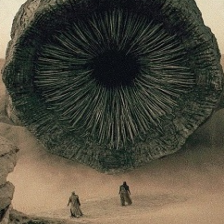

# attack of the worm

## 题目简述

题目给出一个二分类 ResNet-18、固定的 224×224 沙虫图片和完整推理代码。模型最后一层被替换为单个 logit；服务把图片像素除以 255 后直接送入模型，若
`sigmoid(logit) >= 0.5` 就判为沙虫。我们最多能指定 30 个像素的新 RGB 值，目标是在保持其他像素不变的前提下让 logit 小于 0。



这是白盒稀疏对抗样本问题：限制的是被改动像素个数，即像素级
$\ell_0$ 范数，而不是每个像素的扰动幅度。

## 解题过程

### 建立可微扰动

加载官方 `model.pt` 和 `worm.png`，令原图张量为 $x\in[0,1]^{3\times224\times224}$，优化变量为同形状扰动 $d$：

```python
model = resnet18()
model.fc = nn.Linear(model.fc.in_features, 1)
model.load_state_dict(torch.load("model.pt"))

worm = T.ToTensor()(Image.open("worm.png")).unsqueeze(0)
d = torch.zeros_like(worm, requires_grad=True)
```

服务要求“非沙虫”，即 $f(x+d)<0$。官方脚本把目标标签设为 1，却最小化
`-BCEWithLogitsLoss(logit, 1)`，等价于最大化该分类损失，从而把 logit 推向负值。

### 同时优化误分类与稀疏性

$\ell_0$ 不连续，不能直接求梯度。官方解法参考
[$\sigma$-zero 稀疏对抗攻击](https://arxiv.org/abs/2402.01879)，用

$$
\frac{d^2}{d^2+\varepsilon}
$$

近似“该分量是否非零”，并把其均值加入目标：

```python
classification_loss = criterion(logits, torch.tensor([[1.0]]))
l0_surrogate = (d.square() / (d.square() + 0.001)).mean()
loss = -classification_loss + l0_surrogate
```

论文方法的关键不是这个近似式本身，而是结合自适应投影：误分类成功时提高阈值，删除更多小扰动；失败时降低阈值，让优化器先恢复攻击能力。官方脚本实现为：

```python
threshold.add_(
    torch.where(is_adversarial, 0.01 * schedule, -0.01 * schedule)
).clamp_(0, 1)

d.data[d.data.abs() < threshold] = 0
```

每步还要把 $x+d$ 截断到 $[0,1]$，并用余弦退火逐渐降低学习率。为了避免梯度尺度剧烈变化，脚本按 $\ell_\infty$ 范数归一化梯度。

### 按离散像素数保存最佳结果

服务按整数 RGB 修改图片，所以评估稀疏度时也应先量化到 0–255，再按三个通道合并计算被改动的像素位置：

```python
adv = worm + d
changed = ((adv * 255).int() - (worm * 255).int()).abs().sum(dim=1)
pixel_l0 = torch.count_nonzero(changed).item()

if logits.item() < 0 and pixel_l0 < best_l0:
    best_l0 = pixel_l0
    best_adv = adv.detach().clone()
```

训练结束后提取所有变化位置。服务输入格式是
`x,y,r,g,b;x,y,r,g,b;...`，注意 NumPy 图像索引是 `[y, x]`：

```python
changed_xy = torch.nonzero((out - original).abs().sum(dim=2))
payload = ";".join(
    f"{x},{y},{','.join(map(str, out[y, x].tolist()))}"
    for y, x in changed_xy
)
assert len(changed_xy) <= 30
print(payload)
```

提交稀疏扰动后，模型输出低于阈值，服务返回：

```text
UMDCTF{spice_harvester_destroyed_sunglasses_emoji}
```

## 方法总结

- 核心技巧：对白盒图像分类器优化像素级 $\ell_0$ 对抗样本，用可微稀疏代理和自适应阈值在“误分类”与“少于 30 个像素”之间切换。
- 识别信号：模型、固定输入和推理代码全部公开，同时限制修改位置数量而不严格限制 RGB 改变量时，应优先考虑梯度稀疏攻击。
- 复用要点：最终约束按离散像素而非浮点分量计数；保存候选前必须量化并用服务的真实预处理重新推理，否则训练态成功的扰动可能在提交时失效。
