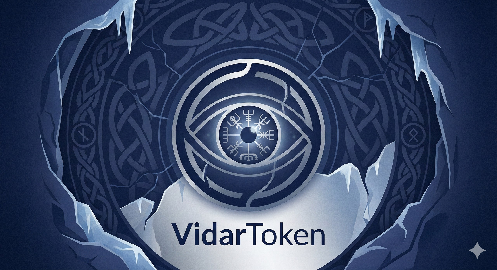
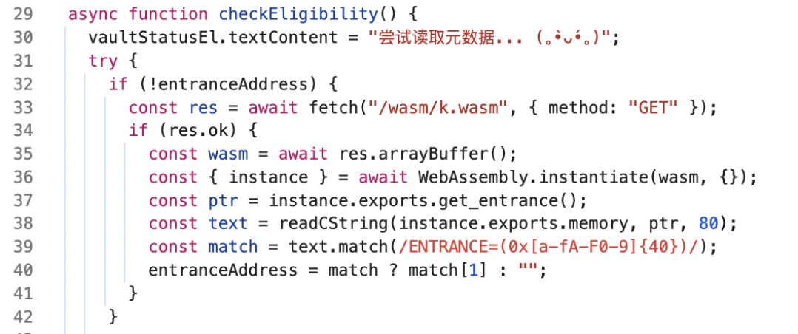
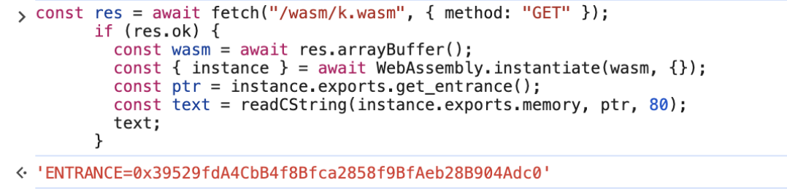
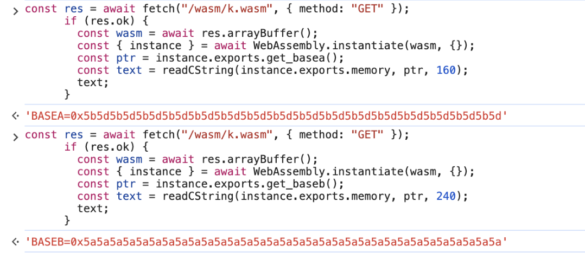
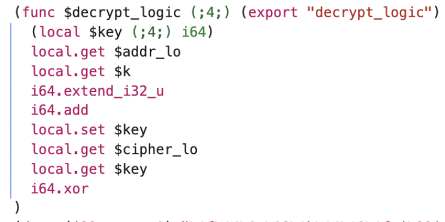
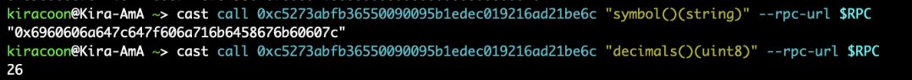
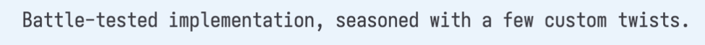
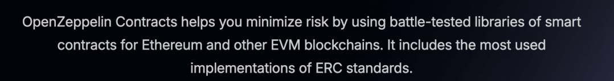
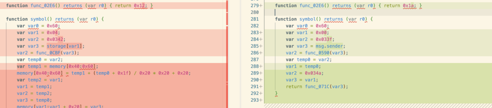

# Vidar Token

## 题目简述

题目没有附件，只有在线靶机。官网题干是一个 Web3 叙事提示：

```text
Vidar Finance has decided to move on-chain.
As an initial foray, we are rewarding those who can hunt down the flags hidden in the depths.
Battle-tested implementation, seasoned with a few custom twists.
You think you're empowered? Prove it.
On-chain, the truth has nowhere to hide.
Fragments in the hollow,
Punks and Coins collide.
Víðarr's eye still sees
Zenless truth inside...
Layers peel away,
Silent god's REvenge.
Decrypt the hidden way
Where broken worlds converge.
```

题面还给了一张 `VidarToken` 主题图：



这是一道 Web3/链上分析与 WASM 解密结合的 Misc 题。前端 `app.js` 暴露 `/rpc` 端点和 `k.wasm` 调用逻辑；WASM 中可以看出解密需要一个基础 key、一个整数 `k` 和地址 `addr`。链上部分通过 `VidarPunks.tokenURI` 找到 `VidarCoin` 地址，`VidarCoin` 是魔改 ERC-20，`decimals` 和 `symbol` 被用来藏解密参数和密文。

关键关系为：

```text
base_key = BASEA xor BASEB
k        = decimals
addr     = msg.sender / CALLER
cipher   = symbol
plain[i] = cipher[i] xor base_key[i % 32] xor (CALLER + decimals).to_bytes(32, "big")[i % 32]
```

## 解题过程

先看前端，确认 RPC 端点和 WASM 的交互方式。



分析 `k.wasm` 后可以确定解密输入和关键常量：







接着根据 `app.js` 提示，通过 `VidarPunks` 的 `tokenURI` 获取 `VidarCoin` 地址。`VidarCoin` 基于 ERC-20 但被修改，可以参考 [EIP-20](https://eips.ethereum.org/EIPS/eip-20) 的标准字段对比异常行为。前端 HTML 注释中的 toolkit 指向链上分析工具，这里可以用 foundry `cast` 查询：

```bash
cast call <VidarPunks> "tokenURI(uint256)(string)" <token_id> --rpc-url <RPC>
cast call <VidarCoin> "decimals()(uint8)" --rpc-url <RPC>
cast call <VidarCoin> "symbol()(string)" --rpc-url <RPC>
cast code <VidarCoin> --rpc-url <RPC>
```

链上分析发现 `decimals` 从 ERC-20 默认语义变成了解密参数，`symbol` 里存的是异常十六进制数据，也就是密文。



解密脚本如下：

```python
BASEA = "0x5b5d5b5d5b5d5b5d5b5d5b5d5b5d5b5d5b5d5b5d5b5d5b5d5b5d5b5d5b5d5b5d"
BASEB = "0x5a5a5a5a5a5a5a5a5a5a5a5a5a5a5a5a5a5a5a5a5a5a5a5a5a5a5a5a5a5a5a5a"

symbol = ""      # VidarCoin.symbol() 返回的异常十六进制数据
CALLER = 0       # 可通过 cast --from 改变并验证
decimals = 26

bytes_a = bytes.fromhex(BASEA.removeprefix("0x"))
bytes_b = bytes.fromhex(BASEB.removeprefix("0x"))
base_key = bytes(a ^ b for a, b in zip(bytes_a, bytes_b))

addr_key = (int(CALLER) + int(decimals)).to_bytes(32, "big")
cipher = bytes.fromhex(symbol.removeprefix("0x"))

plain = bytes(
    c ^ base_key[i % 32] ^ addr_key[i % 32]
    for i, c in enumerate(cipher)
)
print(plain.decode())
```

也可以把反编译的 OpenZeppelin ERC-20 编译后字节码和本题 `VidarCoin` 字节码做 diff。可用 [ethervm.io](https://ethervm.io/decompile) 或 [OpenZeppelin ERC20 源码](https://github.com/OpenZeppelin/openzeppelin-contracts/blob/v5.5.0/contracts/token/ERC20/ERC20.sol) 对照。



题目描述和页面注释还提供了字节码反编译路线的提示：





## 方法总结

- 核心技巧：前端/WASM 确认解密公式，链上查询 ERC-20 异常字段恢复密文和参数。
- 识别信号：Web3 题中 `symbol`、`decimals`、`tokenURI` 出现非标准用途时，要把它们当作可藏数据字段。
- 复用要点：先从前端确定合约地址和 RPC，再用 `cast call` 读链上状态；WASM 中的基础 key 与链上状态往往共同构成解密材料。
