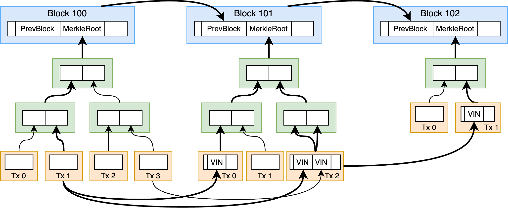

# 哈希三碰撞

## 题目简述

附件包含两个 x86-64 校验程序。第一问要求三个不同的 8 字节输入具有相同的 SHA-256 末 4 字节。第二问从同一个 32 字节状态出发，沿两条各 100 次的

$$
s\leftarrow\operatorname{SHA256}(prefix\parallel s\parallel suffix)
$$

路径迭代，要求中间两状态始终不同，最终两状态与起点的末 8 字节相同。第三问则要求从另一个起点找到 100 条不同路径，全部精确到达第二问的 `base`。

第一问可以逆向后暴力；后两问的预期解不是自行制造 SHA-256 碰撞，而是复用比特币工作量证明、链分叉、区块头、Merkle Tree 与交易输入中已经存在的 Double-SHA256 关系。最终决定性主障碍是链上数据结构和哈希关系图，故整体归为 `blockchain`。

## 解题过程

### 三碰撞之一：32 位截断哈希

程序把三个 16 个十六进制字符的字符串解析为 8 字节，分别计算 SHA-256，只比较最后 4 字节。用哈希表按 32 位后缀分桶，某桶出现第三个元素时输出即可：

```cpp
std::unordered_map<uint32_t, std::vector<uint64_t>> seen;
for (uint64_t x = 0; ; ++x) {
    unsigned char h[32];
    SHA256(reinterpret_cast<unsigned char*>(&x), 8, h);
    uint32_t tail;
    memcpy(&tail, h + 28, 4);
    if (seen[tail].size() == 2) {
        // 输出旧的两个 x 和当前 x 的 8 字节十六进制
        break;
    }
    seen[tail].push_back(x);
}
```

校验器只用 `strcmp` 判断十六进制文本不同，却用 `%2x` 忽略大小写解析字节，因此还有更简单的非预期解：同一 8 字节数据写成三种大小写不同的十六进制字符串，文本不等但解析结果和哈希完全相同。

### 三碰撞之二：用 BTC/BCH 分叉提供两条链

比特币区块哈希是 80 字节区块头的 Double-SHA256。显示区块哈希时通常反转字节序，所以区块浏览器中大量前导零，在 SHA-256 原始字节序里是末尾零，天然满足题目的 64 位截断条件。

区块头布局中，前 4 字节是版本，随后 32 字节是前一区块哈希，余下是 Merkle Root、时间戳、难度和 nonce。若当前状态是前一区块的 Double-SHA256，则一次区块连接恰好拆成题目允许的两步：

1. `SHA256(header[:4] || state || header[36:])`；
2. `SHA256(b"" || state || b"")`。

选择 BTC 与 BCH 在高度 478558 的历史分叉。先取共同祖先区块头 `header0`，提交

```python
initial_data = hashlib.sha256(header0).digest()
```

校验器再做一次 SHA-256 后，`base` 就是祖先区块的 Double-SHA256。随后分别沿 BTC、BCH 读取 50 个区块头；每个区块贡献上面两轮，共 100 轮。两条链每轮前后缀长度相同，分叉后状态不同，最终区块哈希又因 PoW 至少有 8 个末尾零字节而与 `base` 的末 8 字节一致。

### 三碰撞之三：建立链上 SHA-256 DAG

把每个“单次 SHA-256 状态”作为节点。若某个 32 字节节点值 `u` 原样出现在另一个节点 `v` 的 SHA-256 原像中，即

$$
v=\operatorname{SHA256}(a\parallel u\parallel b),
$$

就添加边 $u\to v$，并把 $(a,b)$ 保存为该轮需要提交的 salt。比特币数据提供三类边：

1. 前一区块哈希嵌在后一区块头中；
2. 交易哈希沿 Merkle Tree 合并，奇数叶子会复制自身；
3. UTXO 的前序交易哈希嵌在后续交易输入中。



因为每个链上对象使用 Double-SHA256，每个对象关系应显式拆成两个单 SHA 节点：

```python
def add_doublesha(preimage_from, preimage_to):
    u = sha256(sha256(preimage_from))
    assert u in preimage_to
    mid = sha256(preimage_to)
    v = sha256(mid)
    add_edge(u, mid, preimage_to)
    add_edge(mid, v, mid)
```

加载分叉前后约 100 个区块，验证区块头、无 witness 交易序列化和 Merkle Root 后建图。从较早交易的 Double-SHA256 节点开始深搜到第二问的 `base`，筛选路径长度不超过 100、每侧 salt 不超过 1000 字节，并输出 100 条不同路径。

奇数 Merkle 层会把同一节点在原像中放两次。搜索时不能只用 `preimage.index(node)`，而要枚举每个出现位置；同一对节点于是可以贡献不同的 `(prefix,suffix)`，这些在校验器看来是不同路径。官方简化解表明，仅靠这种重复叶子产生的多重边就足够凑出 100 条路径，UTXO 边不是必需条件。

最终 `magic data` 应取起始交易的一次 SHA-256 中间值，使校验器先哈希一次后得到图搜索的起始 Double-SHA256 节点。每条边输出原像中节点之前和之后的字节即可。构图时对所有节点做

```python
assert sha256(preimage[node]) == node
```

并在输出前逐路径重新执行哈希迭代，确认终点精确等于 `base`。

本次整理静态核对了 `src/1.c`、`src/2.c` 与两份 DAG solver，没有重新访问历史 RPC。高度 478558、区块原始数据及 100 条最终路径仍依赖外部链数据，复现时应从可信节点或区块浏览器交叉验证。

## 方法总结

- 核心技巧：不正面碰撞 SHA-256，而把 PoW 区块链视为已经付出巨额计算成本的哈希语料库，并把区块头、Merkle 与 UTXO 关系还原成可提交的前后缀路径。
- 识别信号：题目允许 `prefix || state || suffix` 迭代、要求大量路径或极低哈希后缀，而公开 PoW 链中恰好存在嵌套 Double-SHA256 时，应考虑链上关系复用。
- 复用要点：处理好显示哈希与内部字节序、Double-SHA256 的两层节点、SegWit 交易的非 witness 序列化，以及同一原像中重复节点产生的多重边；链上历史数据是解法的一部分，不能只保留一个浏览器链接。
