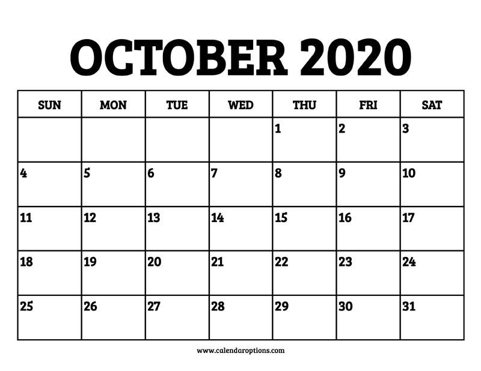

# week1Calendar

## 题目简述

题目给出 2020 年 10 月日历和一串形如 `SAT1`、`MON3` 的坐标。前三个字母指定星期列，末尾数字指定该月日历中的周次；坐标定位到的日期数字再按 `1 -> a`、`2 -> b`、…、`26 -> z` 映射为字母。



```text
SAT1,THU1,MON3,MON2,WED3,SUN2,THU1,SUN4,FRI3,THU1,MON4,MON4,FRI4,THU3,SUN4,SUN2,TUE4,THU1,FRI1,MON3,MON2
```

## 解题过程

把包含 10 月 1 日的第一行记为第 1 周。于是：

- `SAT1` 定位到 10 月 3 日，对应字母 `c`；
- `THU1` 定位到 10 月 1 日，对应字母 `a`；
- `MON3` 定位到 10 月 12 日，对应字母 `l`；
- `MON2` 定位到 10 月 5 日，对应字母 `e`。

按同样规则处理全部坐标，日期序列为：

```text
3,1,12,5,14,4,1,18,16,1,19,19,23,15,18,4,20,1,2,12,5
```

再映射到字母表得到：

```text
calendarpasswordtable
```

按比赛的 flag 格式提交 `0xGame{calendarpasswordtable}`。

## 方法总结

- 核心技巧：把“星期 + 周次”解释为日历坐标，再将日期数字映射到字母表。
- 识别信号：坐标中的字母恰好是星期缩写，数字范围与日历行数一致。
- 复用要点：先明确周次从哪一行开始计数，并用前几个坐标验证映射，避免整串出现固定偏移。
