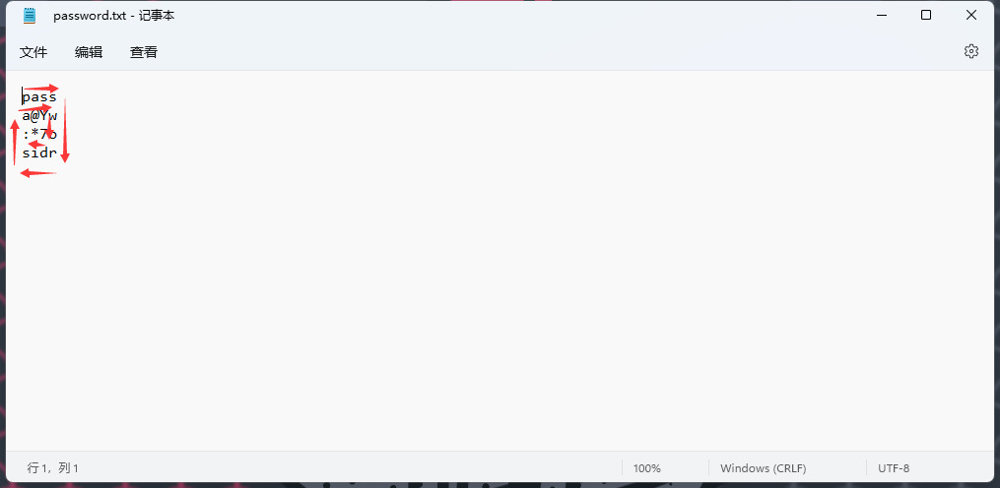

# week3螺旋升天

## 题目简述

题目给出一份 289 字节的伪 ZIP 和一份按 $4\times4$ 方阵排版的密码提示。hint 表明文件字节与密码都按顺时针螺旋顺序重排。因为 $289=17^2$，可把文件视为 $17\times17$ 方阵，逆置换后恢复真正的 ZIP。

## 解题过程

密码图从左上角开始，依次向右、向下、向左、向上并逐层进入中心：



按箭头读取 16 个字符得到：

```text
passwordis:a@Y?*
```

因此压缩包密码是 `a@Y?*`。

文件本身使用同一种置换。下面函数生成从外圈到中心的螺旋位置序列；附件中的第 $i$ 个字节应放回该序列指向的线性位置。恢复后先检查 ZIP 固定签名 `PK\x03\x04`，再写出结果。

```python
from pathlib import Path


def spiral_positions(size):
    positions = []
    left, right = 0, size - 1
    top, bottom = 0, size - 1

    while left <= right and top <= bottom:
        for col in range(left, right + 1):
            positions.append(top * size + col)
        top += 1

        for row in range(top, bottom + 1):
            positions.append(row * size + right)
        right -= 1

        if top <= bottom:
            for col in range(right, left - 1, -1):
                positions.append(bottom * size + col)
            bottom -= 1

        if left <= right:
            for row in range(bottom, top - 1, -1):
                positions.append(row * size + left)
            left += 1

    return positions


scrambled = Path("flag.zip").read_bytes()
size = 17
assert len(scrambled) == size * size

restored = bytearray(len(scrambled))
for value, destination in zip(scrambled, spiral_positions(size)):
    restored[destination] = value

assert restored.startswith(b"PK\x03\x04")
Path("flag_restored.zip").write_bytes(restored)
```

使用密码 `a@Y?*` 解压 `flag_restored.zip`，得到：

```text
0xGame{6e93c04c-5478-4d34-9dd2-c46742d551bb}
```

## 方法总结

本题是二维螺旋置换，不是对字节值做加密。题目尺寸恰为完全平方数，且恢复目标有 ZIP 魔数可供验证，这两点共同确定了建模方式。逆置换时要区分“按螺旋顺序读取矩阵”和“把顺序数据写回螺旋位置”；方向写反会得到长度正确但魔数错误的文件。原解遗漏了实际压缩包密码，本 WP 已从图中完整还原。
