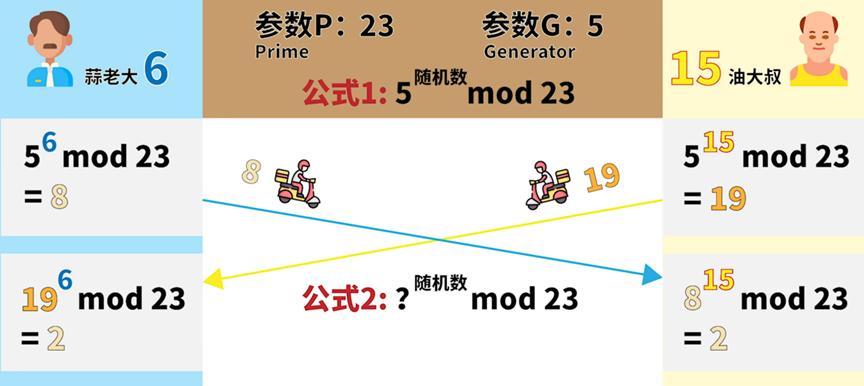

# Diffie-Hellman

## 题目简述

服务端公开 512 位素数 $p$、生成元 $g$ 和 Alice 公钥 $A=g^a\bmod p$，要求客户端提交 Bob 公钥 $B$。双方以 Diffie-Hellman 方式得到共享秘密，随后将其经 SHA-256 派生为 AES-ECB 密钥并加密 flag。题目不要求恢复 Alice 私钥，只需作为 Bob 正常完成一次密钥交换。

## 解题过程



客户端任选私钥 $b$，计算并提交：

$$
B=g^b\bmod p
$$

服务端计算 $s=B^a\bmod p$，客户端则计算 $s=A^b\bmod p$。由于两者都等于 $g^{ab}\bmod p$，客户端能够得到相同的 AES 密钥：

```text
key = SHA256(long_to_bytes(s))
```

完整本地复现脚本如下：

```python
from Crypto.Util.number import *
from hashlib import sha256
from Crypto.Cipher import AES
from Crypto.Util.Padding import unpad
from pwn import *

io = process(["python", "task.py"])

io.recvuntil(b"The Prime is ")
p = int(io.recvline().strip())
io.recvuntil(b"The Generator is ")
g = int(io.recvline().strip())
io.recvuntil(b"Alice's Public Key is ")
A = int(io.recvline().strip())
b = getRandomRange(2, p)
B = pow(g, b, p)
io.recvuntil(b"Bob's Public Key: ")
io.sendline(str(B).encode())
s = pow(A, b, p)
key = sha256(long_to_bytes(s)).digest()
cipher = AES.new(key, AES.MODE_ECB)
io.recvuntil(b"Encrypted Flag: ")
enc = bytes.fromhex(io.recvline().strip().decode())
print(unpad(cipher.decrypt(enc), 16))
```

源码只断言 `B != A`，正常生成 Bob 密钥即可满足约束。收到十六进制密文后使用相同的共享秘密派生密钥并解密、去除 PKCS#7 填充，即可得到 flag。

## 方法总结

- 核心技巧：以协议参与方身份完成 Diffie-Hellman，而不是求离散对数。
- 识别信号：公开 $p,g,A$ 并允许提交 $B$，随后使用共享秘密派生对称密钥。
- 复用要点：严格复现共享秘密的序列化、哈希和分组模式；DH 数学正确但字节转换或填充处理不一致，同样无法解密。
