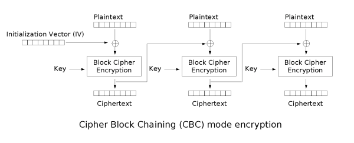
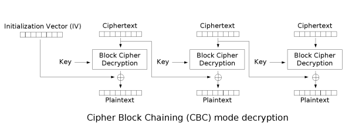

# CCB

## 题目简述

服务提供固定 key、固定 IV 的 AES-CBC 加密机，每次只能加密 48 字节（3 个分组）。先允许取得 IV 和一次正常密文，随后要求提交两组明文，使其加密结果依次呈现 `C-B-C` 与 `C-C-B`。关键是利用 CBC 中每个明文块可通过异或前一密文块控制下一块的输入。

## 解题过程





设已知明文三个块都为 $A$，对应密文为 $C_1,C_2,C_3$：

$$
C_1=E(A\oplus IV),\quad C_2=E(A\oplus C_1)
$$

要让新密文成为 $C_1,C_2,C_1$，前两块仍取 $A$，第三块取：

$$
P_3=A\oplus IV\oplus C_2
$$

因为 $E(P_3\oplus C_2)=E(A\oplus IV)=C_1$。

第二次要得到 $C_1,C_1,C_2$，令：

$$
P_1=A,\quad P_2=A\oplus IV\oplus C_1,\quad P_3=A
$$

完整交互脚本如下：

```python
from base64 import b64decode, b64encode
from pwn import *

io = process(['python', 'task.py'])
A = b'1' * 16

def xor(*blocks):
    return bytes(x ^ y ^ z for x, y, z in zip(*blocks))

io.sendlineafter(b'Your option: ', b'0')
io.recvuntil(b'IV in Base64: ')
iv = b64decode(io.recvline().strip())

io.sendlineafter(b'Your option: ', b'1')
io.sendlineafter(b'plaintext in Base64: ', b64encode(A * 3))
io.recvuntil(b'Ciphertext in Base64: ')
ciphertext = b64decode(io.recvline().strip())
c1, c2, _ = [ciphertext[i:i + 16] for i in range(0, 48, 16)]

cbc = A + A + xor(A, iv, c2)
ccb = A + xor(A, iv, c1) + A

io.sendlineafter(b'Your option: ', b'2')
io.sendlineafter(b'plaintext in Base64: ', b64encode(cbc))
io.sendlineafter(b'plaintext in Base64: ', b64encode(ccb))
io.interactive()
```

## 方法总结

- 核心技巧：根据 CBC 递推式反推能产生目标密文块的明文块。
- 识别信号：固定 key/IV、可选明文加密 oracle，以及服务端只检查密文块之间的相等关系。
- 复用要点：逐块写出 $C_i=E(P_i\oplus C_{i-1})$，再从目标密文倒推异或量；不要把 CBC 的可塑性误写成分组密码本身被破解。
