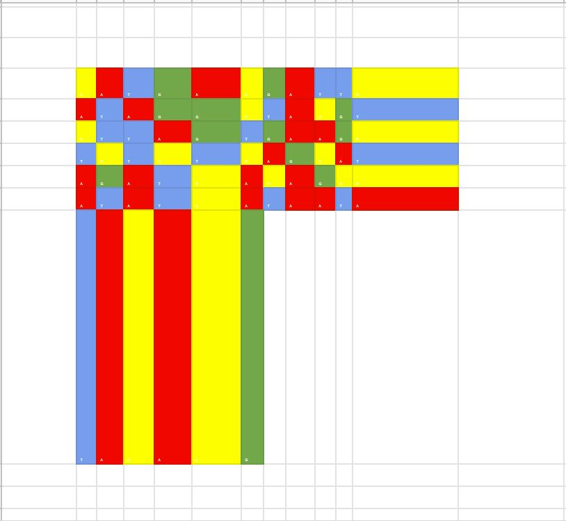

# BYUCTF 2022 - Kendrick Lamar

## 题目简述

题目只给出一张由四种颜色和 `A/C/G/T` 字母组成的模糊图片。字母提示数据与 DNA 序列有关，而颜色能在字形难以辨认时提供更稳定的第二重编码信息。



## 解题过程

从上到下、每行从左到右读取图片；模糊位置不要只猜字母，而应按照同色字符对应同一碱基的关系校正。得到序列：

```text
CATGACGATTCATAGGCTACGTCTTAGTGAAGCTCTCTCAGCATAGATCACAGCCATATCATAATATACACG
```

这不是把三联体翻译成氨基酸，而是使用 DNA Writer 的四进制字符映射。原题所指的 [DNA Writer](https://earthsciweb.org/js/bio/dna-writer/) 正是生成该图片时使用的码表；将序列送入其解码功能，输出为：

```text
BYUCTF.1TS 1N 0UR BL00D.
```

句点标出花括号边界，空格替换为下划线，同时按赛事格式调整前缀大小写，即可得到：

```text
byuctf{1ts_1n_0ur_Bl00d}
```

## 方法总结

本题的关键不是泛泛尝试“DNA 解码”，而是同时利用字母与颜色确认特定码表。图片质量不足时，颜色是纠错信息；正文已经记录完整序列和解码结果，外链只用于复现特定码表。最后还要结合 flag 格式规范化标点和空格。
