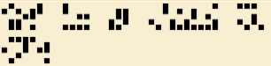

# BYUCTF 2023 - Compact

## 题目简述

题目给出一行由上下排列圆点组成的符号，提示它被设计为拉丁字母的紧凑替代。决定性步骤是识别 Dotsies 字体/编码。



## 解题过程

Dotsies 把每个拉丁字母编码为同一竖列中五个位置的点阵，单词间仍留有明显空格。按 Dotsies 字母表逐列对应，原图解码为：

```text
well its definitely more compact
```

按题目格式加上前缀和花括号：

```text
byuctf{well its definitely more compact}
```

## 方法总结

符号密码先从重复单元、字符宽度和分词方式判断它是“字体替换”还是一般加密。题图保持了空格，且每个字符都使用固定五点槽位，这些特征比盲目做频率分析更快指向 Dotsies。
