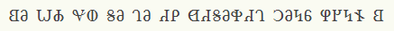

# BYUCTF 2023 - 𐐗𐐡𐐆𐐑𐐓𐐄?

## 题目简述

标题和图片使用非拉丁字符。检索标题中的单个 Unicode 字符可确认它们属于 Deseret Alphabet；这是一套按英语语音设计的字母表。



## 解题过程

题中文字转写为：

```text
𐐒𐐀 𐐎𐐌 𐐏𐐅 𐐝𐐀 𐐓𐐀 𐐇𐐙 𐐔𐐇𐐝𐐀𐐡𐐇𐐓 𐐣𐐀𐐤𐐞 𐐐𐐊𐐤𐐆 𐐒
```

逐个按音值读出后得到：

```text
B Y U C T F DESERET MEANS HONEY BEE
```

其中 `deseret` 的传统释义就是“honey bee”。整理格式后为：

```text
byuctf{DESERET_MEANS_HONEY_BEE}
```

比赛还接受了少数同音拼写，但上面是官方标准答案。

## 方法总结

面对罕见文字，先利用可复制的 Unicode 标题定位字符集，再按该文字的音值而非外观替换。正文已经给出完整转写与语义，因此不依赖在线转换器也能复核结论。
