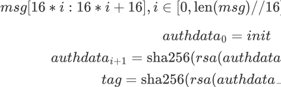

# d3sys

## 题目简述

题目服务包含两层：第一层是 `CTR-SM4` 加密的登录 token 和基于 `CRT-RSA` 的 tag 校验，需要利用 CTR 可篡改性把普通用户 token 改成 admin；第二层登录 admin 后只能拿到 CRT-RSA 私钥指数片段的最低位和密文 flag，需要结合泄露位恢复 RSA 私钥或足够的 CRT 参数来解密。

## 解题过程

服务端实现了一个 `D3_ENC` 类，使用 `CTR` - `SM4` 加密消息，并用 `CRT` - `RSA` 实现认证机制。

**第一部分（交互时间限制 60s 内）**

### 认证机制（get_tag）



### 注册机制

输入 `username`，要求长度小于 20，并随机生成 8 字节 nonce。

按如下方式生成 token：

服务端使用 `CTR` - `SM4` 加密 token，把 `Username` 和 `tag` 记录到字典中，并把 `username`、加密后的 token 和 nonce 发送给客户端。

### 登录机制

输入 `username` 和加密后的 token。

服务端解密 `encrypted token`，并判断 token 是否满足以下条件：

- `tag` = `dict[username].tag`

- `username` 位于 `dict.keys` 中

- `username = token["username"]`

-

- `|time-token['time']|<1`

- `admin=1`

如果 token 同时满足这些条件，就能以 `Admin` 身份登录并执行后续操作。

**注意：** 这里忘记写 `unpad`，导致只有少数 ID 长度可用。

### 攻击方式

可以发现其加密模式是 `CTR`，可以视为流密码。

因此可以通过 `xor` 修改明文块。但 `tag` 不能改变，所以可以构造 `username` 得到一个不敏感块。

1. 选择 `len(username)=15`，让 nonce 单独占据一个块，也就是不敏感块。

2. 通过 xor 把 `admin` 从 0 改成 1。

3. xor nonce 所在块，使 nonce 后面的 `authdata` 保持不变。

4. `json.loads(plain)` 要求 `plain` 是合法 `UTF` - `8` 字符串，因此需要多爆破几次，大约 10 次即可。

### 第二部分（以 admin 身份登录）

菜单：

```
 ====---------------------------------------------------------------------------
---
------------------------=
 |    |              +----------------------------------------------------------
---
--------+              |
 |    |              |            [G]et_dp_dq     [F]lag     [T]ime     [E]xit
          |              |
 |    |              +----------------------------------------------------------
---
--------+              |
 ====---------------------------------------------------------------------------
---
------------------------=
```

CRT-RSA 的解密指数额外做了 blinding，只能获得其中部分最低位以及加密后的 flag。

这里涉及的内容可以参考 AC22 或 EC22 的论文实现。重要密码分析思想是：CRT-RSA 实现有时会泄露 `dp`/`dq` 的部分信息；如果低位信息足够，并结合 RSA 同余关系，就可以用 Coppersmith/小根方法恢复缺失高位或素因子。在这份 WP 中，公开 `tk` 脚本按论文参数只能达到约 170 bit，因此最终路线调整为 General 的策略。

从选手 WP 看，大多数解法都是直接修改脚本得到结果。

我也限制过 defund 的 Coppersmith 脚本 bound，但仍然有选手通过提高参数跑出了结果。

## 方法总结

- 核心技巧：CTR 流密码按位篡改、构造 insensitive block 保持 JSON/token 可解析、CRT-RSA `dp/dq` 低位泄露恢复。
- 识别信号：加密 token 使用 CTR 且服务端只校验解密后的 JSON 字段时，应先尝试 xor 字段值；RSA 菜单只给 CRT 指数低位时，应转向 partial key exposure。
- 复用要点：第一阶段要让 `username` 长度对齐，使 nonce 单独占块并抵消后续 authdata 变化；第二阶段论文/脚本只是方法来源，实际参数需要按题目泄露位数和 Coppersmith bound 调整。
