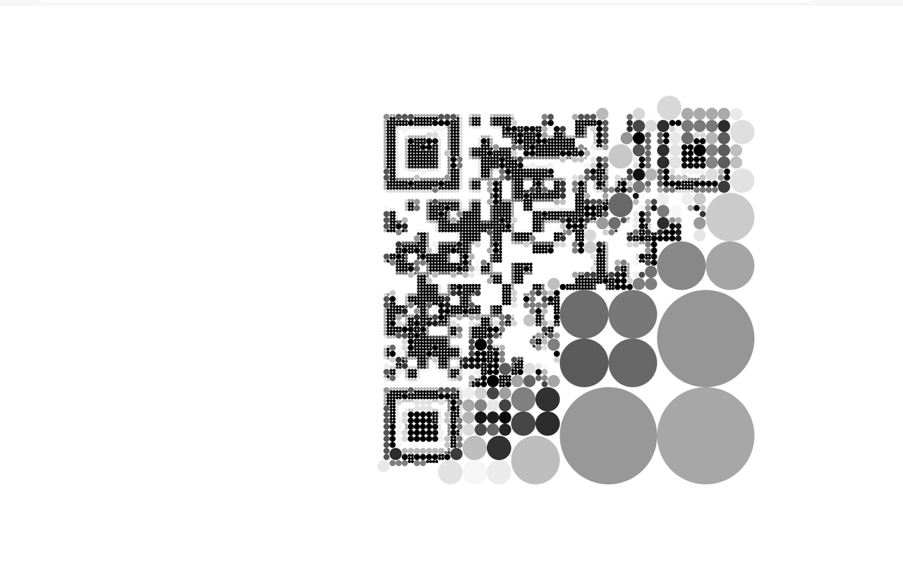

# Baldur's Gate 3 Complete Spell List

## 题目简述

附件 `flag_spells.json` 由若干组《博德之门 3》法术名组成，每组通常含三个按 `"1"`、`"2"`、`"3"` 编号的法术。题目标题提示需要查出每个法术所属的等级，再把等级当作编码数字。

游戏中法术等级为 1 至 9，但没有常规的 8 级法术；题目把字符串 `"8"` 作为 8 级占位项。将法术等级减一后，取值恰好落在 0 至 8，可组成九进制数。每三个九进制位转换为一个 ASCII 字符，最终得到一个刮图页面地址；其查询参数还能继续进行 Base64 解码，直接定位到二维码图片。

## 解题过程

### 建立法术到等级的映射

按标题搜索完整法术列表，逐级整理 1 至 9 级法术。解题所需的不是网页本身，而是如下规则：

- `Level_1` 中的法术映射为数字 0；
- `Level_2` 中的法术映射为数字 1；
- 以此类推，`Level_9` 映射为数字 8；
- 题目中的字面量 `"8"` 归入 `Level_8`，映射为数字 7。

因此只要把收集结果保存成如下结构即可，不需要在 WP 中粘贴完整的数百项法术表：

```json
{
  "Level_1": ["Animal Friendship", "Armour of Agathys"],
  "Level_2": ["Protection from Poison", "Cloud of Daggers"],
  "Level_3": ["Protection from Energy: Thunder"],
  "Level_6": ["Soul Ascension"],
  "Level_8": ["8"],
  "Level_9": ["Aegis of the Absolute", "Power Word Kill"]
}
```

实际求解时，`All_Spells.json` 必须包含附件中出现的全部法术名；缺少任意一项都会导致映射失败。

### 识别九进制编码

第一组法术的等级依次为 2、3、6。等级减一后得到数字 `1, 2, 5`，把它们作为九进制数：

$$
(125)_9=1\times 9^2+2\times 9+5=104
$$

十进制 104 对应 ASCII 字符 `h`。接下来三组分别得到：

$$
(138)_9=116,\quad (138)_9=116,\quad (134)_9=112
$$

对应字符串 `http`。这验证了“等级减一后按九进制解释”的判断。

### 完整解码

下面的脚本读取法术等级表和题目附件，按数字键顺序拼接每组九进制位，再转换为 ASCII：

```python
import json
from pathlib import Path


def load_json(path: str):
    return json.loads(Path(path).read_text(encoding="utf-8"))


all_spells = load_json("All_Spells.json")
spell_to_digit = {
    spell: int(level.removeprefix("Level_")) - 1
    for level, spells in all_spells.items()
    for spell in spells
}

encoded_groups = load_json("flag_spells.json")
decoded = []

for group in encoded_groups:
    ordered_spells = [
        spell
        for _, spell in sorted(group.items(), key=lambda item: int(item[0]))
    ]
    digits = "".join(str(spell_to_digit[spell]) for spell in ordered_spells)
    decoded.append(chr(int(digits, 9)))

print("".join(decoded))
```

输出是一个 `koalastothemax.com` 刮图页面。页面查询参数中的 Base64 数据为：

```text
aHR0cHM6Ly9pLnBvc3RpbWcuY2MvOVh4MHhmc2svZmxhZy5wbmc=
```

它解码后是托管二维码图片的地址。因此有两种等价做法：

1. 在刮图页面上逐步擦除圆形遮罩，显露并扫描二维码；
2. 对查询参数做 Base64 解码，直接访问底层图片并扫描二维码。

第二种方法说明刮图效果并不是额外的密码层，真正的解码链为“法术等级码表→九进制 ASCII→Base64→二维码”。



## 方法总结

本题的关键是从标题和数据形态构造码表。九个法术等级在统一减一后自然覆盖 $0$ 至 $8$，而三个九进制位的范围为 $0$ 至 $728$，足以编码 ASCII。先用开头几组验证出 `http`，再批量解码全部数据，可以避免在错误编码方向上继续尝试。

外部法术列表只负责提供“法术名属于哪个等级”这一事实，正文已经完整保留其作用、映射规则和解码过程；具体搜索结果页会变化，且不是复现所必需，因此不保留外链。最终页面的查询参数仍需继续检查，Base64 解码可以绕过交互式刮图并直接取得二维码载荷。
