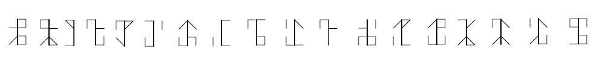

# GlacierCTF2022 - Strange Letters

## 题目简述

题目给出一张由 18 个线状符号组成的图片，并以“monk”提示数字体系。符号是西多会修士数字：一根竖线周围的四个象限分别编码个位、十位、百位和千位，因此一个字形可表示 0 至 9999。

## 解题过程



读取时以中央竖线为基准：右上是个位、左上是十位、右下是百位、左下是千位。按该码表逐个识别图片中的字形，得到下列四位十进制分组；前导零必须保留：

```text
4929 4592 1050 0772 3075 7016 7833 6101 0971
7163 0072 8926 6135 7739 4514 4473 4763 1997
```

这些分组不是分别转十六进制，而是先首尾拼成一个大十进制整数，再把整个整数转换为十六进制和字节串：

```python
groups = """4929 4592 1050 0772 3075 7016 7833 6101 0971
7163 0072 8926 6135 7739 4514 4473 4763 1997""".split()

value = int("".join(groups), 10)
hex_text = f"{value:x}"
print(bytes.fromhex(hex_text).decode())
```

十六进制结果以 `476c6163696572` 开头，即 ASCII 的 `Glacier`，完整输出为：

```text
Glacier{MoNk5_t0g3Ther_5tr0nG}
```

## 方法总结

视觉密码的关键是先确认符号所表达的“数字层”，再判断数字如何组成最终载荷。西多会字形把四位十进制数压进空间象限；本题还多了一层“大十进制整数转十六进制再转 ASCII”，不能把每个四位分组单独转换。
