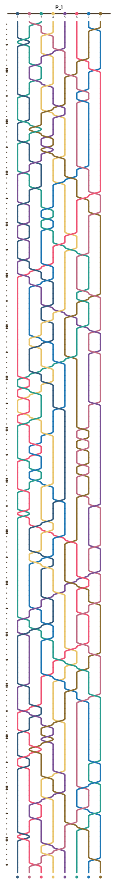
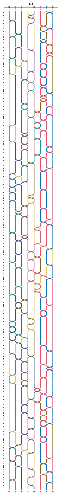

# Long Khipu Braids

## 题目简述

题目把公开密钥矩阵伪装成 14 张 khipu 绳结 SVG：Bob 发布 `P_1` 至 `P_7`，Alice 发布 `E_1` 至 `E_7`。公开参数为 $n=8$、$p=10000019$、$q=17$、$t=42$，需要先从图形恢复 Artin 辫群词，再重建 Lawrence–Krammer–Bigelow（LKB）表示，最后攻击基于共轭矩阵的密钥交换。

下面两张图分别展示 Bob 与 Alice 的第一条公开绳。主绳连接点从左到右给出初始股线编号，每个水平寄存器只有一次相邻交叉；侧边小结只是寄存器标记，不参与解码。





## 解题过程

先解析每个 SVG 中标记为 `crossing` 的元素，按纵坐标从上到下排序。交叉发生在相邻的第 $i$、$i+1$ 股：若左侧股从左上穿到右下，记为正生成元 $\sigma_i$；反向上穿则记为 $\sigma_i^{-1}$。官方脚本还会核对解析出的词长是否与 `challenge.py` 清单中的 `crossings` 一致。

```python
for crossing in svg_crossings_sorted_by_y:
    lane = round((min(x0, x1) - margin_x) / lane_gap)
    sign = 1 if x0 < x1 else -1
    word.append(sign * (lane + 1))
```

接着在 $\mathbb F_p$ 上构造 LKB 表示。其基为：

$$
\{v_{j,k}\mid 1\le j<k\le n\}
$$

所以矩阵维度为 $d=n(n-1)/2=28$。用公开 $q,t$ 按 LKB 分段作用公式生成 $M_1,\ldots,M_7$，并验证远距离生成元可交换、相邻生成元满足辫关系：

$$
M_iM_j=M_jM_i\quad(|i-j|\ge2)
$$

$$
M_iM_{i+1}M_i=M_{i+1}M_iM_{i+1}
$$

将每条 SVG 解出的辫词按顺序乘矩阵，得到 Bob 和 Alice 的公开矩阵。它们满足：

$$
P_i=BM_iB^{-1},\qquad E_i=AM_iA^{-1}
$$

未知矩阵 $A,B$ 虽出现在共轭式中，移项后却得到关于矩阵元素的线性方程：

$$
BM_i=P_iB,\qquad AM_i=E_iA
$$

把每个未知 $28\times28$ 矩阵的 784 个元素展平，并把 7 组等式的每个元素作为一行，即可在 $\mathbb F_p$ 上求齐次线性系统的右核。官方实例中两个系统的核维数均为 1，因此可从核基直接取出可逆的 $A'$、$B'$。它们与真实矩阵至多相差非零标量：

$$
A'=\alpha A,\qquad B'=\beta B
$$

共享状态使用换位子：

$$
K=A'B'{A'}^{-1}{B'}^{-1}=ABA^{-1}B^{-1}
$$

标量在乘逆过程中完全抵消。按行优先顺序序列化 $K$ 的全部有限域元素，以 `Long-Khipu-Braids-v4.0` 为上下文计算 SHA-256 得到密钥。先验证：

$$
\operatorname{SHA256}(key\parallel nonce\parallel ciphertext)[:16]=tag
$$

通过后，以 `SHAKE256(key || nonce)` 生成等长密钥流并异或密文，得到：

```text
grey{kn0t5_BiNd_s3CreTs_w1Th0Ut_w0rdZ_0ops_1_t1nK_i_Ti3D_mY_h4Ndz_2gether...}
```

## 方法总结

这题的难点分成表示层和代数层。SVG 不是装饰，而是无损编码的辫群词；识别 LKB 参数后，非交换共轭问题可通过 intertwiner 等式线性化。由于解空间是一维，恢复出的共轭矩阵只缺一个标量，而换位子恰好消除了这一歧义。完整闭环必须同时核对 SVG 交叉数、辫关系、线性方程和最终认证标签，任何一步的编号或乘法方向错误都会在后续验证中暴露。
