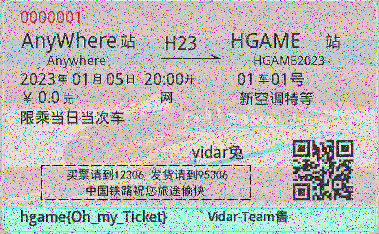

# 兔兔的车票

## 题目简述

题目生成 3 张随机噪声图作为一次性密钥，将 `flag.png` 与 15 张普通图片打乱后逐像素异或。16 个明文只使用 3 张噪声图，必然有多组密文复用同一密钥；两张同密钥密文再次异或会消去噪声，留下两张明文的异或结果。

## 解题过程

若：

$$
C_f=P_f\oplus N,\qquad C_i=P_i\oplus N
$$

则：

$$
C_f\oplus C_i=P_f\oplus P_i
$$

普通图片的生成函数只产生 `width * height * 23` 个随机位，却用 `zfill` 补到 `width * height * 24` 位，再把字节打乱。因此图像中分散着大量值为 0 的通道；在这些位置，$P_f\oplus P_i$ 会直接暴露 $P_f$ 的像素。题目只有 16 张密文，可以枚举全部 $16\times16$ 组合并人工查看输出：

```python
from pathlib import Path

from PIL import Image

SOURCE = Path("pics")
OUTPUT = Path("results")
OUTPUT.mkdir(exist_ok=True)


def xor_images(left, right):
    if left.size != right.size:
        raise ValueError("image sizes differ")

    result = Image.new("RGB", left.size)
    for y in range(left.height):
        for x in range(left.width):
            pixel_left = left.getpixel((x, y))
            pixel_right = right.getpixel((x, y))
            result.putpixel(
                (x, y),
                tuple(a ^ b for a, b in zip(pixel_left, pixel_right)),
            )
    return result


images = [Image.open(SOURCE / f"enc{index}.png").convert("RGB") for index in range(16)]
for left_index, left in enumerate(images):
    for right_index, right in enumerate(images):
        recovered = xor_images(left, right)
        recovered.save(OUTPUT / f"pair-{left_index:02d}-{right_index:02d}.png")
```

命中与 `flag.png` 复用噪声图的组合时，彩色噪声中可以辨认出车票版式、二维码和底部 flag：



底部文字为：

```text
hgame{Oh_my_Ticket}
```

## 方法总结

- 核心技巧：利用 XOR 密钥复用，令两份密文相互异或以消去共同噪声。
- 泄漏来源：普通明文图含有大量零通道，使 `flag.png` 的对应像素在异或结果中近似原样显现。
- 复用要点：图像使用 XOR 加密时，应先检查密钥数量、尺寸和复用关系；候选数很小时，两两组合并用视觉结构筛选往往比恢复完整密钥更直接。
