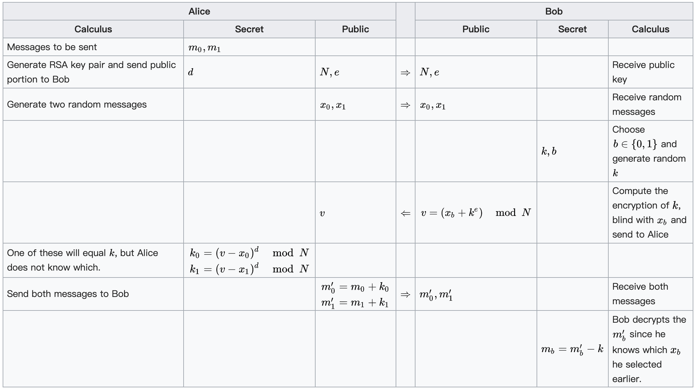

# Hackergame2020 不经意传输 WP

## 题目简述

服务实现基于 RSA 的 1-out-of-2 Oblivious Transfer。第一问可按协议选择并解出一条消息；第二问要求同时恢复 $m_0,m_1$。漏洞不在 RSA，而在两条“消息”其实是 64 随机字节的十六进制文本，每个字节只能是 `0-9a-f`，分布远非均匀随机。

## 解题过程



服务公开 $(n,e,x_0,x_1)$。正常协议中，接收者选择 $b$ 和随机 $k$，发送：

$$
v=x_b+k^e\pmod n,
$$

服务返回：

$$
m'_i=m_i+(v-x_i)^d\pmod n.
$$

接收者以 $m_b=m'_b-k$ 解出所选消息。第一问照此实现即可；若消息整数跨过模数，需要对解出的代表元加若干次 $n$，再按十六进制字符约束筛选。

第二问选择一个小整数 $s$，令两个掩码满足 $k_0=-s k_1$。由：

$$
k_0^e=v-x_0,\qquad k_1^e=v-x_1
$$

可解得：

$$
v=(x_0+s^e x_1)(1+s^e)^{-1}\pmod n.
$$

于是服务响应的线性组合消去未知掩码：

$$
m'_0+s m'_1=m_0+s m_1\pmod n.
$$

官方脚本取 $s=19$。从最低字节开始，对 `0123456789abcdef` 的 $16^2$ 个字符对预计算：

```python
table = [[] for _ in range(256)]
for a in "0123456789abcdef":
    for b in "0123456789abcdef":
        value = ord(a) + 19 * ord(b)
        table[value % 256].append((a, b, value // 256))
```

令当前低字节为 $r\bmod256$，查表得到所有可能字符对与进位，再更新 $r\leftarrow\lfloor r/256\rfloor-\text{carry}$，以动态规划保留所有候选。最后用 RSA 关系：

$$
(m'_0-m_0)^e\equiv v-x_0\pmod n
$$

验证候选 $m_0$，再由线性组合算出 $m_1$。候选量随会话波动，官方脚本会重连，直到估计穷举量低于 $2^{24}$。

## 方法总结

密码协议的安全证明通常假设消息来自规定的均匀域；先把随机字节编码成十六进制文本，会引入强烈的高位结构。代数上消去掩码后，这种结构足以逐字节恢复两条消息。实现协议时必须核对证明中的消息空间、编码与长度条件，不能只照抄公式。
