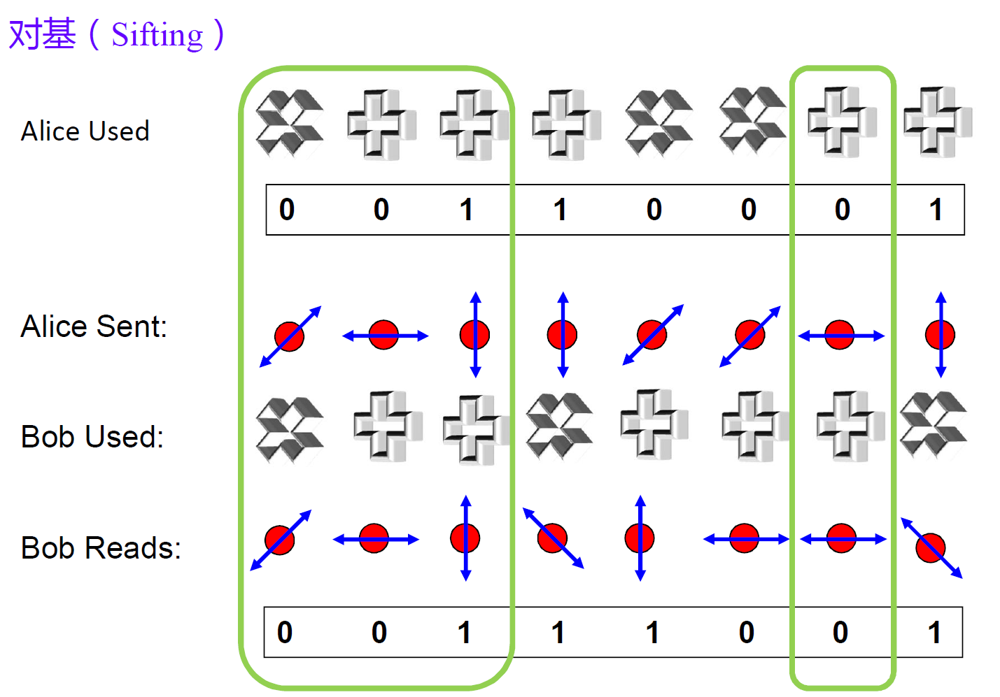

# 量子藏宝图

## 题目简述

题目分两阶段。第一阶段模拟 BB84 量子密钥分发，要求与服务器筛选出至少 128 位共享密钥；第二阶段给出一张 129 量子比特的 Bernstein–Vazirani 电路图，需要从被混淆的黑盒电路中恢复 128 位隐藏字符串。

本题的关键是量子协议和线性函数结构，而不是网页漏洞，因此归入密码与协议方向。

## 解题过程

### 第一阶段：BB84 对基

BB84 使用两组基：题目以 `+` 表示 Z 基，以 `x` 表示 X 基。Alice 随机选择制备基和比特，Bob 随机选择测量基；双方公开基底后，只保留基底相同位置的比特。



题目没有检查 Alice 的输入是否随机，所以可以让全部量子态都为 0、全部制备基都为 `+`。为确保匹配位置不少于 128，输入 512 位最稳妥：

```python
alice_basis = "+" * 512
alice_bits = "0" * 512
```

服务器返回同长度的 `bob_basis`。源码生成正确密钥的逻辑是：

```python
correct_key = "".join(
    alice_bits[i]
    for i in range(len(alice_basis))
    if alice_basis[i] == bob_basis[i]
)
```

因为 Alice 的基底全是 `+`、比特全是 `0`，只需统计 `bob_basis` 中 `+` 的数量 $k$，提交 `"0"*k`。注意服务端要求提交完整筛选结果，不是只截前 128 位；512 次随机选择中约有 256 个位置匹配，几乎必然超过门槛。

### 第二阶段：识别 Bernstein–Vazirani 黑盒

Bernstein–Vazirani 问题中的黑盒为：

$$
f_s(x)=s\cdot x\bmod 2
=\sum_{i=0}^{n-1}s_i x_i\bmod 2.
$$

经典算法要分别查询单位向量才能逐位得到 $s_i$；量子电路先把输入寄存器制备为叠加态，并把辅助比特制备为 $\lvert-\rangle$，一次调用黑盒后再施加 Hadamard 门，测量输入寄存器即可得到整个 $s$。

题目直接暴露了电路内部。图中 $q_0$ 至 $q_{127}$ 是输入寄存器，$q_{128}$ 是辅助比特；两条灰色 barrier 之间就是黑盒区域：


实现黑盒 $f_s$ 时，只要 $s_i=1$，就放置一条以 $q_i$ 为控制端、以 $q_{128}$ 为目标端的 CNOT。因此恢复规则非常简单：

```text
q_i 与 q_128 之间存在 CNOT  <=>  s_i = 1
没有该 CNOT                  <=>  s_i = 0
```

### 排除 X、Z 混淆门

图中还随机插入了 X 和 Z 门，但它们不会改变应恢复的比特：

- 黑盒前输入量子比特均为 $\lvert+\rangle$，而 $X\lvert+\rangle=\lvert+\rangle$；后面又出现配对 X 门，所以 X 混淆无效；
- Z 门成对作用在同一控制量子比特上，而且控制端 Z 与 CNOT 对易，因此

$$
(Z\otimes I)\operatorname{CNOT}(Z\otimes I)
=\operatorname{CNOT}.
$$

所以不需要模拟完整量子态，只需记录 CNOT 的控制线编号。

`map.py` 在绘图前执行了 `flag_01 = flag_01[::-1]`，故图上的编号顺序与文本相反：$q_{127}$ 对应输出比特串的第一位，$q_0$ 对应最后一位。按 $q_{127},q_{126},\ldots,q_0$ 的顺序写出 128 位，每 8 位按大端序转成一个 ASCII 字符。官方电路还原结果为：

```text
flag{f470a85b9b}
```

原官方 PDF 共 8 页，其中 BB84 基础、对基示意、Bernstein–Vazirani 推导、X/Z 门等价关系和最终读取顺序均已转写在正文。网页输入框、测量结果和纯公式截图已文本化，没有重复保留。

## 方法总结

第一阶段利用协议实现未强制随机性的特点，把对基后的密钥化简成“匹配位置数量个 0”；第二阶段利用 Bernstein–Vazirani 黑盒的门级结构，把 CNOT 是否存在直接映射为隐藏比特。处理量子电路图时，应先分清寄存器、barrier 和 oracle，再用量子态或门的代数性质消去无效混淆，最后核对 Qiskit 的比特显示顺序与字节序。
