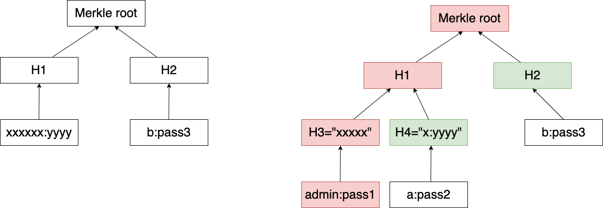

# O(1) 用户登录系统

## 题目简述

服务用 SHA-1 Merkle root 代替用户数据库。导入时接收至少两行 `user:password`，拒绝用户名 `admin`，把每行的 SHA-1 摘要作为叶子；父节点总按两个 20 字节子摘要的字典序排序后计算

$$
H_{parent}=\operatorname{SHA1}(\min(H_l,H_r)\parallel\max(H_l,H_r)).
$$

登录凭据格式为 `user:password:proof`。服务从 $\operatorname{SHA1}(user\mathbin{:}password)$ 开始，依次与 proof 中每个 20 字节摘要合并，最终结果等于已保存的 root 即认证成功。漏洞在于验证器没有绑定叶子索引或树高：它只证明“某个起点沿这条路径能到 root”，没有证明该起点确实是导入树的一片叶子。决定性主障碍是 Merkle commitment 验证协议缺失结构约束以及对 SHA-1 摘要字节的构造，因此归为 `crypto`。

## 解题过程

### 把内部节点伪装成导入用户

直接寻找以 `admin:` 开头的 40 字节内部节点需要同时固定 SHA-1 摘要前缀，代价过高。更有效的方向是反过来扩展树：先构造两个真实叶子

$$
H_3=\operatorname{SHA1}(\texttt{admin:pass1}),\qquad
H_4=\operatorname{SHA1}(\texttt{a:pass2}),
$$

再让导入列表的第一行字节恰好为 $H_3\parallel H_4$。导入程序会把这 40 字节当成 UTF-8 文本 `user:password`，对其再次哈希得到

$$
H_1=\operatorname{SHA1}(H_3\parallel H_4).
$$

第二个导入用户取 `b:pass3`，其叶摘要记为 $H_2$。导入时只存在 $H_1,H_2$ 两片叶子；登录时却从更深一层的 `admin:pass1` 开始，提交兄弟节点 $H_4$ 和叔叔节点 $H_2$，即可依次还原 $H_1$ 与 root。



### 满足文本解析和排序条件

由于导入接口调用 Python `input()` 并执行 `s.split(':')`，$H_3\parallel H_4$ 必须满足：

- 两段 SHA-1 摘要都能严格解码为 UTF-8；
- 拼接结果不能含换行，并且恰好只含一个冒号；
- 为使服务端排序后的拼接仍为 $H_3\parallel H_4$，需有 $H_3<H_4$；
- root 层同理选择 $H_1<H_2$。

可以分别枚举三个十进制密码：先找不含冒号的 $H_3$，再找含且仅含一个冒号并满足 $H_4>H_3$ 的 $H_4$，最后找 $H_2>H_1$。核心生成代码如下：

```python
from hashlib import sha1

def valid_utf8(h, colons):
    try:
        s = h.decode("utf-8")
    except UnicodeDecodeError:
        return False
    return "\n" not in s and s.count(":") == colons

pass1 = 0
while True:
    h3 = sha1(f"admin:{pass1}".encode()).digest()
    if valid_utf8(h3, 0):
        break
    pass1 += 1

pass2 = 0
while True:
    h4 = sha1(f"a:{pass2}".encode()).digest()
    if valid_utf8(h4, 1) and h3 < h4:
        break
    pass2 += 1

h1 = sha1(h3 + h4).digest()
pass3 = 0
while True:
    h2 = sha1(f"b:{pass3}".encode()).digest()
    if h1 < h2:
        break
    pass3 += 1
```

交互时先导入两行 `h3.decode()+h4.decode()` 与 `b:pass3`，结束导入后提交：

```python
credential = f"admin:{pass1}:" + h4.hex() + h2.hex()
```

本地验证可完全复刻服务端折叠过程：从 `sha1(f"admin:{pass1}")` 出发，依次与 `h4`、`h2` 排序拼接并哈希，断言结果等于导入两行计算出的 root。这里利用的不是已知 SHA-1 碰撞，而是验证器允许把不同深度的节点当作同一种 membership proof 起点。

## 方法总结

- 核心技巧：利用 Merkle proof 未绑定树高和叶子身份，把合法导入叶的原文构造成另一棵更深树的内部节点。
- 识别信号：认证器只接收“当前哈希 + 兄弟摘要列表”，却不校验索引、方向、深度或叶子域分离时，应检查内部节点是否能冒充叶子。
- 复用要点：哈希树应对叶子和内部节点使用不同域标签，并把树高、叶子索引和左右方向纳入验证；构造文本型摘要时还必须同时满足编码、分隔符和换行约束。
