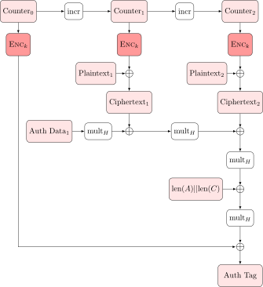

# 认证恢复码

## 题目简述

系统提供注册、登录、用户列表和恢复账户功能。注册时，服务端用全局随机 `SECRET_KEY` 对用户名做 AES-256-GCM 加密，关联数据为 `admin=false`，nonce 却由用户输入确定性生成：

```text
nonce = HMAC-SHA256(key=username, message=password)[:12]
credential = AES-GCM(SECRET_KEY, nonce, plaintext=username, AD="admin=false")
```

`credential` 中的 `ct`（包含 16 字节 GCM tag）、`nonce` 和 `ad` 用 bincode 序列化后再 Base64 编码，作为认证恢复码返回。普通恢复使用 `SECRET_KEY` 解密恢复码，并要求 nonce 与服务器保存的凭据匹配；`super_mode` 则改用：

```text
SUPER_KEY = SHA256(ADMIN_USERNAME || ADMIN_PIN)
```

超级管理员名为 `ADMIN_` 加 16 位数字，PIN 由 6 个 `0` 至 `8` 的字符组成，候选空间为 $9^6=531441$。恢复接口全局最多允许 30 次请求。

第一问的决定性弱点是 AES-GCM nonce 复用，可伪造 `admin=true` 凭据；第二问的决定性弱点是 non-committing AEAD 在弱密钥空间上形成的 Partitioning Oracle，可用一次请求同时检验一组密钥。

## 解题过程

### 恢复码格式

Rust 结构体字段顺序是 `ct, nonce, ad`。在默认 bincode 编码下，每个 `Vec<u8>` 都先放一个 8 字节小端长度，再放数据。因此可用以下代码拆分和重组：

```python
from base64 import b64decode, b64encode

def decode_recovery(code: str):
    raw = b64decode(code.strip('"'))
    fields = []
    for _ in range(3):
        n = int.from_bytes(raw[:8], "little")
        fields.append(raw[8:8+n])
        raw = raw[8+n:]
    assert not raw
    return fields  # ct || tag, nonce, ad

def encode_recovery(fields):
    raw = b"".join(len(x).to_bytes(8, "little") + x for x in fields)
    return b64encode(raw).decode()
```

### Hello? Admin!：nonce 复用与 GHASH 伪造

HMAC 在处理短于 SHA-256 块长 64 字节的密钥时，会先用零补齐密钥块。因此对于不含零结尾的短用户名 `u`，`u` 与 `u || 00` 形成的 HMAC 密钥块相同。给两个用户设置相同密码即可强制 nonce 复用：

```python
u1 = b"attacker"
u2 = b"attacker\x00"
password = b"password"

# 调用 POST /register，username/password 都以 Base64 传入
code1 = register(u1, password)
code2 = register(u2, password)
blob1, nonce1, ad1 = decode_recovery(code1)
blob2, nonce2, ad2 = decode_recovery(code2)
assert nonce1 == nonce2
```

GCM 的认证使用 $\mathbb{F}_{2^{128}}$ 有限域上的 GHASH。令 $H=\operatorname{AES}_K(0^{128})$，将填充后的关联数据、密文和长度块记为 $X_1,\ldots,X_m$，则标签可写成：

$$
T = C + \sum_{i=1}^{m} X_i H^{m-i+1},
\qquad C=\operatorname{AES}_K(J_0).
$$



当 key 和 nonce 相同时，$H$ 与 $C$ 也相同。对两组已知的“关联数据、密文、标签”作差可消去 $C$，得到仅以 $H$ 为未知量的有限域多项式方程。求出候选 $H$ 后回代求 $C$，并用已知明文与 GCM 计数器密钥流得到目标密文，就可以为以下目标消息计算新 tag：

```text
plaintext = u1
associated data = "admin=true"
nonce = nonce1
```

将伪造的 `ciphertext || tag, nonce1, b"admin=true"` 重新编码为恢复码，调用普通模式 `/recover` 为 `u1` 设置新密码。解密能恢复 `u1`，nonce 又与服务器中 `u1` 的旧凭据相同，因此恢复通过；新凭据的管理员位由攻击者提交的 AD 保留。再以新密码登录 `u1`，服务端见 `credential.ad == b"admin=true"` 后返回第一个 flag。

### Super Talent!：Partitioning Oracle 恢复 SUPER_KEY

获得普通管理员身份后，携带登录返回的 Bearer JWT 访问 `/users`，即可从用户列表得到超级管理员用户名。此时只剩 6 位 PIN 未知，可枚举全部候选密钥：

```python
from hashlib import sha256
from itertools import product

keys = [
    sha256(admin_username + ''.join(pin).encode()).digest()
    for pin in product('012345678', repeat=6)
]
```

若逐个试密钥，30 次恢复额度远远不够。Partitioning Oracle 的做法是为一组候选密钥 $K_j$ 构造同一份密文和固定 tag，使它在该组中每个密钥下都能通过 GCM 认证。对每个 $K_j$ 都可计算对应的 $H_j$ 和 $C_j$，要求消息多项式 $P$ 满足：

$$
T = C_j + \operatorname{GHASH}_{H_j}(AD,CT)
\quad\text{for every }K_j\text{ in the selected set}.
$$

将已知的长度块移到右侧后，这些约束变成在不同 $H_j$ 上的多项式取值点。对点集做拉格朗日插值即可求出密文块系数，从而生成 multi-key collision ciphertext。实际求解脚本可用 NTL 实现 $\mathrm{GF}(2^{128})$ 上的插值，再将系数转回 GCM 块字节序。

用 `nonce = 00...00`、`tag = 00...00`和 `AD = b"admin=true"` 构造测试恢复码，向 `/recover` 提交 `super_mode=true`。响应形成一个布尔 oracle：

- 真实 `SUPER_KEY` 在当前碰撞集中：GCM 认证成功，解出的随机用户名通常不在表中，接口返回 404。
- 真实密钥不在集合中：GCM 认证失败，接口返回 401。

第一问的伪造恢复已消耗 1 次额度，而恢复出 `SUPER_KEY` 后还要保留 1 次请求来重置超级管理员密码，所以 Partitioning Oracle 最多可用 28 次。将 531441 个候选平衡分成 13 组，每组不超过 $\lceil531441/13\rceil=40881$，与 $2^{15}$ 仍处在同一数量级。最多查询前 12 组；若都失败，真实密钥必在最后一组，无需再消耗 oracle。定位中组后，每轮对当前候选的一半构造碰撞密文，根据 404/401 保留正确的一半；至多再用 $\lceil\log_2 40881\rceil=16$ 轮收敛到唯一 `SUPER_KEY`，oracle 请求数不超过 $12+16=28$。加上第一问和最后重置密码各 1 次，两问合计不超过 30。

最后用恢复出的 `SUPER_KEY` 正常生成一份可解密为 `ADMIN_USERNAME` 的 GCM 恢复码，在 `super_mode=true` 下将超级管理员密码重置为已知值。以该用户名和新密码登录，服务端通过用户名等值判定其为超级管理员，返回第二个 flag。

## 方法总结

- 核心技巧：先用 HMAC 短密钥零填充等价制造 AES-GCM nonce 复用并伪造管理员 AD；再用 GCM 的 non-committing 性构造多密钥碰撞密文，把弱 PIN 空间按组二分。
- 识别信号：AEAD nonce 由用户可控输入确定性派生，认证失败通过状态码可观测，且高权限密钥来自可枚举 PIN。
- 复用要点：GCM 的 nonce 在同一 key 下必须全局唯一；解密成功/失败不应成为可反复查询的分组 oracle；低熵口令不能直接派生高价值 AEAD 密钥，应使用带盐慢 KDF、严格限速和 committing AEAD 设计。
