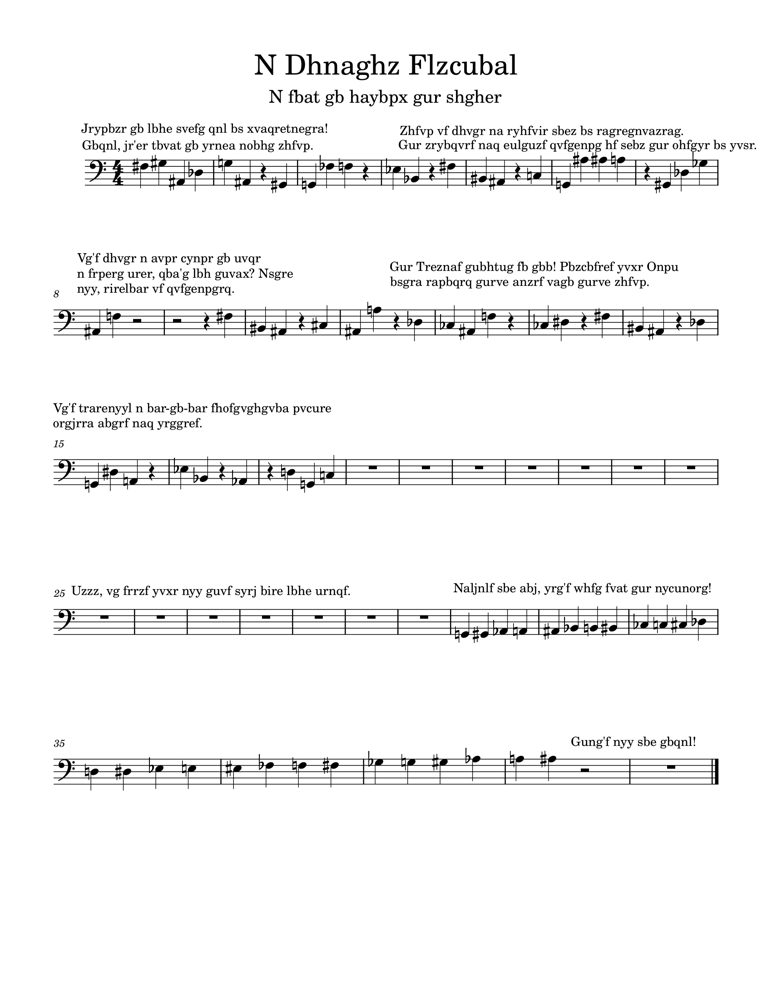

# A Quantum Symphony

## 题目简述

附件是一页乐谱与一段经过 ROT13 处理的文字。服务端接收 4 量子比特的 OpenQASM 电路，删除测量操作后计算状态向量，再把概率最高的三个基态映射成和弦音符。参赛者需要依次提交 12 个正确和弦。



## 解题过程

先对页面上的文字做 ROT13，得到的核心提示是“twelve bars of the jazzy blues”和“the key lies in the land of C maj”。结合乐谱可知目标是 C 大调的标准十二小节布鲁斯进行：

```text
C C C C | F F C C | G F C G
```

源码给出了音符到 4 比特基态的映射。对于每个三和弦，构造一个仅在对应三个基态上具有非零振幅的归一化状态。三个振幅均取

$$
\sqrt{\frac{1}{3}},
$$

这样它们的测量概率都是 $1/3$，并且稳定成为概率最高的三个音符。用 Qiskit 的 `StatePreparation` 生成该状态，再将电路转译到服务端接受的 `rx`、`ry`、`rz` 与 `cx` 门集合：

```python
amps = [0j] * 16
for basis in chord_basis_states:
    amps[basis] = (1 / 3) ** 0.5

qc.append(StatePreparation(amps), range(4))
qc = transpile(qc, basis_gates=["rx", "ry", "rz", "cx"], optimization_level=3)
```

导出 OpenQASM 后按顺序提交 12 个电路。不要加入测量门，也不要依赖比特串显示顺序猜音符；应直接按题目源码的基态整数映射填写振幅。全部和弦匹配后得到：

```text
maple{qu4ntum_p34c3_c0d3_1s_m3m3nt0_m0r1}
```

## 方法总结

题目把音乐替换密码和量子状态构造串在一起：PDF 决定和弦序列，源码决定音符的基态编码。状态向量验证只看最终概率分布，因此没有必要手工设计门序列；先写出目标向量，再让编译器分解到允许门集更可靠。处理此类量子题时还应明确端序和基态编号，否则电路本身正确也会映射到错误音符。
