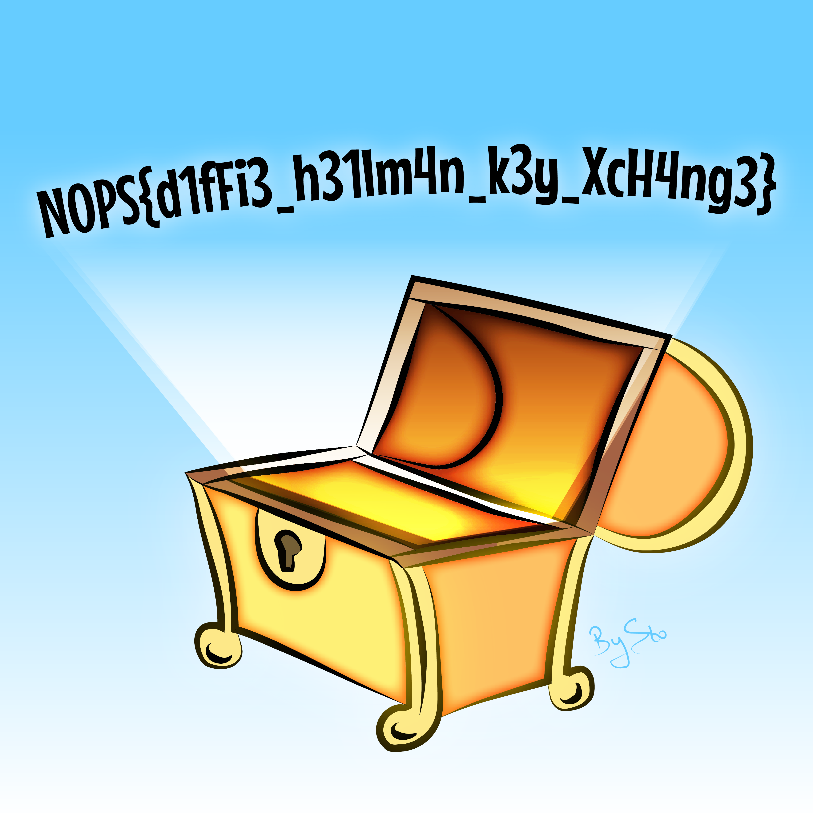

# Key Exchange

## 题目简述

服务端先发送三个定长整数，接收客户端返回的一个整数后，再返回使用共享秘密加密的数据。需要识别密钥交换协议、完成客户端一侧的计算，并解密最终内容。

## 解题过程

源码依次输出素数 $p$、生成元 $g$ 和服务端公钥：

$$
A=g^a\bmod p
$$

客户端应自行选择私钥 $b$，计算并发送：

$$
B=g^b\bmod p
$$

双方随后得到同一个 Diffie-Hellman 共享秘密：

$$
K=B^a=A^b=g^{ab}\bmod p
$$

这道题不要求破坏 Diffie-Hellman，而是要求按源码中的二进制协议实现一个客户端。每个公开参数都被填充为 1024 字节的大端整数，因此必须使用 `recvn(1024)`，不能用按行读取；否则网络分片可能导致整数边界错位。

服务端把共享秘密转换为最短大端字节串，计算 SHA-256 作为 256 位 AES 密钥，再用随机 IV 进行 AES-CBC 加密。返回值的前 16 字节就是 IV，其余部分是 PKCS#7 填充后的密文。完整客户端如下：

```python
import sys
from hashlib import sha256

from Crypto.Cipher import AES
from Crypto.Util.Padding import unpad
from pwn import remote

FIELD_SIZE = 1024

io = remote(sys.argv[1], int(sys.argv[2]))
p = int.from_bytes(io.recvn(FIELD_SIZE), "big")
g = int.from_bytes(io.recvn(FIELD_SIZE), "big")
server_public = int.from_bytes(io.recvn(FIELD_SIZE), "big")

client_private = 2
client_public = pow(g, client_private, p)
io.send(client_public.to_bytes(FIELD_SIZE, "big"))

shared = pow(server_public, client_private, p)
shared_bytes = shared.to_bytes(
    (shared.bit_length() + 7) // 8,
    "big",
)
key = sha256(shared_bytes).digest()

encrypted = io.recvall()
iv, ciphertext = encrypted[:16], encrypted[16:]
plain = unpad(
    AES.new(key, AES.MODE_CBC, iv).decrypt(ciphertext),
    AES.block_size,
)
open("decrypted-flag.png", "wb").write(plain)
```

解密结果是 PNG 图片，图片中的文字即为 flag：



```text
N0PS{d1fFi3_h31lm4n_k3y_XcH4ng3}
```

## 方法总结

本题的核心是从数据流和源码中还原协议，而不是寻找密码学漏洞。实现二进制协议时，要同时核对字段顺序、固定长度、字节序、密钥派生方式、IV 位置和填充规则。任何一个细节与服务端不一致，都会表现为共享密钥错误或解密填充失败。
