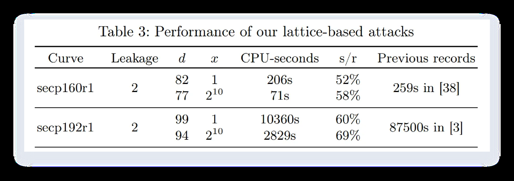

# superguess++

## 题目简述

这是极紧参数的 Hidden Number Problem：约 93 个样本，每个样本泄露 nonce MSB 的 2 bit，模数规模约 `2^182`。解法借助 Fourier/lattice sieving 类 HNP 攻击代码，按题目参数改样本与校验逻辑恢复隐藏值。

## 解题过程

### 关键观察

这是极紧参数的 Hidden Number Problem：约 93 个样本，每个样本泄露 nonce MSB 的 2 bit，模数规模约 `2^182`。

### 求解步骤

这题是经典的 HNP 问题，但是界限非常紧（已知 93 个样本，每个样本泄露 MSB 的 2 bits，一共
186 bits，而未知数有 182 bits）。
搜索 HNP 相关攻击，找到一篇论文 Attacking ECDSA with Nonce Leakage by Lattice Sieving:
Bridging
the
Gap
with
Fourier
Analysis-based
Attacks
（https://eprint.iacr.org/2024/296.pdf），其结果（表格 3）和这题的参数比较相似：
这题的参数是 q ~= 2^182, leakage = 2, d = 93, CPU-seconds ≤ 300 s * number_of_cpus。
修改论文代码（https://github.com/JinghuiWW/ecdsa-leakage-attack，需要去除用于验证的样
本，修改校验逻辑）可以得到以下 exp：
from time import time, process_time
from Crypto.Util.number import getPrime
from random import randint
from myHNPSolver import HNP, HNPSolver
from pwn import process, remote
from ast import literal_eval

class HNPGenerator:
    """
    Generate a HNP instance.
    """

    def __init__(self, q, s, num_lattice):
        self.q = q
        self.s = s
        self.num_lattice = num_lattice
        self.t = []
        self.a = []
        self.alpha = None

    def sampling(self):
        """
        Sampling randomly
        """
        t = randint(1, self.q - 1)
        a = (t * self.alpha - randint(0, self.q >> self.s)) % self.q
        return t, a

    def generate(self):
        """
        Generate (t, a)
        """
        self.alpha = randint(0, self.q - 1)

        num = self.num_lattice
        samples = [self.sampling() for _ in range(num)]
        self.t = [samples[i][0] for i in range(num)]
        self.a = [samples[i][1] for i in range(num)]

if __name__ == "__main__":
    args_n = 160 # bit size of the modulus (182)
    args_s = 2 # leakage
    args_m = args_n // 2 + 2 # number of samples for constructing the lattice
    args_g = 0 # number of GPUs to use
    args_t = 8 # number of CPU threads to use

    # Generate a prime number

    # Create HNP instance by HNPGenerator and recover the hidden number by
HNPSolver

    local = False
    if local:
        q = getPrime(args_n)
        print("q =", hex(q))
        HNPGen = HNPGenerator(q, args_s, args_m)
        HNPGen.generate()
myHNPSolver.py
        HNP_instance = HNP(q, args_s, HNPGen.t, HNPGen.a)
    else:
        io = process(["python3", "server.py"])
        q = int(io.recvline().decode().split("=")[1])
        t = literal_eval(io.recvline().decode().split("=")[1])
        a = literal_eval(io.recvline().decode().split("=")[1])
        args_n = q.bit_length()
        args_m = args_n // 2 + 2
        HNP_instance = HNP(q, args_s, t, a)

    if args_g > 0:
        sieve_alg = "gpu"
    else:
        sieve_alg = "bdgl"

    walltime_1 = time()
    cputime_1 = process_time()
    Solver = HNPSolver(HNP_instance, (args_m, 0, 0, 0), x=0,
quickCheckTech=True, threads=args_t, sieve_algorithm=sieve_alg, gpus=args_g)
    Solver.solve("eliminateAlpha")
    walltime_2 = time()
    cputime_2 = process_time()
    print("HNPSolver Spent Time (walltime):{:.2f} min".format((walltime_2 -
walltime_1) / 60))
    print("HNPSolver Spent Time (cputime):{:.2f} min".format((cputime_2 -
cputime_1) / 60))

    print("alpha =", Solver.alpha)

    if not local:
        io.sendline(str(Solver.alpha).encode())
        io.interactive()
"""
    The primary module for solving the Hidden Number Problem.
    Implement the HNPSolver class, which includes a new lattice construction,
linear predicate, interval reduction algorithm, and pre-screening technique.
"""

import math
from decimal import Decimal
from time import time
from multiprocessing import Pool
from myutil import *
from fpylll import IntegerMatrix, BKZ
from fpylll.util import gaussian_heuristic

class HNP:
    def __init__(self, q, s, t, a):
        self.q = q  # The modulus q
        self.n = (q - 1).bit_length()  # The bit-size
        self.s = s  # The number of leakage
        self.l = self.n - self.s  # l is a parameter to HNP
        self.t = t
        self.a = a

class HNPSolver:
    def handleData(self, num_samples):
        len1, len2, len3, _ = num_samples

        for i in range(sum(num_samples)):
            t_mod = self.HNP_instance.t[i] % self.HNP_instance.q
            a_mod = self.HNP_instance.a[i] % self.HNP_instance.q

            # Distribute samples into respective lists
            if i < len1:
                self.t_lattice.append(t_mod)
                self.a_lattice.append(a_mod)
            elif len1 <= i < len1 + len2:
                self.t_reduce.append(t_mod)
                self.a_reduce.append(a_mod)
            elif len1 + len2 <= i < len1 + len2 + len3:
                self.t_narrow.append(t_mod)
                self.a_narrow.append(a_mod)
            else:
                self.t_check.append(t_mod)
                self.a_check.append(a_mod)

    def __init__(self, HNP_instance, num_samples, r=None, k1=None, G=None,
x=0, error_rate=0, quickCheckTech=True, threads=4, sieve_algorithm="bdgl",
gpus=0):
        """
        Initialize the instance for hidden number recovery.

        Args:
            HNP_instance: An instance containing parameters for the hidden
number problem.
            num_samples (tuple): A tuple representing the number of samples
for different stages
                                (num_lattice, num_reduce, num_narrow,
num_check).
            r (optional): An optional parameter representing a specific known
value (default: None).
            k1 (optional): Another optional parameter (default: None).
            G (optional): The generator point (default: None).
            x (int, optional): An optional parameter affecting lattice
construction (default: 0).
            error_rate (float, optional): The error rate for calculations
(default: 0).
            quickCheckTech (bool, optional): Enables quick check technique for
optimization (default: True).
            threads (int, optional): Number of threads to use for sieving
(default: 4).
            sieve_algorithm (str, optional): The sieving algorithm to use
(default: "gpu").
            gpus (int, optional): The number of GPUs to use for sieving
(default: 1).
        """

        self.HNP_instance = HNP_instance

        # Unpack number of samples for different stages
        self.num_lattice, self.num_reduce, self.num_narrow, self.num_check =
num_samples
        # For constructing the lattice
        self.t_lattice, self.a_lattice = [], []
        # For pre-sceening technique
        self.t_reduce, self.a_reduce = [], []
        # For interval reduction algorithm
        self.t_narrow, self.a_narrow = [], []
        # For linear predicate
        self.t_check, self.a_check = [], []

        self.handleData(num_samples)

        # Precompute constants to avoid repetitive calculations
        self.const1 = self.HNP_instance.q // 2 ** (self.HNP_instance.s + 1)
        self.const2 = self.const1 + self.HNP_instance.q // 2 **
(self.HNP_instance.s + 4)

        # Calculate the inverse of the first t_lattice element modulo q
        self.t0_inverse = pow(self.t_lattice[0], -1, self.HNP_instance.q)

        # Replace arrays to store adjusted sample values
        self.t_lattice_replaced = [0] * (self.num_lattice - 1)
        self.a_lattice_replaced = [0] * (self.num_lattice - 1)
        self.t_reduce_replaced = [0] * self.num_reduce
        self.a_reduce_replaced = [0] * self.num_reduce
        self.t_narrow_replaced = [0] * self.num_narrow
        self.a_narrow_replaced = [0] * self.num_narrow
        if quickCheckTech:
            for j in range(len(self.t_reduce_replaced)):
                self.t_reduce_replaced[j] = int(self.t0_inverse *
self.t_reduce[j] % self.HNP_instance.q)
                self.a_reduce_replaced[j] = int(((self.a_reduce[j] +
self.const1) - self.t_reduce_replaced[j] * (
                            self.a_lattice[0] + self.const1)) %
self.HNP_instance.q)
            for j in range(len(self.t_narrow_replaced)):
                self.t_narrow_replaced[j] = int(self.t0_inverse *
self.t_narrow[j] % self.HNP_instance.q)
                self.a_narrow_replaced[j] = int(self.a_narrow[j] -
self.a_lattice[0] * self.t_narrow_replaced[j] % self.HNP_instance.q)

        # Set other parameters
        self.error_rate = error_rate
        self.max_error = [2 * math.ceil(error_rate * num) for num in
num_samples]
        self.x = x
        self.threads = threads
        self.sieve_algorithm = sieve_algorithm
        self.gpus = gpus
        self.quickCheckTech = quickCheckTech
        self.embedding_number = int(self.const1 / math.sqrt(3))
        self.lattice = None
        self.gh = None
        self.last_column = None
        self.alpha = 0
        saveList(self.alpha, "hidden_number.txt")
        self.r = r
        self.k1 = k1
        self.G = G

    def constructLatticeEliminateAlpha(self):
        """
        Construct lattice based on [AH21]. The lattice dimension is
"num_lattice + 1"
        """

        self.lattice = IntegerMatrix(self.num_lattice + 1, self.num_lattice +
1)

        for i in range(self.num_lattice - 1):
            self.lattice[i, i] = self.HNP_instance.q

        for j in range(1, self.num_lattice):
            self.t_lattice_replaced[j - 1] = int(self.t0_inverse *
self.t_lattice[j] % self.HNP_instance.q)
            self.lattice[self.num_lattice - 1, j - 1] =
self.t_lattice_replaced[j - 1]
            self.a_lattice_replaced[j - 1] = int(((self.a_lattice[j] +
self.const1) - self.t_lattice_replaced[j - 1] * (self.a_lattice[0] +
self.const1)) % self.HNP_instance.q)
            self.lattice[self.num_lattice, j - 1] = self.a_lattice_replaced[j
- 1]

        self.lattice[self.num_lattice - 1, self.num_lattice - 1] = 1
        self.lattice[self.num_lattice, self.num_lattice] =
self.embedding_number

    def constructLatticeIncreaseVolume(self):
        """
        Construct lattice with an increased volume. The lattice dimension is
"num_lattice + 1"
        """
        self.lattice = IntegerMatrix(self.num_lattice + 1, self.num_lattice +
1)

        for i in range(self.num_lattice - 1):
            self.lattice[i, i] = self.HNP_instance.q

        for j in range(1, self.num_lattice):
            self.t_lattice_replaced[j - 1] = mod(self.t0_inverse *
self.t_lattice[j], self.HNP_instance.q)
            self.lattice[self.num_lattice - 1, j - 1] =
self.t_lattice_replaced[j - 1] << self.x

            self.a_lattice_replaced[j - 1] = int(((self.a_lattice[j] +
self.const1) - self.t_lattice_replaced[j - 1] * (
                        self.a_lattice[0] + self.const1)) %
self.HNP_instance.q)
            self.lattice[self.num_lattice, j - 1] = self.a_lattice_replaced[j
- 1]

        self.lattice[self.num_lattice - 1, self.num_lattice - 1] = 1 << self.x
        self.lattice[self.num_lattice, self.num_lattice] =
self.embedding_number

    def checkLattice(self):
        """
        Check if the lattice contains the hidden number by using an improved
linear predicate.
        Iterates through the lattice rows to find a valid solution.
        """

        for i in range(self.lattice.nrows):
            target = self.lattice[i, self.lattice.nrows - 2]
            tau = self.lattice[i, self.lattice.nrows - 1]
            if self.improvedLinearPredicate(target, tau):
                self.alpha = int(loadVariable("hidden_number.txt"))
                return True

        return False

    def solve(self, lattice_construction_method):
        """
        Recover the hidden number using lattice-based algorithms
        """

        # Construct the lattice based on the provided method
        if lattice_construction_method == "eliminateAlpha":
            self.constructLatticeEliminateAlpha()

        if lattice_construction_method == "increaseVolume":
            self.constructLatticeIncreaseVolume()

        # BKZ pre-processing
        BKZ.reduction(self.lattice, BKZ.Param(20))

        # Check if the lattice contains the hidden number
        if self.checkLattice():
            print("Find the target vector in the lattice generated by BKZ")
            return

        # Initialize sieving with G6K and configure the siever parameters
        if self.gpus > 0:
            from g6k.siever import Siever, SieverParams
            g6k = Siever(self.lattice,
SieverParams(default_sieve=self.sieve_algorithm, threads=self.threads,
gpus=self.gpus))
        else:
            from g6k import Siever, SieverParams
            g6k = Siever(self.lattice,
SieverParams(default_sieve=self.sieve_algorithm, threads=self.threads))

        # Calculate Gaussian heuristic for the lattice
        self.gh = Decimal(gaussian_heuristic([g6k.M.get_r(i, i) for i in
range(self.lattice.nrows)]))
        self.gh = self.gh.sqrt()

        # Calculate the expected length of the target vector
        expected_length = Decimal(self.num_lattice + 1) * Decimal(self.const1
** 2) / Decimal(3) * Decimal(1 + self.error_rate * (pow(2, 2 *
self.HNP_instance.s) - 1))

        # Calculate the ratio between the expected length and the Gaussian
heuristic
        ratio = expected_length.sqrt() / Decimal(self.gh)

        if ratio <= 1.1547:
            print("The ratio between the expected length of target vector and
gaussian heuristic: {:.4f} <= sqrt(4/3) = 1.1547".format(ratio))
        else:
            print("The ratio between the expected length of target vector and
gaussian heuristic: {:.4f} > sqrt(4/3) = 1.1547".format(ratio))

        g6k.resize_db(0)
        g6k.initialize_local(0, self.lattice.nrows // 2, self.lattice.nrows)

        while g6k.l > 0:
            t1 = time()
            g6k.extend_left(1)
            try:
                g6k()
            except Exception as e:
                print(f"Error during sieving: {e}")
            t2 = time()

            # Output the sieving process information
            if g6k.l <= 10:
                print("g6k.l", g6k.l, "g6k.db_size", g6k.db_size(), "Sieving
Dim", self.lattice.nrows - g6k.l, "Spent Time {:.1f} s".format(t2 - t1),
flush=True)

            # Once sieving is complete, check the database for the hidden
number
            if g6k.l == 0:
                # Store the last two columns of lattice
                self.last_column =
self.lattice.submatrix(range(self.lattice.nrows), [self.lattice.ncols - 2,
self.lattice.ncols - 1])
                for i in range(self.lattice.nrows):
                    self.last_column[i, 1] = self.last_column[i, 1] //
self.embedding_number

        self.checkDatabaseBatch(g6k.itervalues(), int(g6k.db_size()))

    def checkDatabase(self, db):
        """
        Check all the vectors in the database to see if they contain
information about the hidden number
        """

        search_lst = [([v]) for v in db]

        if self.threads == 1:
            flag = False
            t1 = time()

            for args in search_lst:
                if self.x == 0:
                    if self.checkEliminateAlpha(args):
                        flag = True
                        break
                else:
                    if self.checkIncreaseVolume(args):
                        flag = True
                        break

            t2 = time()
            print("Time of searching the database with one thread:{:.2f}
s".format(t2 - t1))

            return flag

        # Check the database in parallel
        else:
            t1 = time()

            pool = Pool(processes=self.threads)

            if self.x == 0:
                pool.map(self.checkEliminateAlpha, search_lst)
            else:
                pool.map(self.checkIncreaseVolume, search_lst)

            pool.close()
            pool.join()

            t2 = time()
            print("Time of searching the database in parallel: {:.2f}
s".format(t2 - t1))

            return (int(loadList("hidden_number.txt")) > 0)

    def checkDatabaseBatch(self, whole_db, db_size):
        """
        Check the vectors in the database in batches to prevent program
crashes due to memory issues
        """
        t1 = time()
        batch_size = int(5e5)

        # Check the vectors in the database in batches
        if db_size <= batch_size:
            if self.checkDatabase(list(whole_db)):
                self.alpha = int(loadList("hidden_number.txt"))
        else:
            check_round = math.ceil(db_size / batch_size)
            print("batch_size:", batch_size, "Round of checkDatabase:",
check_round)
            db = []
            i = 0
            for item in whole_db:
                db.append(item)
                if len(db) == batch_size:
                    vlen_first = norm(self.lattice.multiply_left(db[0])) /
self.gh
                    vlen_last = norm(self.lattice.multiply_left(db[-1])) /
self.gh
                    print("Searching for vectors with lengths between
{:.4f}".format(vlen_first), "and {:.4f}".format(vlen_last))

                    if self.checkDatabase(db):
                        self.alpha = int(loadList("hidden_number.txt"))
                        db = []
                        break

                    db = []
                    i += 1
                    print("Finished, process of checking the database ", i,
"/", check_round)

            if len(db) != 0:
                vlen_first = norm(self.lattice.multiply_left(db[0])) / self.gh
                vlen_last = norm(self.lattice.multiply_left(db[-1])) / self.gh
                print("Searching for vectors with lengths between
{:.4f}".format(vlen_first), "and {:.4f}".format(vlen_last))
                self.checkDatabase(db)
                print("The database checking has finished")

        t2 = time()
        print("checkDatabase Time:{:.2f} min".format((t2 - t1) / 60))

    def checkEliminateAlpha(self, v):
        """
        Check whether the vector contains information about the hidden number
using an improved linear predicate.
        """

        # Only require two vector-vector multiplications
        v = self.last_column.multiply_left(v[0])

        if abs(v[1]) != 1:
            return False

        if self.improvedLinearPredicate(v[0], v[1] * self.embedding_number):
            return True

        return False

    def checkIncreaseVolume(self, v):
        """
        Check function for our new construction of lattice
        """

        # Only require two vector-vector multiplications
        v = self.last_column.multiply_left(v[0])

        if abs(v[1]) != 1:
            return False

        if self.linearPredicateIncreaseVolume(v[0], v[1] *
self.embedding_number):
            return True

        return False

    def improvedLinearPredicate(self, target, tau):
        """
        Improved linear predicate.
        """

        # Check for early exit conditions
        if target == 0 or abs(target) > self.const1:
            return False

        # Adjust k0 based on the value of tau
        if tau == self.embedding_number:
            k0 = self.const1 - target
        elif tau == - self.embedding_number:
            k0 = target + self.const1
        else:
            return False

        # Compute the potential hidden number
        alpha = self.t0_inverse * int(self.a_lattice[0] + k0) %
self.HNP_instance.q

        # Use additional samples to ensure the uniqueness of the solution
        error_count = 0
        for i in range(len(self.t_lattice)):
            if int(alpha * self.t_lattice[i] - self.a_lattice[i]) %
self.HNP_instance.q > 2 * self.const1:
                error_count += 1
                # Early exit if errors exceed the allowed threshold
                if error_count > 0:
                    return False

        print("The hidden number is found:", alpha)
        saveList(alpha, "hidden_number.txt")

        return True

    def linearPredicateIncreaseVolume(self, target, tau):
        """
        Improved linear predicate for our new lattice construction
        """

        if target == 0 or abs(tau) != self.embedding_number:
            return False

        if tau == self.embedding_number:
            tau, target = -tau, -target

        # Use quick check technique if enabled, otherwise perform enumeration
        if self.quickCheckTech:
            return self.quickCheck(target, tau)
        else:
            return self.enumerateCheck(target, tau)

    def enumerateCheck(self, target, tau):
        """
        Enumerate integers in the range [-2^{x-1}, 2^{x-1}) and check the
predicate for the range [target - 2^{x-1}, target + 2^{x-1}).
        """
        for num in range(target - pow(2, self.x - 1), target + pow(2, self.x -
1)):
            if self.improvedLinearPredicate(num, tau):
                return True

        return False

    def presceening(self, target):
        error_count = 0
        for i in range(self.num_reduce):
            tmp = (self.t_reduce_replaced[i] * target -
self.a_reduce_replaced[i] + self.const2) % self.HNP_instance.q - self.const2
            if abs(tmp) > self.const2:
                error_count += 1
                if error_count > self.max_error[1]:
                    return False

        return True

    def quickCheck(self, target, tau):
        """
            Quick check: first reduce the number of possible target by
t_reduce_replaced and a_reduce_replaced
            then narrow the possible range of each target by t_narrow_replaced
and a_narrow_replaced
        """

        def intersection(intervals_a, intervals_b):
            if intervals_a == [] or intervals_b == []:
                return []

            res = []
            i, j = 0, 0
            while i < len(intervals_a) and j < len(intervals_b):
                a_start, a_end = intervals_a[i]
                b_start, b_end = intervals_b[j]
                if a_end < b_start:
                    i += 1
                elif b_end < a_start:
                    j += 1
                elif a_end >= b_end:
                    res.append([max(a_start, b_start), b_end])
                    j += 1
                else:
                    res.append([max(a_start, b_start), a_end])
                    i += 1
            return res

        def remove(R):
            if R == []:
                return []
            R_new = []
            i = 0
            x, y = R[0][0], R[0][1]
            while i < len(R) - 1:
                i += 1
                if y == R[i][0] or y == R[i][0] - 1:
                    y = R[i][1]
                else:
                    R_new.append([x, y])
                    x, y = R[i][0], R[i][1]
            R_new.append([x, y])
            return R_new

        def divideInterval(t, r):
            interval = []
            for ri in r:
                tmp1 = ri[1] // t
                tmp2 = (ri[0] - 1) // t + 1
                if tmp1 >= tmp2:
                    interval.append([tmp2, tmp1])
            if interval != []:
                return remove(interval)

            return []

        def intervals(a, t, q, l1, l2, alpha1, alpha2):
            n1, n2 = (t * alpha1 - a - l2 - 1) // q + 1, (t * alpha2 - a - l1)
// q

            if n1 > n2:
                return []

            if n1 == n2:
                return divideInterval(t, [[max(a + n1 * q + l1, t * alpha1),
min(a + n2 * q + l2, t * alpha2)]])

            r = []
            r.append([int(max(a + n1 * q + l1, t * alpha1)), int(a + n1 * q +
l2)])
            for i in range(n1 + 1, n2):
                r.append([int(i * q + a + l1), int(i * q + a + l2)])
            r.append([int(a + n2 * q + l1), int(min(t * alpha2, a + n2 * q +
l2))])

            return divideInterval(t, r)

        def narrowRange(low, high, arguments):
            t, a, q, const1 = arguments
            r = [[low, high]]
            for i in range(len(t)):
                if t[i] > q // 2:
                    continue
                r_new = intervals(a[i], t[i], q, 0, 2 * const1 - 1, low, high)
                r = intersection(r, r_new)
            r = remove(r)
            return r

        # Pre-sceening technique
        if not self.presceening(target):
            return False

        # Subsampling technique
        repeat = 1
        if self.error_rate != 0:
            repeat = 10
        for _ in range(repeat):
            indices = random.sample(list(range(self.num_narrow)), self.x)
            perfect_t_narrow_replace = [self.t_narrow_replaced[i] for i in
indices]
            perfect_a_narrow_replaced = [self.a_narrow_replaced[i] for i in
indices]
            argus = perfect_t_narrow_replace, perfect_a_narrow_replaced,
self.HNP_instance.q, self.const1
            new_range = narrowRange(target + self.const1 - pow(2, self.x + 1),
target + self.const1 + pow(2, self.x + 1), argus)

            for r in new_range:
                for k0_replaced in range(r[0] - self.const1, r[1] + 1 -
self.const1):
                    if self.improvedLinearPredicate(k0_replaced, tau):
                        return True

        return False
myutil.py
"""
    Contain commonly used helper functions.
"""

import json
import decimal

def norm(v):
    """
    Return the 2-norm of vector
    """
    res = decimal.Decimal(0)
    for vi in v:
        vi = int(vi)
        res += decimal.Decimal(vi) * decimal.Decimal(vi)
    return res.sqrt()

def mod(value, q):
    """
    The result is in (-q//2, q//2]
    """
    value = value % q

    if value > q // 2:
        value -= q

    return value

def saveVariable(filename, v):
    with open(filename, 'a') as file:
        file.write(str(v))
        file.write('\n')

def loadVariable(filename):
    with open(filename, 'r') as f:
        lines = f.readlines()
    last_line = int(lines[-1])
    return last_line

运行 exploit（myexample.py，需要调整代码中的 CPU/GPU 数量），有概率（这个攻击的成功率
只有一半左右）得到 flag，需要几次尝试。

### 参考链接补充

论文与仓库把问题建模为带少量 nonce 泄露的 HNP：给定模数 `q`、泄露位数 `s`、样本数组 `t` 与 `a`，目标是在极少 MSB/LSB 泄露下恢复隐藏数。仓库中的 `HNP` 类保存 `q`、`n = bit_length(q - 1)`、`s` 和 `l = n - s`，`HNPSolver` 则把样本拆成四组：

- `num_lattice`：构造 lattice 的核心样本。
- `num_reduce`：预筛和规约阶段使用。
- `num_narrow`：区间缩小阶段使用。
- `num_check`：线性 predicate / 校验阶段使用。

README 给出的 MSB 示例使用 `solveECDSAfromMSB.py -n 256 -s 3 -m1 90 -m4 512 -t 16 ...`，其中 `-n` 是模数位数，`-s` 是泄露位数，`-m1` 是建 lattice 的样本数，`-m4` 是线性 predicate 样本数，`-t` 是线程数。本题参数 `q ~= 2^182`、`s = 2`、`d = 93` 与论文表格中的低泄露场景接近，因此修改仓库代码时重点是：

- 把题目交互得到的 MSB 样本转成 `HNP(q, s, t, a)` 所需的 `t/a` 形式。
- 去掉原仓库依赖私钥或验证样本的逻辑，改成本题可观测的 flag/交互结果校验。
- 调整样本分配、CPU/GPU/线程参数，多次运行以覆盖 lattice sieving/Fourier predicate 成功率波动。

### PDF 图片

### PDF 外链

- <https://eprint.iacr.org/2024/296.pdf>
- <https://github.com/JinghuiWW/ecdsa-leakage-attack>

## 方法总结

- 核心技巧：低比特泄露 HNP 的 lattice sieving/Fourier attack。
- 识别信号：样本数量接近未知量位数，每个样本只泄露极少 MSB。
- 复用要点：这类攻击有成功率波动，需调整 CPU/GPU、样本分配和校验逻辑多次尝试。
