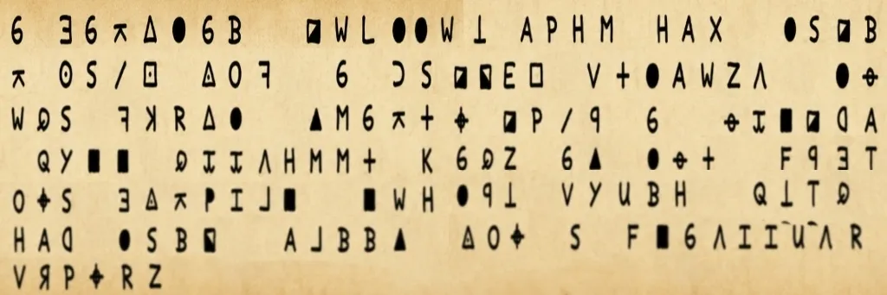
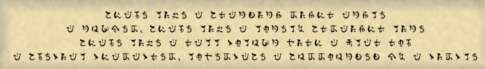
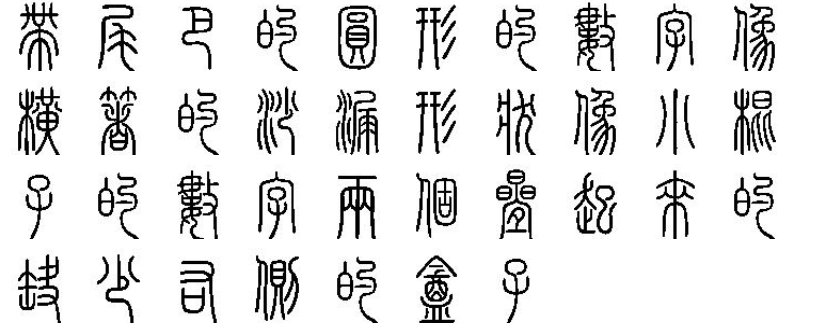
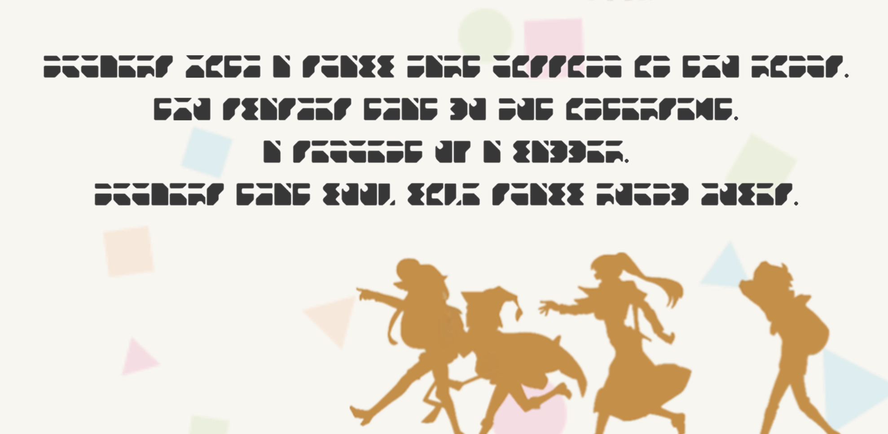
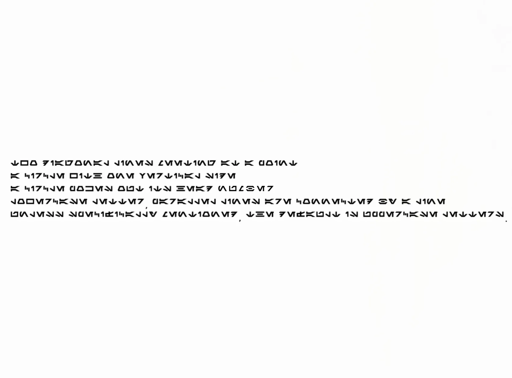
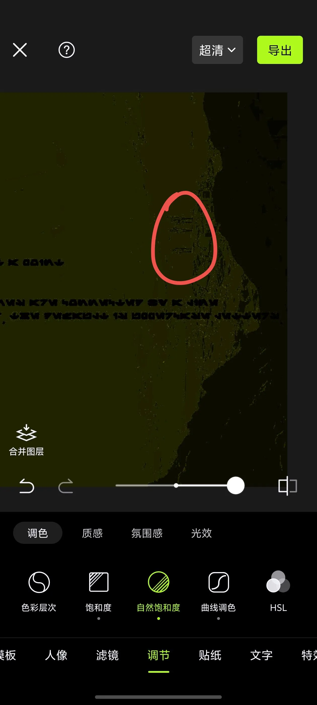
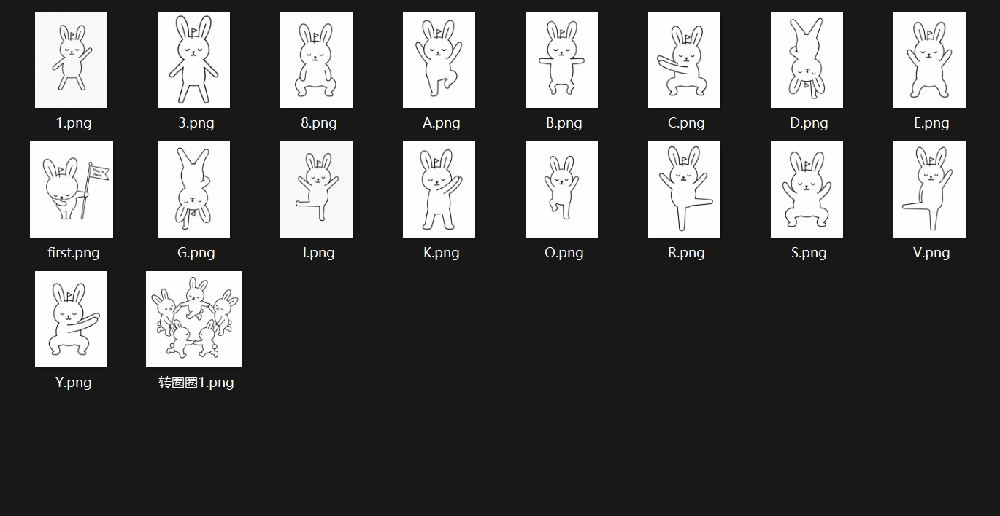

# dancing_rabbit

## 题目简述

附件是一个带密码的压缩包，密码由五组不同世界观下的符号文字拼接而成。题目同时给出每组四个字符的外形描述，因此重点是先判断符号体系，再依据形状做交叉核对。解压后的第二层使用“跳舞小人”式替换字母表，最终给出密钥提示和 flag。

虽然载体中包含多张图片，但决定性工作是识别并解码符号字母表，而不是在像素位平面中提取隐藏数据，因此归入密码方向。

## 解题过程

### 1. 黄道十二宫密码

第一张图中的四个符号分别符合“两个高峰的 M、空心圆形的 0、空心圆形的 0、两面竖墙加斜桥的 N”。



得到第一段：

```text
M00N
```

### 2. 稻妻文字

第二组来自《原神》的稻妻文字。按“直角、独立竖线、带平顶立柱、圆圈包围小写 a”的轮廓逐一对照，得到：



```text
L1T@
```

### 3. 小篆与《为美好的世界献上祝福》字母表

小篆一组按“带尾巴的圆形数字、横置沙漏、小棍状数字、上下叠放且缺右边的方框”读作：



```text
9X1E
```

下一组来自《为美好的世界献上祝福》中的替换字母表。四个轮廓依次对应 `3`、`V`、`H`、`0`：



```text
3VH0
```

### 4. Aurebesh 与压缩包密码

最后一组是《星球大战》的 Aurebesh。结合“两条斜线相交、带竖边的圆、圆形探出头部、由横线连接的平行线”等描述，读取为：



```text
KQ6z
```

原场景中字符不够醒目，增强图可以确认符号的方向和大小写；它们只作为视觉证据，不需要依赖外部字母表网页。




将五段按题目出现顺序拼接，压缩包密码为：

```text
M00NL1T@9X1E3VH0KQ6z
```

### 5. 解码跳舞小人

解压后得到 `dancing_rabbit.mp4`。视频中的兔子依次摆出一组固定姿势；把每个姿势映射到 Dancing Men 字母表并按出现顺序读取：



得到明文：

```text
KEY IS 3YC1OVERSYC
```

去掉提示语 `KEY IS` 后，得到密钥 `3YC1OVERSYC`。

### 6. 提取视频末尾的加密 ZIP

检查 MP4 的文件结构，可以在正常媒体数据之后发现一个附加的 ZIP：起始偏移为十进制 `10143833`（十六进制 `0x9AC859`），压缩包中有加密文件 `flag.txt`。这说明舞姿给出的字符串不是另一套替换表，而是内嵌压缩包的密码。

可按偏移切出 ZIP，再用刚得到的密钥直接读取文件：

```bash
dd if=dancing_rabbit.mp4 of=embedded-flag.zip bs=1 skip=10143833 status=none
unzip -P '3YC1OVERSYC' -p embedded-flag.zip flag.txt
```

输出为：

```text
SCTF{You_can_solve_this? Really? I_dont_believe}
```

## 方法总结

这类多字母表题不适合凭单个图形猜答案。更稳妥的方法是先用题面语境确定候选文字体系，再同时利用四个字符的轮廓约束，最后用可打印字符和压缩包校验做整体验证。得到疑似密钥后还应继续检查载体的完整文件结构；本题若只写出舞姿明文，就遗漏了从密钥到 flag 的决定性一步。关键图片应保留为原始证据，纯字母表截图则应转写成正文中的对应关系，避免题解只能靠图片或失效网页才能理解。
