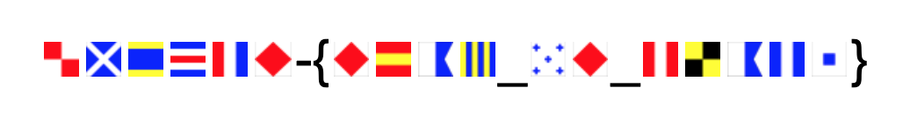

# Art Class

## 题目简述

题目只给出一张由多面彩色方旗组成的图片。图案并非普通装饰，而是国际信号旗字母表：每一面旗对应一个拉丁字母，按从左到右的顺序读取即可恢复明文。



## 解题过程

先观察每面旗的颜色分区、十字、斜纹和方块位置，再与国际信号旗表逐一比对。例如蓝白纵条、红底白十字等图案都能唯一落到一个字母。

按图片顺序查表后得到：

```text
F1AG 0F 7LA9S
```

其中数字 `1`、`0`、`7`、`9` 是题目使用的 leetspeak 写法，不需要继续替换。套入赛事格式得到：

```text
UMDCTF-{F1AG_0F_7LA9S}
```

## 方法总结

识别图形密码时，应先根据元素的固定形制判断码表，而不是直接做 OCR。本题的决定性特征是海事信号旗的标准化配色和几何图案；确认码表后，剩余工作只是保持原顺序查表并保留题目给出的数字字符。
