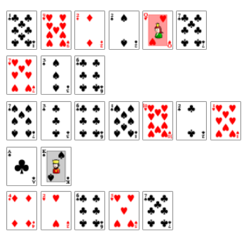

# Cards Galore

## 题目简述

题目把一串扑克牌排列成多行。每张牌的点数和花色共同表示一个字母，解出的中间文本还经过一次凯撒位移。



## 解题过程

把牌面点数 `A` 到 `K` 视为每个半区中的 13 个位置，再用花色区分字母表的前后半区：

- 黑色花色对应 `a` 到 `m`；
- 红色花色对应 `n` 到 `z`；
- 同色的两种花色用于适配题目实际排列，最终以能让整行保持一致映射为准。

按行读取图片中的牌面后，得到中间密文：

```text
hvobyg_tcf_gcfhwbu_am_qofrg
```

对它做凯撒轮转。将每个字母向后移动 12 位，等价于执行 ROT14，可恢复：

```text
thanks_for_sorting_my_cards
```

因此 flag 为：

```text
UMDCTF-{thanks_for_sorting_my_cards}
```

## 方法总结

扑克牌密码通常会分别利用点数和花色。先建立稳定的 13 位索引，再判断花色负责大小写、前后半区还是其他状态。本题查表结果仍不像明文，说明还有一层简单替换；用词频和可读性枚举 26 种凯撒位移即可确定唯一答案。
