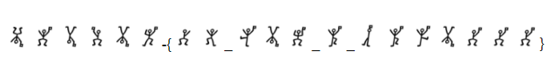

# Celebration

## 题目简述

题目给出一排姿态各异的线条小人。这些图形来自福尔摩斯故事中著名的 Dancing Men（跳舞小人）替换密码，每一种姿态对应一个英文字母。



## 解题过程

先按人物手脚方向、身体倾斜和是否持旗区分符号，再对照 Dancing Men 字母表逐个查表。图片中的分隔位置可作为单词边界，最终读出：

```text
YO ITS A PARTYYY
```

题目使用小写形式提交，空格改为下划线：

```text
UMDCTF-{yo_its_a_partyyy}
```

## 方法总结

这类图形替换密码的难点是识别标准码表。人物姿态并非随意绘制，持旗状态也可能改变含义；转写时应逐个记录特征，避免把镜像或仅一条手臂不同的符号合并。查表后还要依据题目格式统一空格和大小写。
