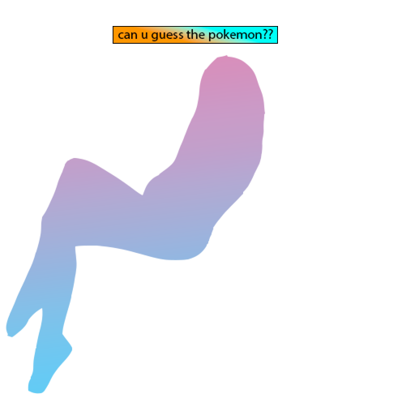
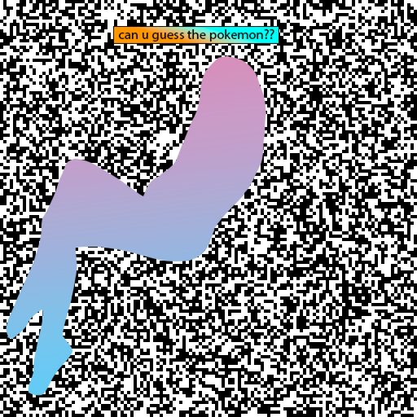

# Adi Shamir's Spontaneously Setec Astronomy Sharing System Security Assessment

## 题目简述

题目把一个随机 128 位 AES 密钥作为 Shamir 秘密分享多项式的常数项。在素数域
$\mathbb F_p$ 上生成次数小于 64 的多项式 $f(x)$，计算 128 个份额
$f(1),\ldots,f(128)$，再把每个 128 位份额绘制成一行黑白像素。每个比特被放大为
$4\times4$ 像素，最后叠加一张带透明区域的彩色遮罩。





附件还给出 `flag.png.enc`。其前 16 字节是 IV，后续数据使用恢复出的密钥进行
AES-CBC 加密。关键不是从图形轮廓猜宝可梦，而是利用 128 个不完整份额之间必须来自同一低次多项式这一约束，补回被遮挡的连续比特段。

## 解题过程

### 从图像恢复已知比特与未知区间

对 `out.png` 和 `mask.png` 的每个 $4\times4$ 块进行检查。只要遮罩块中存在透明像素，就能从输出图对应位置的最低位读出原始黑白比特；若 16 个像素都被遮住，则把该位标成未知。

官方脚本将每一行的连续未知位合并为若干段。设某段从第 $o$ 位开始、长度为
$s$，它对份额的贡献可以写成

$$
u\cdot 2^o,\qquad 0\le u<2^s.
$$

这样未知量的数量由“未知像素数”降为“连续未知段数”，并且每个变量都有很小的明确上界。

### 建立多项式一致性关系

前 64 个完整份额本应满足 Vandermonde 关系

$$
\begin{bmatrix}
1&1&\cdots&1^{63}\\
1&2&\cdots&2^{63}\\
\vdots&\vdots&&\vdots\\
1&64&\cdots&64^{63}
\end{bmatrix}
\mathbf a=\mathbf y
\pmod p.
$$

这里 $\mathbf a$ 是多项式系数，$\mathbf y$ 是份额。对 Vandermonde 矩阵求逆后，任意第
$65$ 至第 $128$ 个份额都可表示成前 64 个份额的线性组合。为消除逆矩阵中的分母，脚本取所有分母的最小公倍数 $d$；再为每条关系加入一个 $p$ 的整数倍，便得到只含整数的线性等式。

把各未知段的变量代入这些等式后，可以构造一个整数格：

- 常数列表示当前可见比特形成的份额；
- 每个未知段对应一列，系数中带有其位偏移 $2^o$；
- 额外列吸收模 $p$ 的倍数；
- 按段长设置权重，使 $s$ 位变量在格中都表现为相近尺度的短分量。

对该格执行 LLL，寻找同时满足全部 64 条冗余份额关系、且各段值落在其位宽内的短向量。得到各未知段后即可重建所有份额。

### 恢复密钥并解密图片

在 $\mathbb F_p$ 上对重建的点做拉格朗日插值并计算 $f(0)$：

```python
R = PolynomialRing(GF(p), "x")
f = R.lagrange_polynomial(list(zip(range(1, n + 1), data)))
key = int(f(0)).to_bytes(16, "big")
```

随后拆出 IV，执行 AES-CBC 解密并去除 PKCS#7 填充：

```python
iv, ciphertext = encrypted[:16], encrypted[16:]
cipher = AES.new(key, AES.MODE_CBC, iv=iv)
plaintext = unpad(cipher.decrypt(ciphertext), 16)
```

恢复出的图片直接给出 flag。


```text
UMDCTF{y0u_pull3d_@_g3m_0ut_0f_th3_m3ss}
```

## 方法总结

- 核心技巧：把遮罩造成的连续未知比特段参数化，再利用过量 Shamir 份额之间的多项式一致性构造格，用 LLL 恢复小范围未知量。
- 识别信号：秘密分享阈值为 64，却给出 128 个部分损坏的份额，说明额外份额不是冗余附件，而是恢复缺失比特的约束来源。
- 复用要点：图像只是份额的表示层；先按生成器的 $4\times4$ 布局精确还原位序，再处理有限域和格关系。像素端序或遮罩透明度判断错误都会使所有插值关系失效。
