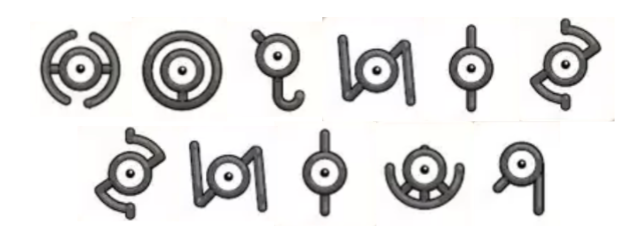

# Mirror Unknown

## 题目简述

附件是一张由两行圆形符号组成的图片。题面提到“古代文明不使用空格或小写”，这些符号对应宝可梦世界中的 Unown 字母表；标题中的 `Mirror` 则提示整张图被水平镜像。



这不是像素位面或文件尾隐藏数据，明文就编码在可见符号的形状和排列中，因此按符号替换码处理。

## 解题过程

先把图片水平翻转，使每个 Unown 字形及阅读顺序恢复正常。随后对照 Unown 的
A–Z 字母表逐个转写；按第一行到第二行连续读取，不插入空格，得到：

```text
SINJOHRUINS
```

`Sinjoh Ruins` 是宝可梦系列中的地点名，语义也能反向验证字形识别没有颠倒。题面明确说不使用空格和小写，所以提交时保持全大写连写：

```text
UMDCTF{SINJOHRUINS}
```

## 方法总结

- 核心技巧：根据题面语境识别 Unown 替换字母表，先做水平镜像修正，再逐符号转写。
- 识别信号：一组形似眼睛、各自轮廓不同的圆形符号配合 Pokémon 语境，强烈指向 Unown 字母。
- 复用要点：镜像会同时改变字形方向和整行顺序；应先对整张图翻转，再解码，而不是只把最终字符串倒序。
