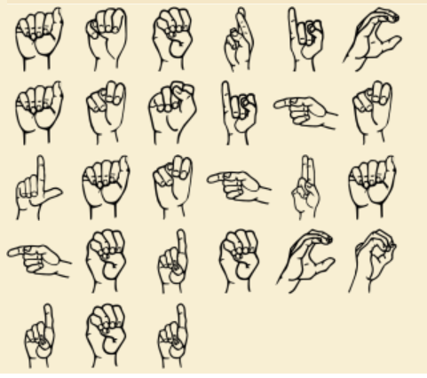

# Amazing Song Lyrics

## 题目简述

题名三个单词的首字母组成 `ASL`，提示 American Sign Language。附件中的手势序列不是装饰，而是逐字母编码的美国手语字母表。

## 解题过程

观察原图中的手势顺序：



对照美国手语字母表逐个转写，并按题面要求统一为小写，可得到：

```text
americansignlanguagedecoded
```

补上 flag 外壳：

```text
n00bz{americansignlanguagedecoded}
```

## 方法总结

题名缩写负责识别码表，图片的手形与方向则是不可替代的视觉信息。转写时要保持原顺序，并遵守题面对大小写的额外约束。
