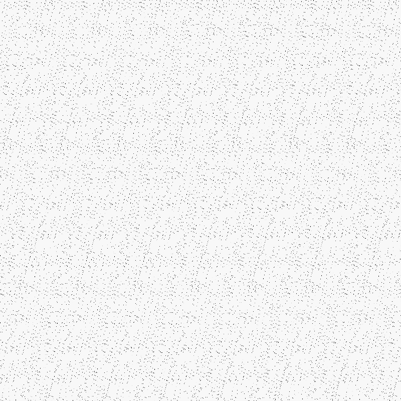
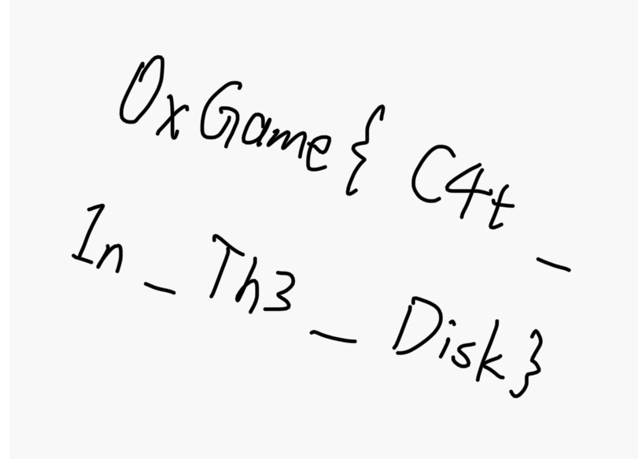

# week4走失的猫猫

## 题目简述

题目提供一份磁盘镜像，并提示有一只“走失”的猫。需要从文件系统中恢复被删除的图片，再根据图片尾部参数逆转 Arnold 置乱，读出最终 flag。

## 解题过程

删除文件通常只会移除目录项或把对应空间标记为空闲，在数据块尚未被覆盖时，内容仍可恢复。对镜像进行深度扫描和签名恢复后，可以找回 `catcat.png`。

恢复出的 PNG 可以正常打开，但内容像均匀散布的噪点：

检查文件十六进制内容，在 PNG 结束标记之后还能看到三个附加参数：

~~~text
a = 114  b = 514  st = 1
~~~

PNG 解码器会忽略结束标记后的附加数据，因此这些参数不会影响图片显示。方形图像、置乱后的纹理以及参数 $a,b,st$ 共同指向广义 Arnold 变换，其中 `st` 是迭代次数。按题目使用的坐标关系，对置乱坐标 $(x',y')$ 做一轮逆变换：

$$
x=(x'-ay')\bmod N,\qquad y=(y'-bx)\bmod N.
$$

对应脚本如下：

~~~python
from PIL import Image

scrambled = Image.open("catcat.png").convert("RGB")
assert scrambled.width == scrambled.height

size = scrambled.width
a = 114
b = 514
steps = 1

current = scrambled
for _ in range(steps):
    restored = Image.new(current.mode, current.size)
    for y_prime in range(size):
        for x_prime in range(size):
            x = (x_prime - a * y_prime) % size
            y = (y_prime - b * x) % size
            restored.putpixel((x, y), current.getpixel((x_prime, y_prime)))
    current = restored

current.save("flag.png")
~~~

逆变换后的图片直接写出了 flag：

~~~text
0xGame{C4t_1n_Th3_Disk}
~~~

## 方法总结

本题包含两层取证：先利用未覆盖的数据块恢复删除文件，再检查文件尾部的非标准附加数据。对方形噪声图，若同时出现两个线性参数和迭代次数，应优先考虑 Arnold 类坐标置乱；实现逆变换时必须明确源坐标与目标坐标的方向，避免只照搬变量名混乱的脚本。
