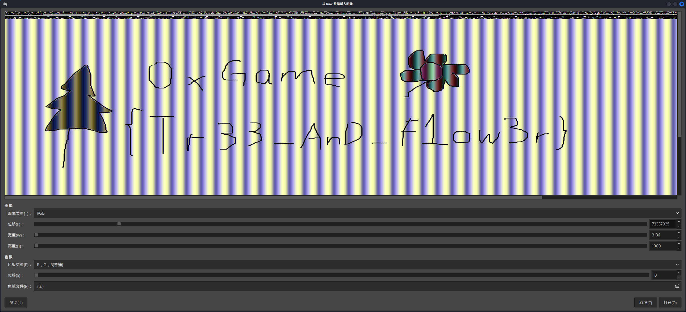

# 画画的baby

## 题目简述

题目提供 Windows 内存镜像 `painting.raw`。目标是定位正在运行的 Microsoft Paint 进程，从其进程地址空间中恢复尚未另存为图片的画布内容。源仓库只保留了[原始附件网盘链接](https://pan.baidu.com/s/1iNe4gPJugvRtjR_iwqtYxg?pwd=m6wa)，提取码为 `m6wa`；下面已写全分析过程和最终内容，不需要依赖其他教程。

## 解题过程

### 1. 定位画图进程

使用 Volatility 2 时先识别镜像版本：

```bash
python2 vol.py -f painting.raw imageinfo
```

建议的 profile 为 `Win10x64_19041`。列出进程：

```bash
python2 vol.py -f painting.raw --profile=Win10x64_19041 pslist
```

关键记录为：

```text
mspaint.exe  PID 5372  PPID 3912  2024-09-06 14:36:00 UTC
```

这里应使用 PID `5372`，不能误把父进程号 `3912` 传给转储插件：

```bash
mkdir -p dump-v2
python2 vol.py -f painting.raw \
  --profile=Win10x64_19041 \
  memdump -p 5372 -D dump-v2
```

Volatility 3 不需要手动指定 profile：

```bash
python3 vol.py -f painting.raw windows.pslist
python3 vol.py -f painting.raw windows.memmap --pid 5372 --dump
```

### 2. 从进程内存恢复画布

Paint 的位图像素仍保留在进程地址空间中。将转储文件作为 Raw Image 导入 GIMP，选择 RGB 数据并调整偏移、宽度和高度。该镜像中宽度可设为 `3136`，高度约为 `1000`；Volatility 2/3 的转储布局不同，所以起始偏移应通过滑动预览分别确定，而不能机械照搬同一个数值。

恢复后可见一棵树、一朵花以及手写 flag：



```text
0xGame{Tr33_AnD_F1ow3r}
```

## 方法总结

本题恢复的是进程内存中的绘图表面，而不是磁盘上的图片文件。分析 GUI 应用内存时，应先用进程列表确定正确 PID，再转储地址空间并按原始像素数据尝试宽度、色彩通道和偏移；同时要注意 Volatility 输出中的 PID 与 PPID 列，避免转储错误进程。
