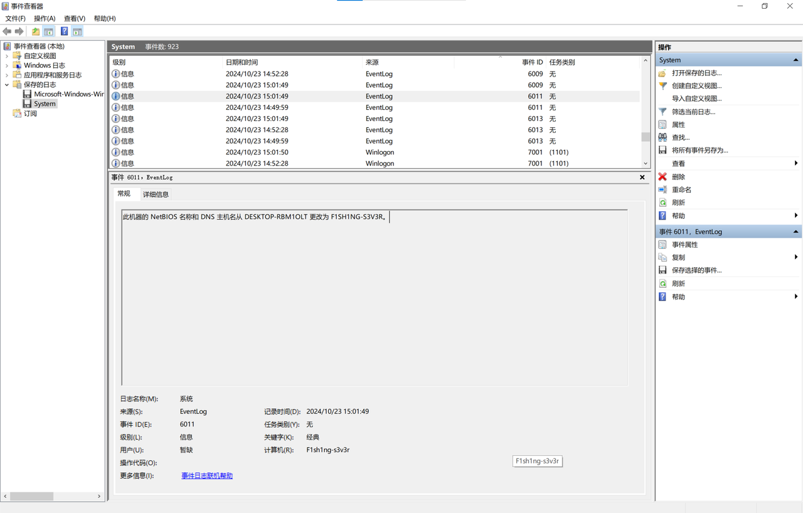

# FBI Open The Door!! 2

## 题目简述

本题沿用 `fish.E01`，要求找出嫌疑人计算机的主机名。

[原始 E01 检材（百度网盘，提取码 `2vmz`）](https://pan.baidu.com/s/1oo6k9svcSJHaXo-9R5hDJg?pwd=2vmz)

## 解题过程

使用 FTK Imager 只读加载镜像，在以下路径导出系统事件日志：

```text
C:\Windows\System32\winevt\Logs\System.evtx
```

主机名变更由 `EventLog` 来源的事件 ID 6011 记录。可以在事件查看器中筛选，也可以直接用 PowerShell 读取导出的日志：

```powershell
Get-WinEvent -Path "./System.evtx" -FilterXPath "*[System[(EventID=6011)]]" |
    Select-Object TimeCreated, Id, ProviderName, Message
```

事件消息显示，NetBIOS 名称和 DNS 主机名从 `DESKTOP-RBM1OLT` 改为 `F1SH1NG-S3V3R`；自动取证结果中的当前完整计算机名也显示为 `F1sh1ng-s3v3r`。



Windows 主机名本身不区分大小写，按题目预期格式提交：

```text
0xGame{F1sh1ng-s3v3r}
```

## 方法总结

查 Windows 主机名时，当前注册表值只能说明最终状态；系统日志事件 6011 还能给出旧名称、新名称和变更时间，证据链更完整。这里用自动取证结果交叉校验即可，不应只写“工具一键得到”。
