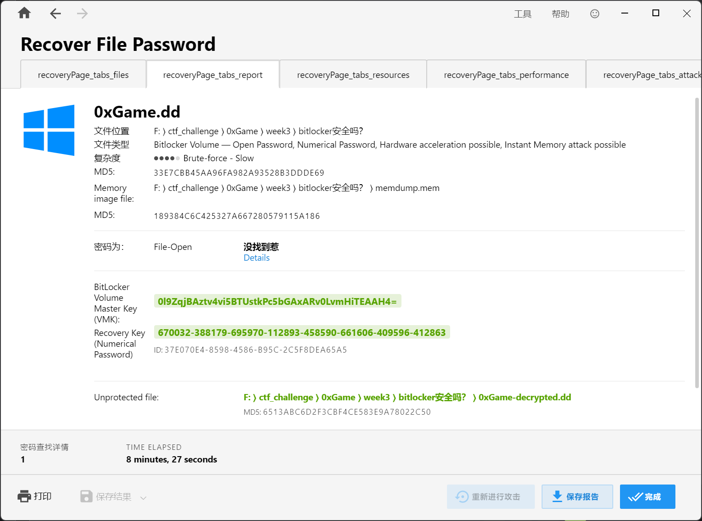

# Bitlocker 安全吗？

## 题目简述

题目给出一份 Windows 内存镜像 `memdump.mem` 和一份 BitLocker 加密磁盘镜像 `0xGame.dd`。目标不是爆破 BitLocker 密码，而是从系统运行时内存中恢复 Full Volume Encryption Key（FVEK），再用该密钥解密磁盘并读取 `flag.txt`。

题目外层附件 `0xGame_attachment` 是 VeraCrypt 容器，并同时提供 `keyfile.jpg` 作为密钥文件。选择一个空闲盘符，加载容器，勾选“使用密钥文件”并添加 `keyfile.jpg`，密码留空即可挂载。挂载后的 `Bitlocker安全吗？.zip` 中才是实际取证材料：

```text
memdump.mem
0xGame.dd
```

这里需要区分两层机制：VeraCrypt 只负责保护附件分发，BitLocker 才是题目要求分析的加密卷。

## 解题过程

### 从内存恢复 FVEK

BitLocker 卷在解锁并使用期间，系统必须持有用于扇区加解密的 FVEK。只要内存镜像采集时卷仍处于解锁状态，就有机会从 Windows 内核池中的 AES 密钥调度数据恢复它，而不必知道用户密码或 48 位恢复密钥。

可使用以下两个插件：

- [Volatility 3 BitLocker 插件](https://github.com/lorelyai/volatility3-bitlocker)扫描 `FVEc`、`Cngb`、`None` 等内核池标签，校验 AES 密钥调度，并可直接生成供 Dislocker 使用的 `.fvek` 文件。
- [Volatility 2 BitLocker 插件](https://github.com/breppo/Volatility-BitLocker)同样从内存恢复 FVEK，可输出 Dislocker 或 bdemount 所需的密钥；适合仍使用 Volatility 2 profile 的环境。

本题采用 Volatility 3：

```bash
python vol.py -f memdump.mem -vvv \
  windows.bitlocker.BitlockerFVEKScan \
  --tags FVEc Cngb None --dislocker
```

插件命中候选密钥后会生成类似下面的文件：

```text
0xe000899f7680-Dislocker.fvek
```

文件名中的十六进制数是内存池命中地址；真正交给 Dislocker 的是文件中按其格式保存的 FVEK，而不是这个地址本身。

### 解密并只读挂载磁盘

创建两个挂载目录。题目镜像中 BitLocker 卷从字节偏移 `65536` 开始，因此将该偏移与生成的 `.fvek` 一并传给 Dislocker：

```bash
sudo mkdir -p /mnt/dislocker_tmp
sudo mkdir -p /mnt/decrypted

sudo dislocker -v --offset 65536 \
  -k 0xe000899f7680-Dislocker.fvek \
  -- 0xGame.dd /mnt/dislocker_tmp

sudo mount -o loop,ro -t ntfs-3g \
  /mnt/dislocker_tmp/dislocker-file /mnt/decrypted
```

`dislocker-file` 是 Dislocker 暴露出的已解密虚拟卷，再以 `loop,ro` 挂载可以避免修改原始证据。读取根目录中的 `flag.txt`：

```bash
ls /mnt/decrypted
cat /mnt/decrypted/flag.txt
```

输出为：

```text
$RECYCLE.BIN  System Volume Information  flag.txt
0xGame{Wow_Y0u_@r3_BEsT_H@cker!!!_Coom3_0n!!!}
```

结束后按由内到外的顺序卸载：

```bash
sudo umount /mnt/decrypted
sudo umount /mnt/dislocker_tmp
sudo rmdir /mnt/decrypted /mnt/dislocker_tmp
```

商业工具 Passware Kit Forensic 也能完成同一恢复过程：同时加载 `0xGame.dd` 与 `memdump.mem`，工具可从内存中恢复 BitLocker VMK/恢复密码，并导出解密后的磁盘镜像。截图中的结果页显示其已生成 `0xGame-decrypted.dd`；这是一条替代路径，不是开源流程的必需步骤。



## 方法总结

本题的核心证据链是“已解锁系统的内存镜像 → FVEK → BitLocker 磁盘镜像 → NTFS 文件”。BitLocker 对静态磁盘的加密仍然可靠，但只要系统正在使用该卷，解密所需密钥就必须存在于内存；及时采集内存便可能绕过对口令的正面攻击。

处理此类题目时，应先确认外层容器与真正目标的边界，再保留原始镜像、记录卷起始偏移、从内存提取 FVEK，并以只读方式挂载解密结果。FVEK、VMK 与恢复密码作用不同：本题开源路线直接使用 FVEK，Passware 展示的 VMK/恢复密码则是另一种解锁材料，不能把它们混为同一个值。
