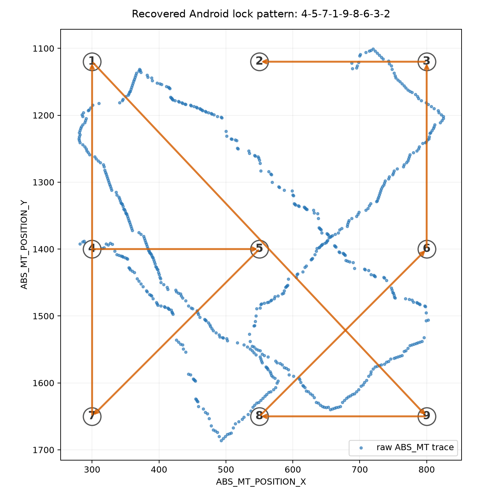

# Lock Pattern

## 题目简述

附件中的 `event2` 是通过 Android `getevent` 获取的触摸屏输入事件流，要求恢复设备的九宫格解锁图案。决定性信息位于 Linux input event 的绝对坐标事件中，而不是普通文本日志。

## 解题过程

在 64 位环境中，每条 `input_event` 记录占 24 字节，可以按 `<qqHHI` 解析为秒、微秒、事件类型、事件代码和数值。触摸屏坐标使用 `EV_ABS`（类型 3），其中代码 53 是 X 坐标，代码 54 是 Y 坐标：

```python
import struct
import matplotlib.pyplot as plt

data = open("event2", "rb").read()
x = y = None
points = []

for offset in range(0, len(data) - 23, 24):
    _, _, event_type, code, value = struct.unpack_from(
        "<qqHHI", data, offset
    )
    if event_type == 3 and code == 53:
        x = value
    elif event_type == 3 and code == 54:
        y = value
    elif event_type == 0 and code == 0 and x is not None and y is not None:
        points.append((x, y))

xs, ys = zip(*points)
plt.scatter(xs, ys, s=5)
plt.gca().invert_yaxis()
plt.gca().set_aspect("equal")
plt.show()
```

屏幕坐标原点位于左上角，所以必须翻转 Y 轴。把轨迹叠加到标准九宫格上，可以清楚读出经过节点的顺序：



```text
4 -> 5 -> 7 -> 1 -> 9 -> 8 -> 6 -> 3 -> 2
```

因此 flag 为：

```text
shellmates{457198632}
```

## 方法总结

恢复触摸轨迹时，先依据目标架构确定 `input_event` 的字节宽度，再筛选 `EV_ABS` 的 X/Y 事件，并在绘图时处理屏幕坐标方向。图案的空间关系是本题不可替代的证据，因此保留语义化命名的轨迹图。最终 flag 为 `shellmates{457198632}`。
