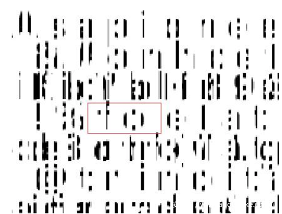
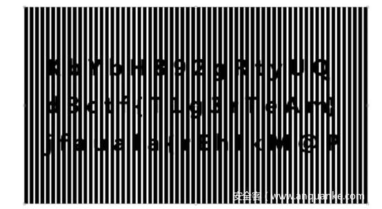

# vera

## 题目简述

题目名和题面“加密”暗示 VeraCrypt 容器。挂载时需要密码，结合《冒险小虎队》相关线索可猜测密码为书籍 ISBN，成功解密后得到一张 jpg。图片中的文字经过光栅/栅栏式遮挡，大部分字母重叠，但仍有局部清晰字符可用来确定光栅宽度和间距；按固定间距移动/填充后即可恢复 flag。

题目资料地址：https://github.com/dimo233/d3ctf-Vera

题目过程图显示的流程与正文一致：先从题名 `Vera` 和“加密”联想到 VeraCrypt，再用书籍 ISBN 解容器，最后根据图片中局部清晰的 `f`、`o` 等字符确定光栅宽度和间距，通过等距离移动恢复 flag。

## 解题过程

题目名叫Vera，且题面中提到了加密，估计用了 VeraCrypt 软件进行的加密。

装载发现有密码，密码长度可能是13位，猜测密码为该书的ISBN号，成功解密

。

打开后发现一个jpg文件

虽然大部分字母都有重叠，但有几行还是比较清楚的，可以作为找光栅宽度和间距的依据，比如：

这里的f、o就很容易找到相应的填充。

然后就是等距离填充，移动一下就能得到flag了

## 方法总结

- 核心技巧：先根据题名和题面识别 VeraCrypt 容器，再用书籍 ISBN 作为密码线索，最后对解出的图像做光栅间距恢复。
- 识别信号：`Vera`、加密容器、书籍/冒险小虎队线索同时出现时，应优先尝试 VeraCrypt 和 ISBN/出版信息类密码。
- 复用要点：光栅题不需要逐字猜测全部内容，先找清晰字符确定宽度、间距和偏移，再等距离移动叠合即可恢复文本。
