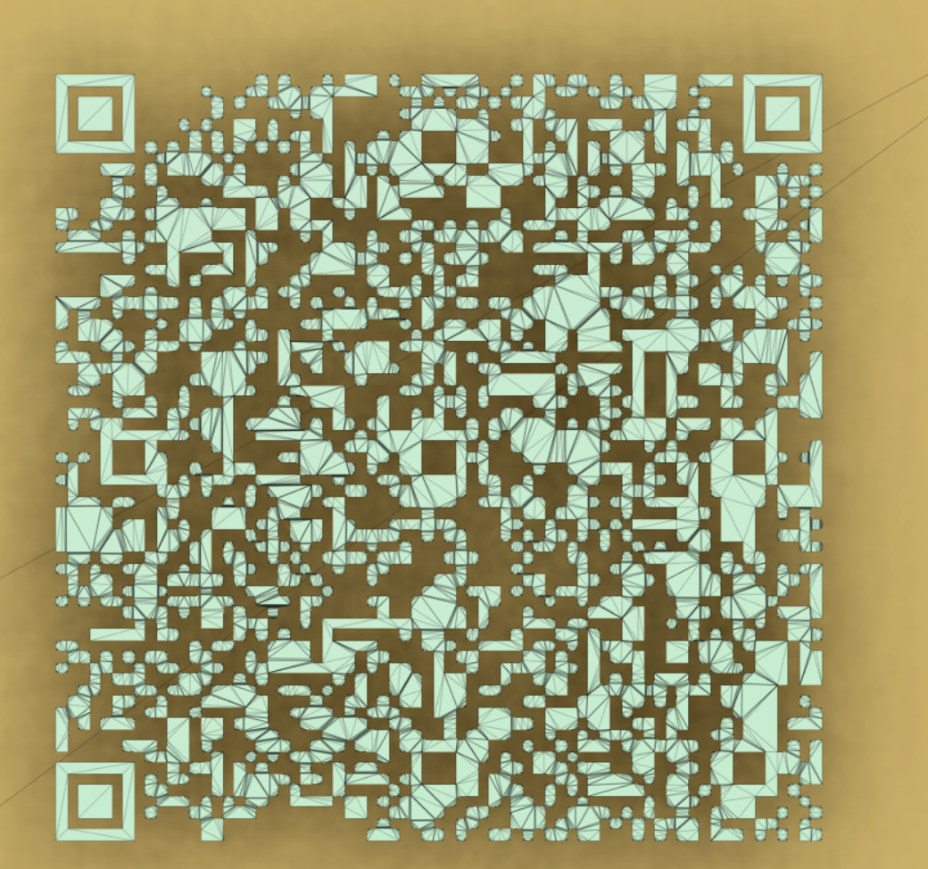

# d3image

## 题目简述

题目是内存取证 + 网络载体恢复 + 立体模型隐写的组合。给出 LiME Linux 内存镜像，需要为 Volatility 2 准备对应 profile，从 bash/firefox 痕迹中恢复本地 Web 访问和 proxychains 配置，再取得 `magic.7z`。其中 ICMP pcap 用“可达地址/不可达地址”表示 bit，恢复压缩数据后得到 STL 模型，模型截面藏有 QR code，后续还需 rot47/base62、手柄按键和 Morse/base32 解码。

## 解题过程

镜像文件是 LiME 类型的 Linux 内存镜像，因此需要创建对应的 profile 或 symbol。本题主要使用 Volatility 2，所以需要准备相关 profile 文件。

```
strings out.mem | grep version | head -n 5
```

由此可以确认 Linux 版本。

```
4.15.0-142-generic (buildd@lgw01-amd64-039) (gcc version 5.4.0 20160609 (Ubuntu
5.4.0-6ubuntu1~16.04.12)) #146~16.04.1-Ubuntu SMP Tue Apr 13 09:27:15 UTC 2021
```

因此需要创建对应 profile。使用 Volatility 2 的 bash 插件查看历史记录后，发现 firefox 是通过 proxychains 启动的。先 dump firefox 相关进程，再用 strings 搜索访问过的相关 URL，可以得到：

```
http://127.0.0.1:2333
http://127.0.0.1:2333/magic.7z
```

为了恢复文件系统并定位相关 proxychains 配置文件，可以使用 Volatility 2 的 `linux_recover_filesystem` 插件。

```
socks5  192.168.31.136 51234 Gigantic_Splight Tearalaments_Kitkalos
```

使用该配置尝试连接目标机器并访问相关 URL，最终可以得到相关 Web 界面和一个 `magic.7z` 文件。上个月曾在 DN42 网络中测试过一个基于 ICMP 的

canvas：用地址选择像素位置和颜色。本题受此启发，用地址表示 bit 的索引。为了增加混淆，使用“可达地址”表示 `1`，“不可达地址”表示 `0`。

```
import os
from tqdm import trange
valid = set()
request = set()
max_num = 0
pkt_num = (os.stat("input.pcap").st_size - 24) // 44
with open("input.pcap", "rb") as f:
    f.read(24)
    for _ in trange(pkt_num):
        pkt = f.read(44)
        ip = pkt[32:36]
        pkt_type = list(pkt[36:38])
        num = ip[1] * 256 * 256 + ip[2] * 256 + ip[3]
        max_num = num if num > max_num else max_num
        if pkt_type == [0x08, 0x00]:
            request.add(num)
        elif pkt_type == [0x00, 0x00]:
            try:
                request.remove(num)
                valid.add(num)
            except KeyError:
                pass
        elif pkt_type == [0x00, 0x03]:
            try:
                request.remove(num)
            except KeyError:
                pass
with open('output.bin', 'wb') as f:
    for i in trange((max_num + 1) // 8):
        byte_value = ''.join('1' if k in valid else '0' for k in range(i * 8, (i
+ 1) * 8))
        f.write(int(byte_value, 2).to_bytes(1, 'big'))
```

解密后得到一个压缩文件，其中包含一个 STL 文件，看起来像是手柄模型。但文件大小与其简单轮廓不匹配，因此使用 SolidWorks 这类工程建模软件做截面分析，检查内部是否存在多余复杂边。最终在模型内部发现了一个 QR code 截面。



```
3;A6eI`(J{z29|Gz":Dqt;~h*Bvc$7}c"dw'uBJth$Jg(+4+8x9eG7`>83$q5hF%I*)yrcb3+7$*~Dr"
G|:K~C{_"Jv5=B9t9|>bwugCE~d&3fd{H;@hD?
(DDz~$h#I%I`IB8zKyfHby3x'yfc56fH35|E8$+KGE@(u`7
```

使用 rot47 和 base62 解码后得到一串 emoji，它们对应 JavaScript 代码中的手柄按键编号：LB、RT、LT、RB、up、down、left、right、ABAB。因此连接手柄，在网页中输入这串按键并提交。token 正确后，手柄会开始振动，振动内容是 Morse code。

解码出的消息是 `MZWGCZ33O5UECVC7GRPW4MLDMVPUONDNGNIGCZD5`，再用 base32 解码即可得到 flag。

## 方法总结

- 核心技巧：LiME 内存镜像 profile、Volatility bash/firefox 进程恢复、proxychains 配置恢复、ICMP reachability bitstream、STL 截面 QR、rot47/base62/gamepad/Morse/base32 多层编码。
- 识别信号：内存镜像里出现浏览器代理访问本地地址时，应同时恢复代理配置和浏览器进程字符串；PCAP 里大量 ICMP echo/reply/unreachable 可以编码位图。
- 复用要点：本题关键是保留每层 artifact 的转换规则，而不是只写最终脚本：IP 地址后三字节映射 bit index，echo reply 表示 1，unreachable/无 reply 表示 0。
